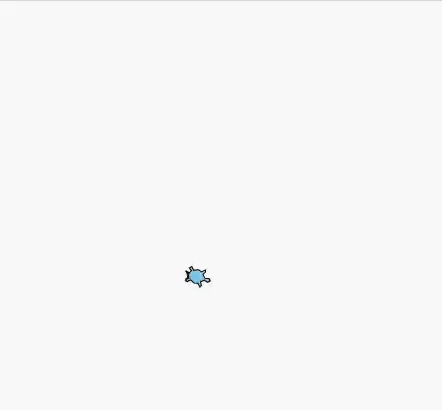
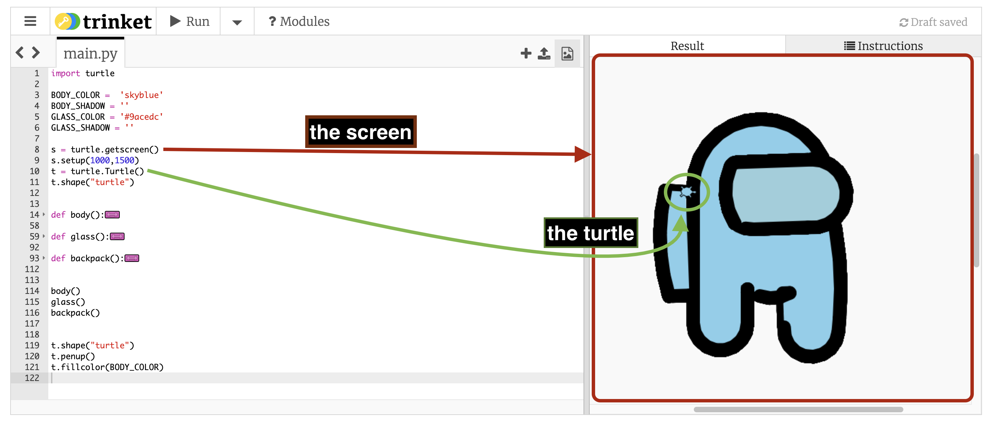
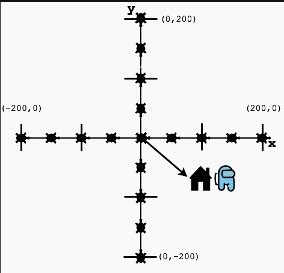
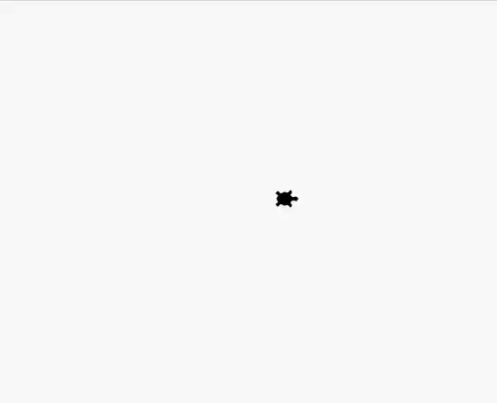
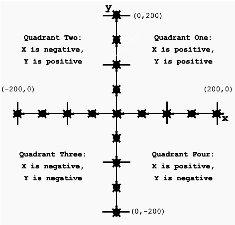

import ReactAudioPlayer from 'react-audio-player';
import audioFile from '../../static/audio/py1/py1sus.mp3';

# Lesson 1: Intro to Python Turtle
:::info
<details style={{border:'none'}}>
<summary>**Prerequisites: Before You Dive In!**</summary>    

    **Python Libraries**
    
Before you start coding in Python, let's talk about what a "library" is. 

Think of a library like a toolbox where you can borrow tools you need for a project. 
In programming, a library is similar, but instead of physical tools, it gives us special functions that you can use to make coding easier and faster.
    
    **Getting to Know the Python turtle Library**
    
    The Python turtle library is a built-in tool that lets you create pictures and shapes by providing a virtual canvas. The tool you use to draw on this canvas is called the "turtle," and that's how the library gets its name.

You can use it to draw all sorts of shapes and images. Here's an example of what you can do with the turtle:

<div align="center">
    
</div>
<div align="center">
    <ReactAudioPlayer
        src={audioFile}
        controls
    />
</div>

Pretty neat, isn't it? This is just one example of the many things you can create using the turtle library.
</details>
:::
## Objective 🧐🗿

Dive into the world of Python programming by learning about libraries, variables, and basic turtle commands to start moving and positioning your turtle creatively!
## Getting Started with Turtle 🚩🐢

### Step 1. Import Turtle

:::info
<details style={{border:'none'}}>
<summary>**Coach Note!**</summary>    

Here, your coach will speak a bit about the Python import system. 
<details>
<summary> **Standard** </summary>

You'll learn how to use Python's import system, including:
        <ul>
            <li>Basic usage of the <code>import</code> statement.</li>
            <li>How to import specific functions, classes, and variables from modules.</li>
            <li>Understanding the role of Python's built-in modules in everyday programming tasks.</li>
        </ul>
</details>

<details>
<summary> **Advanced** </summary>

If you've gone over the content in the Standard section above and still need a bit more of a challenge, have no fear for your coach is here! 

You'll learn how a library is used in Python from start to finish, covering:
        <ul>
            <li>An overview of PyPi (Python Package Index), the repository for Python packages.</li>
            <li>The process of downloading and installing packages using pip.</li>
            <li>Understanding what "creating an instance" means in terms of import</li>
        </ul>
</details>
</details>
:::

Open up our "My Turtle" file we made in our Setup section.

To use the Python Turtle library, we first need to import it into our environment. Type this command in:
``` python
# main.py
import turtle
```

Now that we have Turtle in our Python environment, we can begin programming with it.


### Step 2. Making Our Own Turtle

Let's talk about our Turtle and the screen! 

**Our Turtle and Screen**
<div align="center">
    
</div>
<figure align="center">
  <figcaption>
    The box highlighted in <span style={{ color: 'red' }}>red</span>
    is called the screen. It’s where you can view the output of your code. The circle highlighted in <span style={{ color: 'green' }}>green</span> is called our turtle.
  </figcaption>
</figure>

To do make some cool artwork, we'll need a variable to access our turtle. 

:::info
<details style={{border:'none'}}>
<summary>**Coach Note!**</summary>

Here your coach will speak a bit on variables.
<details>
<summary>**Standard**</summary>
<ul>
Understanding Variables:
        <ul>
            <li>What a variable is and how it's used to store data.</li>
            <li>How to create and initialize variables in Python, with examples using Turtle graphics.</li>
        </ul>
        
Variable Naming:
        <ul>
            <li>Importance of choosing clear and descriptive names for better readability and maintainability of code.</li>
            <li>Examples of good vs. bad variable names in the context of Turtle graphics.</li>
        </ul>
</ul>
</details>

<details>
<summary>**Advanced**</summary>
<ul>
    Advanced Variable Management:
        <ul>
            <li>Discussing variable scope (local vs global variables) and its implications in larger Python scripts.</li>
            <li>Using variables effectively to manage the state and properties of Turtle objects and the Turtle screen.</li>
        </ul>
    Dynamic Typing in Python:
        <ul>
            <li>Explanation of Python's dynamic typing system and how it affects variable assignment and function arguments.</li>
            <li>Practical example of creating a Turtle instance with custom parameters</li>
            <li>Case studies: Modifying the properties of Turtle objects (like color, shape, and speed) dynamically based on user input or other conditions.</li>
        </ul>
</ul>
</details>

</details>
:::

First, let’s bring in our turtle. This turtle is going to be your artist, drawing cool stuff on the screen!

``` python
t = turtle.Turtle()
```

The turtle has changeable characteristics, like size, color, and speed. It always points in a specific direction and will move in that direction unless you tell it otherwise:
- When it’s up, it means that no line will be drawn when it moves.
- When it’s down, it means that a line will be drawn when it moves.

Now, we need to set up the screen where your turtle will draw. Think of it like setting up a canvas for painting. This screen also works off a coordinate system.

**On Coordinates**

Imagine the screen as a giant graph paper, divided into four quadrants. The center, where your turtle starts, is called Home and is at coordinates (0,0). 

<div align="center">
    
</div>

<figure align="center">
  <figcaption>
Understanding the coordinates helps move our turtle to any point on the screen using its x and y coordinates.
 </figcaption>
</figure>


We'll have to make a variable for our screen, just like we did for our turtle. Here's one way to do it:

```python
s = turtle.getscreen()
```

We use a short and sweet name s for the screen. Easy to type and easy to remember, right?

We now have a screen and our turtle. The screen acts as a canvas, while the turtle acts like a pen. We can program the turtle to move around the screen. 

## Programming with Turtle ⌨️💚

:::info
<details style={{border:'none'}}>
<summary><strong>Coach Note!</strong></summary>

In these next two sections, your coach will be going over Turtle Movement and Positioning. Here is what you can expect to learn!

<details>
<summary><strong>Standard</strong></summary>
<ul>
Basic Turtle Movements:
    <ul>
        <li>Introduction to moving the turtle using basic commands like <code>t.forward(100)</code> and <code>t.right(90)</code>.</li>
        <li>Understanding how these commands affect the turtle’s position and orientation on the screen.</li>
        <li>Practical exercises: Commands to move the turtle in a square or triangle pattern.</li>
    </ul>
</ul>
</details>

<details>
<summary><strong>Advanced</strong></summary>
<ul>
Complex Movements and Patterns:
    <ul>
        <li>Using loops and conditions to create complex geometric patterns and designs.</li>
        <li>Examples include creating spirals, fractals, and other intricate designs with the Turtle module.</li>
    </ul>

Precise Positioning Techniques:
    <ul>
        <li>Detailed explanation of the coordinate system used in Turtle graphics.</li>
        <li>How to use <code>t.goto(x, y)</code> for absolute positioning, and the implications of using absolute vs. relative movements.</li>
        <li>Case study: Using mathematical functions to calculate exact positions for more dynamic and responsive Turtle graphics.</li>
    </ul>
</ul>
</details>

</details>
:::

### Turtle Movement
    There are four directions that a turtle can move in:
- Forward
- Backward
- Left
- Right

<div align="center">
    
</div>

<figure align="center">
  <figcaption>
The turtle moves `.forward()` or `.backward()` in the direction that it’s facing. You can change this direction by turning it `.left()` or `.right()` by a certain degree. 
 </figcaption>
</figure>


Let's start with some simple movements. Use the following commands to move your turtle around the screen:

```python
t.right(90)     # Turn right by 90 degrees
t.forward(100)  # Move forward by 100 units
t.left(90)     # Turn right by 90 degrees
t.backward(100)  # Move backward by 100 units
```

When you run these commands, 
- the turtle will turn right by ninety degrees, 
- go forward by a hundred units, 
- turn left by ninety degrees, 
- and move backward by a hundred units. 

:::info
<details style={{border:'none'}}>
    <summary>**Shorthand Notation**</summary>

    To save some time, we can use shortened versions of the function names as well.
``` python
t.rt() # instead of t.right()
t.fd() # instead of t.forward()
t.lt() # instead of t.left()
t.bk() # instead of t.backward()
```

</details>
:::


<details>
    <summary>**CHALLENGE: Complete the Square 👉 🟩 👈**</summary>

    The commands we just ran form half of a square. Your goal is to now complete the square. 
    
    You’ll want your turtle to point in the upwards direction, move forward, and turn right, move forward.

    If you need help, click below for some help!

    <details>
            <summary>**HINT 🤫**</summary>

        ```python
        import turtle
        t = turtle.Turtle()

        t.forward(100)  # Move forward by 100 units
        t.right(90)     # Turn right by 90 degrees
        t.forward(100)  # Move forward by 100 units
        t.right(90)     # Turn right by 90 degrees
        t.forward(100)  # Move forward by 100 units
        t.right(90)     # Turn right by 90 degrees
        t.forward(100)  # Move forward by 100 units
        t.right(90)     # Turn right by 90 degrees
        ```
    </details>
</details>

### Turtle Positioning

With Python Turtle, you can not only move your turtle around but also precisely position it anywhere on the screen. Let's dive into the world of coordinates and discover how to navigate the Turtle's universe!

**Moving Your Turtle**

To move your turtle to a specific position, use the `.goto()` function and specify the x and y coordinates. For example, to move to the point (100,100), you would write:

``` python
t.goto(100, 100)
```

**Drawing Lines**

You can also draw a line from your current position to another point on the screen using the `.goto()` function. This allows you to create intricate shapes and patterns with ease!

After exploring and creating your masterpiece, you can always bring your turtle back to its home position using the `.home()` function. This resets the turtle's position to (0,0), ready for your next adventure!

<details>
    <summary>**CHALLENGE: Exploring ✨ Quadrants ✨**</summary>

Have your turtle draw a line towards its original position, to quadrant one, to quadrant two, to quadrant three, and finally quadrant four.

Check out the diagram below for some guidance:

<div align="center">
    
</div>


    Click below if you need some help!

    <details>
                <summary>**HINT 🤫**</summary>

You'll want to base your coordinates given to the ```
python
goto(x,y)
```
 function above according to the quadrant visiting. 
```python
t.goto(50, 50) # X and Y are positive. This is Quadrant One.
t.goto(-50, 50) # X is negative, Y is positive. This is Quadrant Two.
t.goto(-50, -50) # Both X and Y are negative. This is Quadrant Three.
t.goto(50, -50) # X is positive, Y is negative. This is Quadrant Four.
t.home() # Sending our turtle back home 
```
    </details>
</details>

<br  />
- [x] **You've just embarked on an amazing coding journey, mastering the basics of turtle movement and positioning, setting the stage for more creative adventures!**
<br  />
