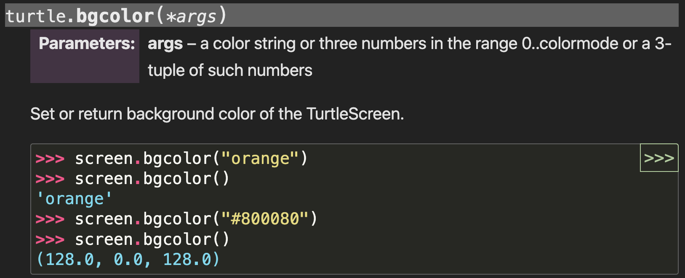
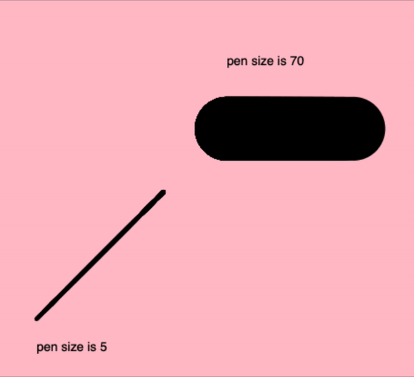
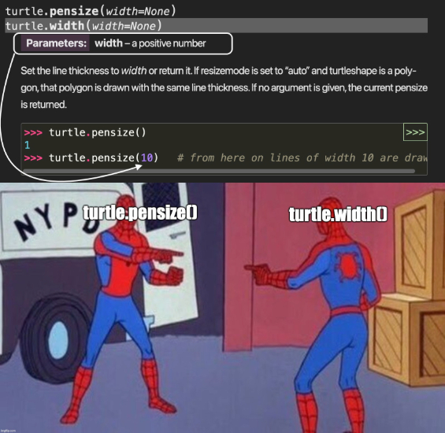

import ReactAudioPlayer from 'react-audio-player';
import audioFile from '../../static/audio/py1/wow.mp3';

# Lesson 2: The Art of Drawing with Python Turtle

:::info
<details style={{border:'none'}}>
    <summary>**Prerequisites: Before You Dive In!**</summary>

**Functions and Parameters**

Before we dive deeper into using more Turtle functions, let's talk about what a function is. 

A **function** is like a little machine in your program. You give it some information, it does something with that information, and then it might give something back. For example, in a game, you might have a function that calculates the score each time a player scores points. 

**Parameters** are the bits of information you give to the function. Think of them as ingredients in a recipe. Just like you might need eggs, flour, and sugar to make a cake, a function needs parameters to do its job.

Here's a simple example: 

Imagine you have a function in Turtle that draws a square. The parameter might be the size of the sides of the square. You tell the function how long each side should be, and it uses that information to draw the square for you.

Functions help you reuse code without having to write it over and over again. You can write the function once, and then use it many times with different parameters to do similar tasks. This makes your code cleaner, easier to read, and easier to manage.

</details>
:::

:::info
<details style={{border:'none'}}>
    <summary><strong>Coach Note!</strong></summary>

Here's what you'll be learning in this section, based on your current level:
<details style={{border:'none'}}>

<summary>**Standard**</summary>
<ul>
- Explore the Turtle documentation, understanding how technical guides are laid out and how to use them to your advantage!
- Discover how functions act like little helpers in your code, taking in information (parameters) and performing tasks. You'll learn to use Turtle functions to draw basic shapes and control the screen.
- Start by creating simple geometric shapes. You'll draw your first square and see how changing commands can turn it into a rectangle. This is your first step in turning code into art!
- Learn how to change the background color of the Turtle screen to make your drawings stand out. It’s a simple way to add flair to your projects!
- The basic commands for lifting the pen (`penup()`) and placing it back down (`pendown()`).

</ul>
</details>

<details style={{border:'none'}}>

<summary>**Advanced**</summary>

- Dive deeper by designing your own functions to draw more complex shapes. You’ll learn how to use loops and conditions to automate repetitive tasks and create intricate designs.
- Expand your drawing skills beyond basic shapes. You’ll tackle circles, polygons, and even fun challenges like drawing a smiley face using advanced Turtle commands.
- Take control of the Turtle canvas by learning to dynamically change screen features in response to user actions. Discover how to make your programs interactive and responsive.
- Pure functions versus side effects with respect to Turtle environment.

</details>

</details>
:::
## Objective 🧐🗿
Get ready to turn code into art as we explore how to use functions and parameters to draw shapes and spice up our screen with vibrant colors!

## Drawing Shapes 📒 🖍️
Now that we know the movements of the turtle, we can move on to making actual shapes! 

Let's start by drawing polygons since they all consist of straight lines connected at certain angles. 
### Drawing a Square
To draw a square, we need to move forward and turn right four times. Here's how you can do it:

```python
t.fd(100)
t.rt(90)
t.fd(100)
t.rt(90)
t.fd(100)
t.rt(90)
t.fd(100)
```

<details>
    <summary>**CHALLENGE: 🧑‍🎨🖌️ Draw a Rectangle 🧑‍🎨🖌️**</summary>

Try to draw a rectangle. Remember, in a rectangle, all four sides are not equal. You'll need to adjust the code accordingly. Can you figure it out?
Show your coach once you're done (or check out below for some help)!

<details>

    <summary>**HINT 🤫**</summary>

    To draw a rectangle, you can change the length of the sides. Here's an example:

```python
t.fd(200)  # Move forward by 200 units (longer side)
t.rt(90)   # Turn right by 90 degrees
t.fd(100)  # Move forward by 100 units (shorter side)
t.rt(90)   # Turn right by 90 degrees
t.fd(200)  # Move forward by 200 units (longer side)
t.rt(90)   # Turn right by 90 degrees
t.fd(100)  # Move forward by 100 units (shorter side)
```
</details>

</details>

### Drawing Preset Figures
Suppose we want to draw a circle. If we attempt to draw it in the same way as we drew the square, then it would be extremely tedious, and you’d have to spend a lot of time just for that one shape!

Thankfully, the Python turtle library provides a solution for this. You can use a single command to draw a circle:

``` python
t.circle(60)
```

The number within the parentheses is the **radius** of the circle. You can increase or decrease the size of the circle by changing the value of its radius.

In the same way, you can also draw a dot, which is nothing but a filled-in circle. Type in this command:

``` python
t.dot(20)
```

<details>
    <summary>**CHALLENGE: 🙂 Draw a Smiley Face 🙂**</summary>

Time to put on your thinking cap! Your challenge is to draw a smiley face using the knowledge we've learned so far. 

You may need some help since we haven't gone over all the turtle functions necessary to do this. If you get stuck, take a peek at the code below and continue trying it out yourself!
<details>
    <summary>**HINT 🤫**</summary>
```python
t.speed(0)  # Set the drawing speed

# Draw the face
t.penup()
t.goto(0, -100)  # Move to the starting position for the face
t.pendown()
t.circle(100)  # Draw a circle with radius 100 for the face

# Draw the eyes using dot
t.penup()
t.goto(-35, 40)  # Position for the left eye
t.dot(20, 'black')  # Draw the left eye

t.goto(35, 40)  # Position for the right eye
t.dot(20, 'black')  # Draw the right eye

# Draw the smile
t.goto(-60, -20)
t.pendown()
t.setheading(-60)  # Angle the turtle to start the smile
t.circle(70, 120)  # Draw the smile
```
</details>

</details>

## Screen Color 🖥️ 🎨
By default, Turtle always opens up a screen with a white background. This is kind of boring, right? Let's change things up with the following command:

```python
s.bgcolor("blue")
```

From the [turtle documentation](https://docs.python.org/3/library/turtle.html#turtle.bgcolor), we can see that the `bgcolor()` function will take in a **color string** or a **color’s hex code number**.
<div align="center">
    
</div>

**Screen Color Practice**

Try changing the color of the background to your favorite color. Feel free to use a [color picker](https://htmlcolorcodes.com/color-picker/) site to find your unique shade!

Show your coach once you’re done! 
<details>
    <summary>**Need some help? 👀**</summary>

    To change the background color to your favorite color, use the `screen.bgcolor()` function and specify the color name or hex code as a string. 
    
    For example, to change the background color to red we have three different options:

```python
# We can pass in red as the word
s.bgcolor("red") 

# We can pass in red as its hex code
s.bgcolor("#FF0000") 

# We can pass in red as its RGB
s.bgcolor((255, 0, 0)) 
```
</details>

## Pen Width 🖋️ 📐

Sometimes we may need to increase or decrease the thickness of the pen. Turtle gives us the ability to do so. Check it out below!
<div align="center">
    
</div>
<div align="center">
    <ReactAudioPlayer
        src={audioFile}
        controls
    />
</div>


We'll want to make sure we pass in a positive number into the `pensize()` function.
We can do so with these simple commands:
```python
t.forward(100)
t.pensize(5)
t.forward(100)
```


<figure align="center">
  <figcaption>
  We can also use `width()` to achieve the same result. Just like `pensize()`, `width()` takes in a positive number. 
 </figcaption>
</figure>

<div align="center">
    
</div>

Go ahead and adjust our pen using `width()` and show your coach once complete!

<details>
    <summary>**Need some help? 👀**</summary>

Here's how we can change the pen's width to 3. 

```python
t.forward(100)
t.width(3)
t.forward(100)
```

Now try it on your own, with your lucky number as the new width!
</details>

## Picking the Pen Up and Down ⬆️ ⬇️

Sometimes, you may want to move your turtle to another point on the screen without drawing anything on the screen itself. 

To do this, you use `.penup()`. Then, when you want to start drawing again, you use `.pendown()`.

```python
t.fd(100)
t.rt(90)
t.penup()
t.fd(100)
t.rt(90)
t.pendown()
t.fd(100)
t.rt(90)
t.penup()
t.fd(100)
t.pendown()
```

<br  />
- [x] **Well done! You've transformed lines of code into beautiful drawings and learned how to customize your canvas and turtle to bring your creative ideas to life!**
<br  />