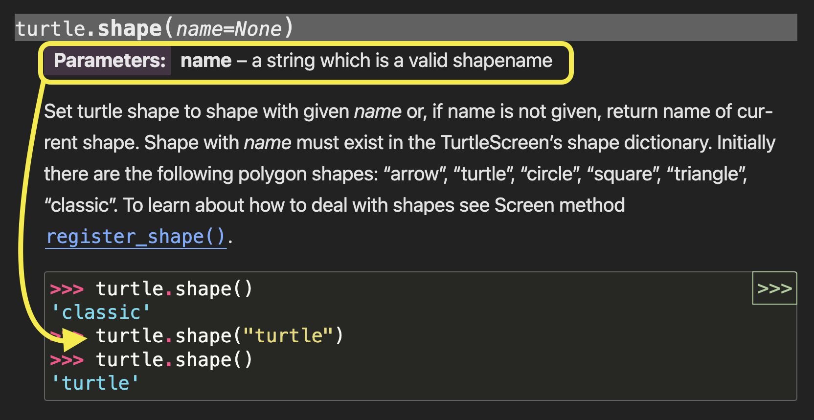
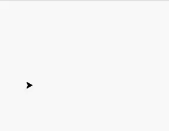
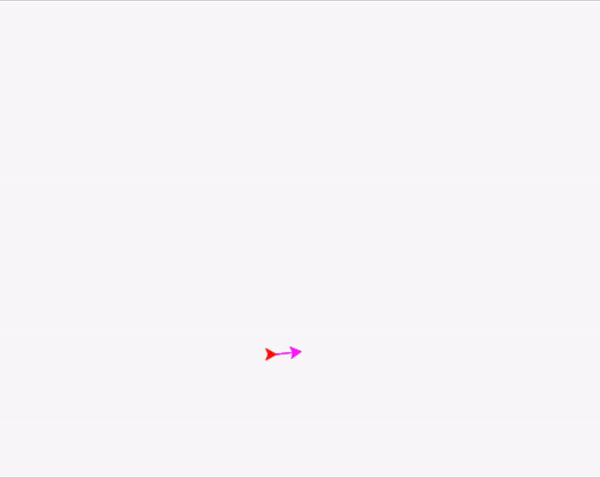

import ReactAudioPlayer from 'react-audio-player';
import audioFile from '../../static/audio/py1/py1wee.mp3';
import audioFileTwo from '../../static/audio/py1/speed.mp3';

# Lesson 3: Customizing Your Turtle

:::info
<details style={{border:'none'}}>
    <summary><strong>Coach Note!</strong></summary>

Here's what you'll be learning in this section, based on your current level:
<details style={{border:'none'}}>

<summary>**Standard**</summary>

- Personalize the appearance of your turtle by changing its shape and color. This will help you grasp the basics of using functions and parameters within the Turtle module.
- Continue to learn about different Turtle methods.
- Set forth on your own journey through the Turtle documentation with the guide of your coach!
- The concept of leaving a stamp with `stamp()`

</details>

<details style={{border:'none'}}>

<summary>**Advanced**</summary>

- To continue on learning about functions and parameters, your coach will further explain the different data types for parameters. 
- If the code examples aren't quite clicking for you, don't worry! Your coach will outline specific Turtle methods relevant to the lesson. Your challenge is to find these methods in the Turtle documentation and implement them on your own. Continue this throughout the tutorial if needed.

</details>

</details>
:::
## Objective 🧐🗿
Let's personalize your turtle by experimenting with different shapes, speeds, and colors, and see how we can fill our drawings with splashes of color!

## Turtle Shape 🟠 🟫
The initial shape of the turtle isn’t really a turtle, but a triangular figure. However, we can change the way the turtle looks, and we do have a couple of options when it comes to doing so. 

Let’s have a look at them by typing in these following commands:

```python
t.speed(2)
t.penup()

t.shape("turtle")
t.forward(50)
t.shape("arrow")
t.forward(50)
```

The shape of the turtle will change accordingly, like this:

<div align="center">
    
</div>
<div align="center">
    <ReactAudioPlayer
        src={audioFile}
        controls
    />
</div>

Let’s take a look at the shape section within Python turtle documentation: 

<div align="center">
    
</div>

As you can see, we are given some initial shapes to work with. Choose one, and change your turtle’s shape to it. 

Show your coach your work once you’re done!

<details>
    <summary>**Need some help? 👀**</summary>

To change your turtle's shape, use the `shape()` function and specify the shape name as a string. 

For example, to change your turtle's shape to a triangle:

```python
t.shape("triangle")
```
Now that you know, look back at the screenshot above and change your turtle's shape to one we haven't gone over yet!
</details>

## Turtle and Pen Color 🐢 🖊️
When you start drawing with Python Turtle, the turtle is initially a black figure that is drawing with black ink. But did you know you can change both the color of the turtle itself and the color of the pen it uses to draw? 

You can change the color of the turtle (fill color) and the color of the pen (outline or ink color) using the following commands:

``` python
t.fillcolor("red")   # Change the turtle's fill color to red
t.pencolor("green")  # Change the pen color to green
```

## Filling in an Image 🖼️ 🔴
Coloring in an image usually makes it look better, doesn’t it? The Python turtle library gives you the option to add color to your drawings. Try typing in the following code and see what happens:

```python
t.begin_fill()
t.fd(100)
t.lt(120)
t.fd(100)
t.lt(120)
t.fd(100)
t.end_fill()
```
When you use `.begin_fill()`, you're letting your program know that you're about to draw a shape with closed boundaries that you want to fill in with color.

After drawing your shape, you use `.end_fill()` to signal that you've finished drawing and the shape should now be filled with the chosen color.


## Turtle Speed 🐢 💨
The turtle generally moves at a moderate pace. If you want to decrease or increase the speed to make your turtle move slower or faster, then you can do so by typing the following:

``` python
t.speed(1)
t.forward(100) 

t.penup()
t.goto(50,50)

t.pendown()
t.speed(10)
t.forward(100)
```
This code will first decrease the speed and move the turtle forward, then increase the speed and move the turtle forward again, like this:

<div align="center">
    
</div>

<div align="center">
    <ReactAudioPlayer
        src={audioFileTwo}
        controls
    />
</div>

**Scavenger Hunt Time!**

Head over to the turtle documentation: https://docs.python.org/3/library/turtle.html#turtle.speed

What are the fastest, fast, normal, slow and slowest speeds? 

Adjust your code above to demonstrate them!


<details>
    <summary>**HINT 🤫**</summary>

Here are the different speeds:

- Fastest: `t.speed(0)`
- Fast: `t.speed(10)`
- Normal: `t.speed(6)`
- Slow: `t.speed(3)`
- Slowest: `t.speed(1)`

Adjust your code to include these speed settings and observe how the turtle's speed changes with each setting.
</details>

## Leaving a Stamp 📍 👋

You have the option of leaving a stamp of your turtle on the screen, which is nothing but an imprint of the turtle as the line is drawn. 


<div align="center">
    
</div>

<figure align="center">
  <figcaption>
This figure from Section 1 is actually a cumulation of turtle stamps, 50 units apart.
 </figcaption>
</figure>

Try typing in this code to see how it works:
``` python
t.stamp()
t.fd(100)
t.stamp()
t.fd(100)
```

## Cloning Your Turtle 🐢 🐢
Sometimes, we may need to have more than one turtle on your screen. We’ll see an example of this later on in the final project. 

For now, let’s get another turtle by cloning your current turtle into your environment. Try running this code to create a clone turtle, `c`, and then move both the turtles on the screen:

```python
c = t.clone()
t.color("magenta")
c.color("red")
t.circle(100)
c.circle(60)
```

The output will look like this:
<div align="center">
    
</div>

<details>
    <summary>**End of Section Challenge 🔚 ✅**</summary>

So far we've been over how to move our turtle, how to draw different shapes, how to manipulate our screen, and several other things. 

Now it's time put that thinking cap on once again and create a fun turtle drawing. This could be anything you think of! 

You can ask a friend or your coach for some help brainstorming. Once you're done with your masterpiece, show it off to your coach!
</details>


<br  />
- [x] **Fantastic job! Your turtle now reflects your unique style with its new look and swift movements, making coding as fun as it is colorful!**
<br  />