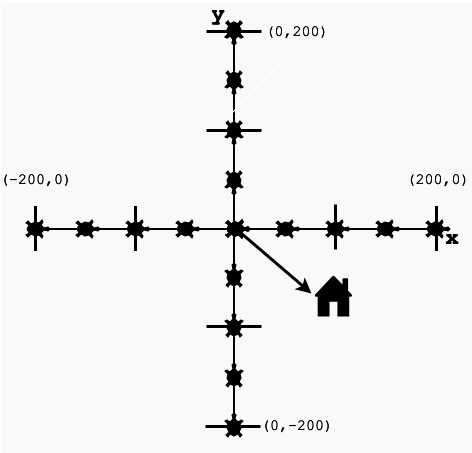
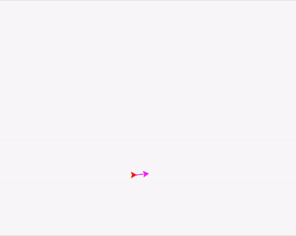

# Lesson 4: Advanced Turtle Techniques

## Objective 🧐🗿
Take your turtle skills to the next level by learning advanced techniques like lifting the pen, stamping, and even cloning your turtle for complex patterns!

## Picking the Pen Up and Down ⬆️ ⬇️

Sometimes, you may want to move your turtle to another point on the screen without drawing anything on the screen itself. 

To do this, you use `.penup()`. Then, when you want to start drawing again, you use `.pendown()`.

```python
t.fd(100)
t.rt(90)
t.penup()
t.fd(100)
t.rt(90)
t.pendown()
t.fd(100)
t.rt(90)
t.penup()
t.fd(100)
t.pendown()
```

## Handling Changes ✈️ 🧭

### Undoing Actions
If you want to undo the very last thing you did, then type in the following:
```python
t.undo()
```

This undoes the last command that you ran. For example, you want to undo your last three commands, then you would type t.undo() three times.


### Clearing the Screen
Right now, you probably have a lot on your screen since you’ve started this tutorial. To make room for more, just type in the following command:

```python
t.clear()
```

This will clean up your screen so that you can continue drawing. Note here that your variables will not change, and the turtle will remain in the same position. 

### Resetting the Environment
You also have the option to start on a clean slate with a reset command. The screen will get cleared up, and the turtle’s settings will all be restored to their default parameters.

```python
t.reset()
```

This clears the screen and takes the turtle back to its home position. Your default settings, like the turtle’s size, shape, color, and other features, will also be restored.

## Leaving a Stamp 📍 👋

You have the option of leaving a stamp of your turtle on the screen, which is nothing but an imprint of the turtle as the line is drawn. 


<div align="center">
    
</div>

<figure align="center">
  <figcaption>
This figure from Section 1 is actually a cumulation of turtle stamps, 50 units apart.
 </figcaption>
</figure>

Try typing in this code to see how it works:
``` python
t.stamp()
t.fd(100)
t.stamp()
t.fd(100)
```

## Cloning Your Turtle 🐢 🐢
Sometimes, we may need to have more than one turtle on your screen. We’ll see an example of this later on in the final project. 

For now, let’s get another turtle by cloning your current turtle into your environment. Try running this code to create a clone turtle, `c`, and then move both the turtles on the screen:

```python
c = t.clone()
t.color("magenta")
c.color("red")
t.circle(100)
c.circle(60)
```

The output will look like this:
<div align="center">
    
</div>

<details>
    <summary>**End of Section Challenge 🔚 ✅**</summary>

So far we've been over how to move our turtle, how to draw different shapes, how to manipulate our screen, and several other things. 

Now it's time put that thinking cap on once again and create a fun turtle drawing. This could be anything you think of! 

You can ask a friend or your coach for some help brainstorming. Once you're done with your masterpiece, show it off to your coach!
</details>


<br  />
- [x] **Impressive progress! You've mastered advanced techniques that will help you in creating more sophisticated programs and designs with your turtle.**
<br  />