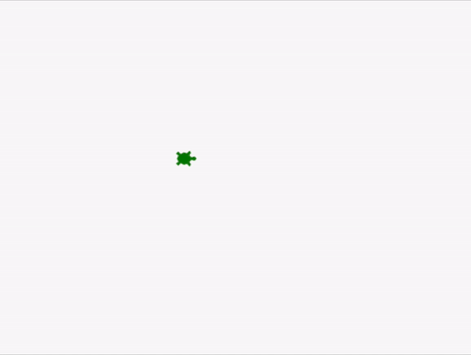
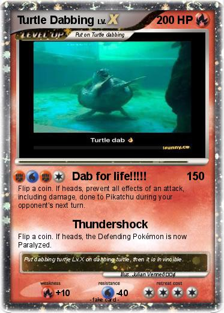

# Lesson 5: The Thrilling Python Turtle Race

:::info
<details style={{border:'none'}}>
    <summary><strong>Coach Note!</strong></summary>

Here's what you'll be learning in this section, based on your current level:
<details style={{border:'none'}}>

<summary>**Standard**</summary>

- Personalize the appearance of your turtle by changing its shape and color. This will help you grasp the basics of using functions and parameters within the Turtle module.

</details>

<details style={{border:'none'}}>

<summary>**Advanced**</summary>

- To continue on learning about functions and parameters, your coach will further explain the different data types for parameters. 
- If the code examples aren't quite clicking for you, don't worry! Your coach will outline specific Turtle methods relevant to the lesson. Your challenge is to find these methods in the Turtle documentation and implement them on your own. Continue this throughout the tutorial if needed.

</details>

</details>
:::

So far, you’ve learned how to customize your turtle environment, program your turtle to move around the screen, and use loops and conditional statements to improve your code. 

Now it’s time for the most important part of your programming journey. In this section, you’ll be implementing all that you’ve learned into a single program by creating a fun game that you can play with your friends.

<details>
    <summary>**Prerequisites: Before You Dive In!**</summary>

Before you begin, here’s what you need to know about the game:
    
    **1. The Objective:**
    
The player whose turtle reaches its home first wins the game.
    
    **2. How to Play:**
    - Each player rolls a dice to get a number.
    - The player then moves their turtle by that many steps.
    - The players alternate turns until one of them wins.

    **3. The Structure:**

    - Each player had a turtle indicated by a different color. You can have more than two players, but for the sake of this tutorial, you’ll be creating a two-player game.
    - Each turtle has a home position that it must reach.
    - Each player uses a die to choose a value at random for their turn. In your program, the die is represented by a list of numbers from 1 to 6.

    Now that you’ve understood the logic of the game, you can go ahead and begin creating it! First, you’ll need to set up the environment.
</details>

## Set Up the Environment 🌐
Start by importing the Python turtle library. 

After this, import the built-in random library, which you’ll use randomly select an item from a list:

## Setting Up the Turtles and Homes 🐢 🏠
You now have to create the two turtles that will represent the players. 

Each turtle will be a different color, corresponding to the different players. Here, player one is <span style={{ color: 'green' }}>green</span> and player two is <span style={{ color: 'blue' }}>blue</span>:

``` python
Try these steps on your own!
1. Create player one turtle
2. Change the turtle's color to green
3. Change the turtle's shape to turtle
4. Move the turtle's pen up
5. Make the turtle move to coordinates (-200,100)
```

We will make player two's turtle by clone player one's and changing its color. 
``` python
Try these steps on your own!
1. Create player two turtle
2. Change the turtle's color to bluie
3. Change the turtle's shape to turtle
4. Move the turtle's pen up
5. Make the turtle move to coordinates (-200,100)
```

Now, set up homes for the turtles, represented by circles. These are their finishing points. Make sure both homes are the same distance from the starting point. 


``` python
Try these steps on your own! This will be working on the player one's turtle.
1. Make the player one turtle move to  (200,60)
2. Move the turtle's pen down
3. Draw a circle with a radius of 40
4. Move the turtle's pen up
5. Make the turtle move to coordinates (-200,100)
```

``` python
Try these steps on your own! This will be working on the player two's turtle.
1. Make the player two turtle move to (200,-140)
2. Move the turtle's pen down
3. Draw a circle with a radius of 40
4. Move the turtle's pen up
5. Make the turtle move to coordinates (-200,100)
```

After drawing the respective homes, you send the turtles back to their starting positions:
<div align="center">
    
</div>

Awesome! The visual aspects of your game are complete. You can now create the die that you’ll be using to play the game.

## Creating the Die 🎲 ❓
In real life, you might prepare grocery lists and to-do lists to help you stay organized. In Python, lists work in a similar way.

You can create a virtual die for your game with a list, which is an ordered sequence of items. 
 
First, you define your list of numbers in ascending order from 1 to 6. You can define a list by giving it a name and then enclosing its items within square brackets, like this:

This list has now become your die. To roll the dice, all you have to do is program your system to randomly select a number from it. 
The number that is selected will be considered as the output of the die.

## Developing the Game 🕹️ ⌨️ 
It’s time to develop the code for the rest of the game. You’ll be using loops and conditional statements here, so you need to be careful with the indentations and spaces! 

To start, take a look at the steps your program will need to take to run the game:

```
Set up a loop that repeats 20 times:
    Check if Player One's position is at or beyond (200, 100):
        If true, print "Player One Wins!" and stop the game.
    Check if Player Two's position is at or beyond (200, -100):
        If true, print "Player Two Wins!" and stop the game.
    
    If neither player has won yet:
        Ask Player One to press 'Enter' to roll the die.
        Randomly choose a number from the die options.
        Print the result of the die roll.
        Calculate the number of steps by multiplying the die result by 20.
        Print the number of steps.
        Move Player One forward by the calculated number of steps.
        
        Ask Player Two to press 'Enter' to roll the die.
        Randomly choose a number from the die options, just like for Player One.
        Print the result of the die roll for Player Two.
        Calculate the number of steps for Player Two, just like for Player One.
        Print the number of steps for Player Two.
        Move Player Two forward by the calculated number of steps.
        
Repeat until the loop finishes or a player wins by reaching or passing their target position.

```
## Conclusion 🏁 🏁

Wow, we've finally made it to the end! Over these past sections, we really dived into the turtle library and became comfortable with the basics as well as some advanced features. 

You've learned how to create various shapes, control the speed and color of your turtle, and even animate simple drawings. Now you've got a cool game to show off to your friends and family.


Take this, you deserve it! 

<div align="center">
    
</div>