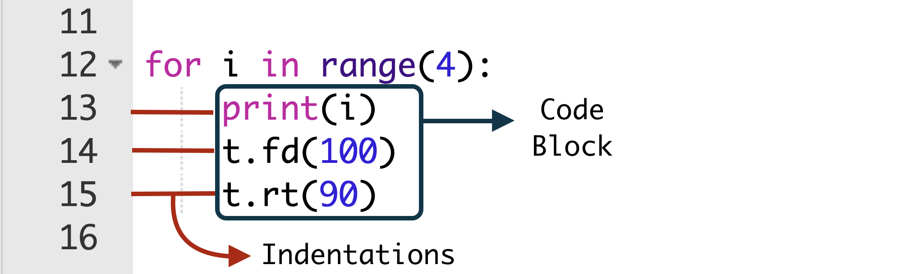
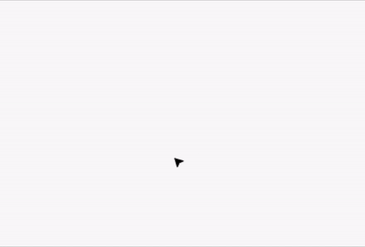

# Lesson 5: Mastering Loops and Conditional Logic

## Objective 🧐🗿

When you get into higher-level programming, you’ll find yourself using loops and conditional statements very often. 

That’s why, in this section, you’ll be going through a couple of turtle programs that make use of these types of commands.

## A Brief Intro 🏃 📝

- **Loops** are a set of instructions that are continuously repeated until a particular condition is satisfied.
- **Conditional statements** carry out a certain task based on a condition that’s satisfied.
- **Indentations** are used to define blocks of code, especially when using loops and conditional statements. In general, you create an indentation by tapping the Tab key on the keyboard.

## For Loops 4️⃣ 🔁

Do you remember the program that you used to create a square? You had to repeat the same line of code four times, like this:
```python
t.fd(100)
t.rt(90)
t.fd(100)
t.rt(90)
t.fd(100)
t.rt(90)
t.fd(100)
t.rt(90)
```

A much shorter way to do this is with the help of a for loop. Try running this code:
```python
for i in range(4):
    print(i)
    t.fd(100)
    t.rt(90)
``` 

Here, the i is like a counter that starts from zero and keeps increasing by 1. 

When you say `in range(4)`, you’re telling the program that the value of this i should be **less** than 4. It will terminate the program **before** i reaches 4.

Here’s a breakdown of how the program works:

- At the start of the code block, we are printing out the value of i. You'll see it starts from 0 and goes up to 3.
- At i = 0, the turtle moves forward by 100 units and then turns 90 degrees to the right.
- At i = 0 + 1 = 1, the turtle moves forward by 100 units and then turns 90 degrees to the right.
- At i = 1 + 1 = 2, the turtle moves forward by 100 units and then turns 90 degrees to the right.
- At i = 2 + 1 = 3, the turtle moves forward by 100 units and then turns 90 degrees to the right.
- The turtle will then exit the loop. 

## Indentation ➡️ ➡️

Indentation refers to the spaces at the beginning of a code line. 
Take a note at the whitespace after our `for i in range(4):` line. This is the **indentation**. 

This indicates that all 3 lines form a single block of code. 

<div align="center">
    
</div>

## While Loops ⏳ 🔂
The while loop is used to perform a certain task while a condition is still satisfied. If the condition is no longer satisfied, then your code will terminate the process. 

You can use a while loop to create a series of circles by typing in this code:
``` python
n = 10
while n <= 40:
    t.circle(n)
    n = n + 10
```
<figure align="center">
  <figcaption>
When you run this code, you’ll see the circles appearing one after the other, and each new circle will be larger than the previous one:
 </figcaption>
</figure>

<div align="center">
    
</div>

Here, n is used as a counter. You’ll need to specify by how much you want the value of n to increase in each loop. Take a look at this mini walk-through to see how the program works:

- At n = 10, the turtle draws a circle with a radius of 10 units. After that, the value of n is increased by 10. n is now 20.
- At n = 20, the turtle draws a circle with a radius of 20 units. Once again, the value of n is increased by 10. n is now 30.
- At n = 30, the turtle draws a circle with a radius of 30 units. For the third time, the value of n is increased by 10. n is now 40.
- At n = 40, the turtle draws a circle with a radius of 40 units. For the last time, the value of n is increased by 10. n is now 50. 
- At n = 50, n is no longer less than or equal to 40. The loop is terminated.

## Conditional Statements ☝️ ⛔
You use conditional statements to check if a given condition is true. If it is, then the corresponding command is executed. Try typing in this program:

### Using `if` 
```python
u = input("Would you like me to draw a shape? Type yes or no: ")
if u == "yes":
    t.circle(50)
```

`input()` is used to obtain input from the user. Here, it will store the user’s response under the variable `u`. 

Next, it will compare the value of `u` with the condition provided and check whether the value of `u` is "yes". 

If it’s "yes", then your program draws a circle. 

If the user types in anything else, then the program won’t do anything.

<details>
    <summary>**Note: Comparsion Operator**</summary>

The comparison operator == indicates a comparison. It’s used to check if the value of something is equal to something else. 

The assignment operator = is used to assign a value to something.
</details>

### Using `else` 

When you add an else clause to an if statement, you can specify two results based on whether the condition is true or false.

Let’s see this in a program:

```python
u = input("Would you like me to draw a shape? Type yes or no: ")
if u == "yes":
    t.circle(50)
else:
    print("Okay")
```

Here, you tell the program to display a particular output even when the user does not say "yes". You use `print()` to display some pre-defined characters on the screen.

**NOTE: User Input**

The user doesn’t need to type "no". They can type anything else, in which case, the result will always be "Okay", because you’re not explicitly telling the program that the user needs to type "no". 

Not to worry, however, as that can be fixed. You can add an `elif` clause to provide the program with several conditions and their respective outputs, as you can observe next.

### Using `elif` 
```python
u = input("Would you like me to draw a shape? Type yes or no: ")
if u == "yes":
    t.circle(50)
elif u == "no":
    print("Okay")
else:
    print("Invalid Reply")
```
As you can see, this program now has more than one outcome, depending on the input it receives. Here’s how this code works:

- If you type in "yes", then the code processes the input and draws a circle, as per your instructions.
- If you type in "no", then the code prints out "Okay" and your program is terminated.
- If you type in anything else, like "Hello" or "Sandwich", then the code prints "Invalid Reply" and your program is terminated.

<br  />
- [x] **You've done a spectacular job! Alright, we've covered some key Python concepts using Turtle graphics! Now, it's time to put our newfound skills to the test with our final project. Head over to the next section get started!**
<br  />