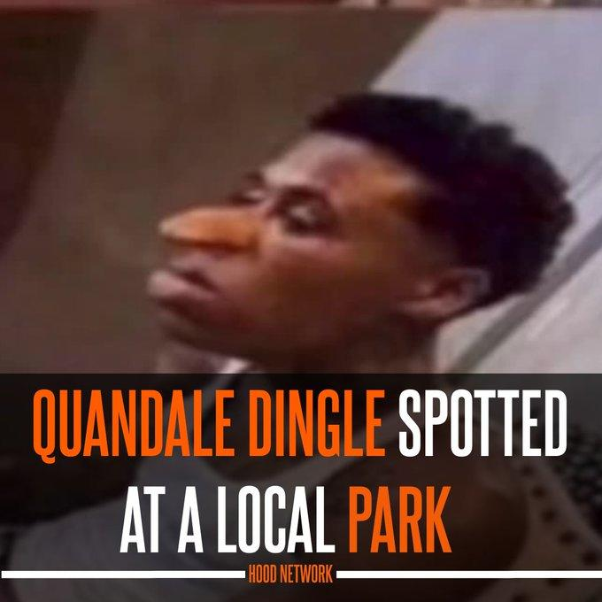

import ReactPlayer from 'react-player'
import ReactAudioPlayer from 'react-audio-player';
import audioFile from '../../static/audio/entre1/stage5meme.mp3';

# Stage 5: Fireball Footpath

:::info

    
**Prerequisites: Before You Dive In!**

    To embark on the fiery adventure of Stage 5: Fireball Footpath, you'll need to complete a series of exciting challenges to prepare yourself! Here's what you need to master before diving into the flames:

    **1. Intro**

    Get ready to ignite your coding journey with an introduction to the basics!

    **2. Setup**

    Equip yourself with the essential tools and knowledge to navigate the Roblox world like a true coding champion!

    **3. Stage 1: Ascending Walls**

    Conquer the heights and sharpen your skills by scaling the walls of coding excellence!

    **4. Stage 2: Sphere Stairs**

    Roll into the next stage of coding expertise as you ascend the spherical steps towards mastery!

    **5. Stage 3: Plank Walkway**

    Balance your way through the challenges and hone your precision on the wobbly planks of coding creativity!

    **6. Stage 4: KillBrick Path**

    Navigate the treacherous path of kill bricks and sharpen your reflexes in the face of danger!

    **Once you've conquered these stages, you'll be ready to face the blazing inferno of Stage 5: Fireball Footpath! Are you prepared to dance through the flames and emerge victorious? Let's find out! 🌟🔥**

:::

 

      <iframe src="https://player.vimeo.com/video/952507738?h=3aec82b7bd" frameborder="0" allow="autoplay; fullscreen; picture-in-picture; clipboard-write" style="position:absolute;top:0;left:0;width:100%;height:100%;" title="Roblox Entrepreneur Part 1 - Stage 5 (Easy)"></iframe>
    

    
  `
}} />

## Objective 🧐🗿

Welcome to the fiery challenge of Stage 5! Brace yourself as we venture into the realm of the Fireball Footpath.

## Description 📖🪶

Welcome to Stage 5: Fireball Footpath, where things are heating up as we crank up the challenge! Get ready to feel the burn as we dial up the fireball frequency and size! Are you prepared to brave the flames and emerge victorious?

We are going to create a script that makes a part in Roblox shoot fireballs. The fireballs will be created at random times, move in a straight line, and explode when they touch a player. Here's what we want to accomplish: 

**1. Create Fireballs:**

The script will create new fireballs at random intervals. 

**2. Move Fireballs:**

Each fireball will move forward at a random speed. 

**3. Explode on Touch:**

If a fireball touches a player, it will explode and disappear. 

**4. Remove Fireballs After Time:**

Fireballs will automatically be removed after a short time if they don't touch anything. 

**By doing this, we will create an exciting effect where fireballs are continuously shot from a part, creating dynamic gameplay.** 

## Instructions and Code Logic 📝📚

### Step 1 - Set Up the Starting Variables

- Create a variable for the part by setting it to the `Parent` of the script. 

- Get the `ServerStorage` and `Players` services from the game. 

- Get the `Debris` service from the game to help remove items. 

- Create a variable for the speed of the fireballs with a random value between 10 and 20. 

- Create a variable for the time after which the fireballs will be removed (`removalTime`). 

- Create a variable for the time between each fireball spawn with a random value between 1 and 5 (`spawnTime`). 

- Create a variable for the color of the fireballs (`myBrickColor`). 

### Step 2 - Create a Function

- Define a function named `createFireBall` to handle making new fireballs. 

- Inside the function, create a new part and set it up to look like a fireball. 

- Set the fireball's size to a random value between 2 and 5. 

- Make the fireball's color neon red. 

- Add a `BodyVelocity` to the fireball to make it move forward. 

### Step 3 - Set Fireball Movement

- Set the velocity of the fireball to make it move in the direction the part is facing, multiplied by the speed. 

### Step 4 - Set Fireball Position

- Set the position of the fireball to be just in front of the part. 

### Step 5 - Handle Fireball Touch

- Connect a function to the fireball's `Touched` event to check if it hits a player. 

- If the fireball touches a player, create an explosion at the fireball's position and destroy the fireball. 

### Step 6 - Remove Fireballs After Time

- Use the `Debris` service to remove the fireball after the `removalTime`. 

### Step 7 - Create Fireballs Continuously

- Create a loop that runs forever using `while true do`. 

- Inside the loop, call the `createFireBall` function to make a new fireball. 

- Pause the loop for the `spawnTime` before creating the next fireball. 

## Putting It All Together 🔧🔩

- Start by setting up your part, services, and fireball properties. 

- Define a function named `createFireBall` to handle making new fireballs. 

- Inside the function, create a new fireball and set its properties. 

- Set the fireball to move forward and check for player touches to cause explosions. 

- Use the `Debris` service to remove fireballs after a short time. 

- Create an infinite loop to keep making new fireballs at random intervals. 

    
**Medium: Fireball cannons that flash up and down!**

    
    

        <iframe src="https://player.vimeo.com/video/952507755?h=b6b5ec1dec" frameborder="0" allow="autoplay; fullscreen; picture-in-picture; clipboard-write" style="position:absolute;top:0;left:0;width:100%;height:100%;" title="Roblox Entrepreneur Part 1 - Stage 5 (Medium)"></iframe>
        

        
    `
    }} />

     

    **Description 📖🪶** 

    We are going to create a script that makes a brick in Roblox move up and down continuously. Additionally, it will create a fireball at each position change. Here's what we want to accomplish: 

    *1. Move Up and Down:*
    
    The brick will move up to a certain height and then move back down to its original position. 

    *2. Smooth Movement:*
    
    The movement will be smooth and continuous. 

    *3. Create Fireball:*
    
    At each position change, a fireball will be created. 

    *By doing this, the brick will create a smooth up and down animation effect and spawn fireballs.* 

     

    **Instructions and Code Logic 📝📚**

    Step 1 - Set Up the Starting Variables

    - Create a variable for the brick by setting it to the `Parent` of the script. 

    - Store the original height of the brick. 

    - Set the maximum height the brick will move up to (`maxHeight`). 

    - Set the speed at which the brick will move (`moveSpeed`). 

    - Create a true/false variable to know if the brick is moving up (`isAscending`). 

    Step 2 - Create a Function

    - Define a function named `moveUpAndDown`. 

    - Inside the function, check if `isAscending` is true. 

    - If true, move the brick up by adding to its Y position using `Vector3`. 

    - If the brick reaches `maxHeight`, set `isAscending` to false. 

    - If false, move the brick down by subtracting from its Y position using `Vector3`. 

    - If the brick reaches its original height, set `isAscending` to true. 

    Step 3 - Create an Infinite Loop

    - Create a loop that runs forever using `while true do`. 

    - Inside the loop, call the `moveUpAndDown` function to move the brick. 

    - Call a function to create a fireball (`createFireBall`). 

    - Use the `wait` function to pause the loop for a short time. 

     

    **Putting It All Together 🔧🔩**

    - Start by setting up your brick, height, speed, and direction variables. 

    - Define a function named `moveUpAndDown` to handle the continuous movement. 

    - Inside the function, move the brick up or down based on the `isAscending` variable. 

    - Create an infinite loop using `while true do` to keep calling the `moveUpAndDown` function and create fireballs. 

    - Use the `wait` function to pause the loop during each iteration. 

    
**Hard: Smoothly animate those fireball cannons!**

    
    

        <iframe src="https://player.vimeo.com/video/952507750?h=5b2bfec1a9" frameborder="0" allow="autoplay; fullscreen; picture-in-picture; clipboard-write" style="position:absolute;top:0;left:0;width:100%;height:100%;" title="Roblox Entrepreneur Part 1 - Stage 5 (Hard)"></iframe>
        

        
    `
    }} />

     

    **Description 📖🪶** 

    We are going to create a script that makes a brick in Roblox move up and down continuously using tween animations. Here's what we want to accomplish: 

    *1. Move Up and Down:*
    
    The brick will move up to a certain height and then move back down to its original position. 

    *2. Smooth Movement:*
    
    The movement will be smooth and continuous. 

    *By doing this, the brick will create a smooth up and down animation effect.* 

     

    **Instructions and Code Logic 📝📚**

    Step 1 - Set Up the Starting Variables

    - Get the `TweenService` from the game. 

    - Create a variable for the brick by setting it to the `Parent` of the script. 

    - Store the original position of the brick. 

    - Set the maximum height the brick will move up to (`maxHeight`). 

    - Set the speed at which the brick will move (`moveSpeed`). 

    Step 2 - Create the Functions

    - Define a function named `createTween` that takes a `targetPosition` as an argument. 

    - Inside the function, create a `TweenInfo` object to define the properties of the tween animation: 

        - Time it takes for the tween to complete (`moveSpeed`). 

        - Easing style (`Linear`). 

        - Easing direction (`InOut`). 

        - Number of times to repeat (`0`). 

        - Should it reverse when complete (`false`). 

        - Delay before starting (`0`). 

    - Define the goal position for the tween. 

    - Create and return the tween object using `TweenService:Create`. 

    - Define a function named `moveUpAndDown`. 

    - Inside the function, create a tween to move the brick up by calling `createTween` with the target position being the original position plus the maximum height. 

    - Create a tween to move the brick down by calling `createTween` with the original position. 

    - Connect a function to the `Completed` event of the ascending tween to play the descending tween when the ascending tween finishes. 

    - Connect a function to the `Completed` event of the descending tween to play the ascending tween when the descending tween finishes. 

    - Call the `moveUpAndDown` function to start the up and down movement. 

     

    **Putting It All Together 🔧🔩**

    - Start by setting up your tween service, brick, and other variables. 

    - Define a function named `createTween` to create tweens. 

    - Define a function named `moveUpAndDown` to handle the continuous movement. 

    - Inside the function, create tweens for moving up and down, and handle their completion events to loop the movement. 

    - Call the `moveUpAndDown` function to start the movement. 

 

**Congratulations! You've triumphed over the fiery challenges of Stage 5 and are now prepared to soar to even greater heights in Stage 6! 🌟**

    

    <ReactAudioPlayer
        src={audioFile}
        controls
    />

