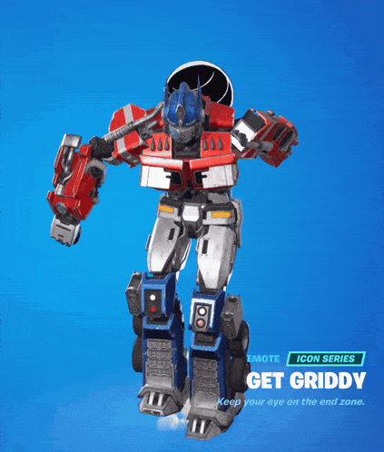

import ReactPlayer from 'react-player'
import MyVideoUrl from './video/Stage9.mp4';
import MyVideoUrl2 from './video/entre9medium.mp4'
import ReactAudioPlayer from 'react-audio-player';
import audioFile from './video/stage9meme.mp3';

# Stage 9: Kinetic KillWall

    
**Prerequisites: Before You Dive In!**

    Prepare yourselves for the next adventure! Before embarking on Stage 9's thrilling journey through the Kinetic KillwWall, ensure you've conquered the following challenges:

    **1. Intro**

    Begin your journey into the world of obstacles and challenges.

    **2. Setup**

    Lay the groundwork for your adventure by preparing your environment.

    **3. Stage 1: Ascending Walls**

    Scale towering walls to reach new heights.

    **4. Stage 2: Sphere Stairs**

    Navigate a staircase of spheres to advance.

    **5. Stage 3: Plank Walkway**

    Traverse a precarious path made of planks.

    **6. Stage 4: KillBrick Path**

    Brave a path littered with deadly obstacles.

    **7. Stage 5: Fireball Footpath**

    Dodge fireballs as you make your way forward.

    **8. Stage 6: Military Minefield**

    Navigate through a field of hidden dangers.

    **9. Stage 7: Rolling Rocks**

    Evade rolling boulders as you progress.

    **10. Stage 8: Spinning KillBricks**

    Conquer platforms while avoiding spinning obstacles.

    **Once you've triumphed over these trials, you'll be ready to face the Kinetic KillWall head-on!🚀🌟**

  <ReactPlayer controls url={MyVideoUrl}/>

## Objective 🧐🗿

Get ready for the pulse-pounding excitement of Stage 9: Kinetic Killwall! Brace yourselves as you dive into a whirlwind of action and strategy.

## Description 📖🪶

Let's raise the stakes in Stage 9 by adding a thrilling twist to our doorways - they'll flicker on and off, adding an extra layer of excitement to our adventure!

We are going to create a script that makes a part in Roblox change its color and whether it can be collided with or not. Here's what we want to accomplish: 

**1. Change Color:**

The part will switch between green and red. 

**2. Toggle Collision:**

The part will change whether it can be collided with or not when it changes color. 

**3. Repeat Continuously:**

The part will keep changing color and collision status in a loop. 

**By doing this, the part will keep switching colors and collision states, creating an interesting effect.** 

## Instructions and Code Logic 📝📚

### Step 1 - Set Up the Starting Variables

- Create a variable for the part by setting it to the `Parent` of the script. 

- Create a variable for the green color. 

- Create a variable for the red color. 

- Create a variable for the delay between swaps (`swapDelay`). 

### Step 2 - Create a Function

- Define a function named `swapColor`. 

- Inside the function, change the part's color to green and set `CanCollide` to false. 

- Pause the function for the `swapDelay`. 

- Change the part's color to red and set `CanCollide` to true. 

- Pause the function for the `swapDelay`. 

### Step 3 - Create an Infinite Loop

- Create a loop that runs forever using `while true do`. 

- Inside the loop, call the `swapColor` function to keep swapping the part's color and collision status. 

## Putting It All Together 🔧🔩

- Start by setting up your part and color variables. 

- Define a function named `swapColor` to change the part's color and collision status. 

- Inside the function, switch the part's color and collision state and pause for the `swapDelay`. 

- Create an infinite loop using `while true do` to keep calling the `swapColor` function.

    
**Medium: A moving kill wall that changes speed randomly!**

    

        <ReactPlayer controls url={MyVideoUrl2}/>
    

     
    
    **Description 📖🪶** 

    We are going to create a script that makes a part in Roblox move back and forth continuously along the Z-axis. Additionally, if a player touches the part, their health will be set to zero. Here's what we want to accomplish: 

    *1. Move Back and Forth:*
    
    The part will move back and forth along the Z-axis. 

    *2. Random Speed:*
    
    The speed of the movement will be updated randomly. 

    *3. Detect Touch:*
    
    If a player touches the part, their health will be set to zero. 

    *By doing this, the part will create a dynamic movement and interaction with players in the game.* 

     

    **Instructions and Code Logic 📝📚**

    Step 1 - Set Up the Starting Variables

    - Create a variable for the part by setting it to the `Parent` of the script. 

    Step 2 - Create a Function

    - Define a function named `PlayerTouched` that takes a part (`Part`) as an argument. 

    - Inside the function, get the parent of the touched part (which should be a player's character). 

    - Check if the parent is a player's character. 

    - If it is, set the player's health to zero. 

    - Connect the `PlayerTouched` function to the part's `Touched` event. 

    Step 3 - Create an Infinite Loop

    - Create a loop that runs forever using `while true do`. 

    - Inside the loop, update the speed randomly. 

    - Move the part backwards along the Z-axis in small steps. 

    - Wait for a short time before moving again. 

    - Update the speed randomly. 

    - Move the part forwards along the Z-axis in small steps. 

    - Wait for a short time before moving again. 

    - The loop will automatically start running and moving the part back and forth. 

     

    **Putting It All Together 🔧🔩** 

    - Start by setting up your part. 

    - Define a function to handle player touch. 

    - Connect the `PlayerTouched` function to the part's `Touched` event. 

    - Create an infinite loop to keep moving the part back and forth. 

    - Use the `wait` function to pause the loop during each iteration. 

    
**Hard: Add in some unpredictability with random pauses!**

    **Description 📖🪶** 

    We are going to create a script that makes a part in Roblox move back and forth continuously using tweens. The part will pause randomly during its movement and will reset a player's health to zero if touched. Here's what we want to accomplish: 

    *1. Move Back and Forth:*
    
    The part will move forward and backward along the Z-axis. 

    *2. Random Speed and Pauses:*
    
    The speed of the movement and pauses will be random. 

    *3. Detect Touch:*
    
    If a player touches the part, their health will be set to zero. 

    *By doing this, the part will create a dynamic and interactive environment.* 

     

    **Instructions and Code Logic 📝📚** 

    Step 1 - Set Up the Starting Variables

    - Get the `TweenService` from the game. 

    - Create a variable for the part by setting it to the `Parent` of the script. 

    Step 2 - Create a Function

    - Define a function named `PlayerTouched` that takes a part (`Part`) as an argument. 

    - Inside the function, get the parent of the touched part (which should be a player's character). 

    - Check if the parent is a player's character. 

    - If it is, set the player's health to zero. 

    - Connect the `PlayerTouched` function to the part's `Touched` event. 

    - Define a function named `getRandomPause` that returns a random pause duration between 1 and 2 seconds. 

    - Define a function named `getRandomSpeed` that returns a random speed between 1 and 3 seconds. 

    - Define the maximum distance the part will move (`maxDistance`). 

    - Store the initial position of the part. 

    - Define a function named `createTween` that takes a target position and speed as arguments. 

    - Inside the function, set up the tween information (duration, easing style, direction, repeat count, reverse, delay). 

    - Create and return the tween to move the part to the target position. 

    - Define a function named `movePart`. 

    - Inside the function, create a loop that runs forever using `while true do`. 

    - In each loop iteration, create and play a tween to move the part forward. 

    - Pause randomly during the tween's playback. 

    - Create and play a tween to move the part backward. 

    - Pause randomly during the tween's playback. 

    - Call the `spawn` function with `movePart` to start the movement. 

         

    **Putting It All Together 🔧🔩** 

    - Start by setting up your part and services. 

    - Define functions to handle player touch, generate random pauses and speed, and create tweens. 

    - Create a function to handle continuous movement with random pauses. 

    - Connect the player touch function to the part's `Touched` event. 

    - Call the `spawn` function to start the movement. 

 

**Hooray! By navigating the twists and turns of Stage 9: Kinetic KillWall, you've showcased incredible bravery and ingenuity! Onward to Stage 10, where new adventures eagerly await your arrival! 🌟**

    

    <ReactAudioPlayer
        src={audioFile}
        controls
    />

