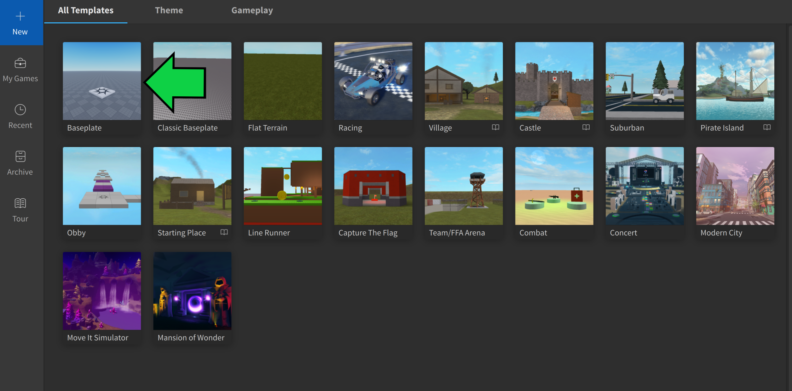
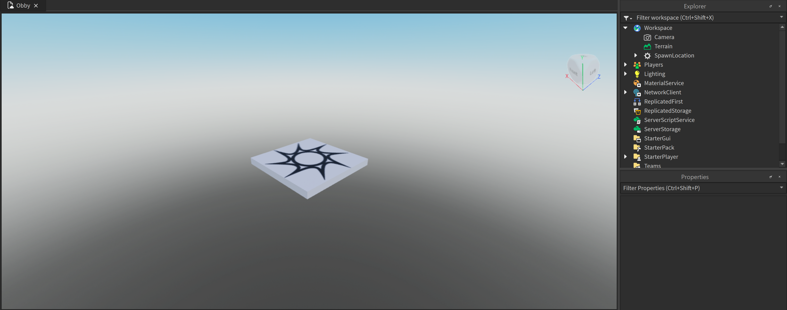

import ReactAudioPlayer from 'react-audio-player';
import audioFile from './video/nerd-emoji-sound.mp3';

    
**Prerequisites - Before You Dive In!**

    Hey there, future coding champions! Before we dive into our epic Obby adventure, let's make sure we're all set with these fun and essential skills:

    [**Interface Exploration**](https://create.roblox.com/docs/studio/ui-overview): Get ready to embark on a journey through Roblox Studio's awesome interface! Learn all the buttons, menus, and tools that'll help you bring your coding dreams to life.

    [**Modeling Magic**](https://create.roblox.com/docs/parts): It's time to unleash your creativity! Learn the basics of modeling and discover how to create and shape parts like a true coding artist. Who knew coding could be so artsy?

    [**Scripting Superpowers**](https://create.roblox.com/docs/tutorials/scripting/basic-scripting/intro-to-scripting): Get ready to become a coding superhero! Learn the basics of scripting and discover how to create amazing features that'll take your Obby game to the next level. With scripting skills in your arsenal, there's no coding challenge you can't conquer!

    So, gear up and get ready to embark on this exciting coding journey. With these skills under your belt, you'll be unstoppable! 🚀💻

## Objective 🧐🗿

Hey there, future Obby masters! Are you ready to kickstart our coding adventure? Let's set up our workspace and get ready to unleash our creativity!

## Step 1 - Load up the Template 💡:white_check_mark:

Fire up Roblox Studio and select the first Baseplate template. It's like starting with a blank canvas, waiting for your coding masterpiece!

    

### 1.2 Get Ready to Build

One of the key challenges in our Obby is staying on course. To make things interesting, we'll need to remove the Baseplate. Head over to the Explorer tab, find the Baseplate under Workspace, and delete it. Say goodbye to the ground and get ready to soar through the skies of coding creativity!

### 1.3 Voila! Your Workspace is Ready

Take a look around - your workspace should now be clear and ready for action! It's like a blank canvas, just waiting for you to fill it with your coding dreams.

    

 

- [x] **Congratulations, young coder! You've successfully set up your workspace and you're now ready to dive into the exciting world of Obby creation. Get ready to tackle Stage 1 and unleash your coding superpowers! 🎮🚀**

 

    

    <ReactAudioPlayer
        src={audioFile}
        controls
    />

