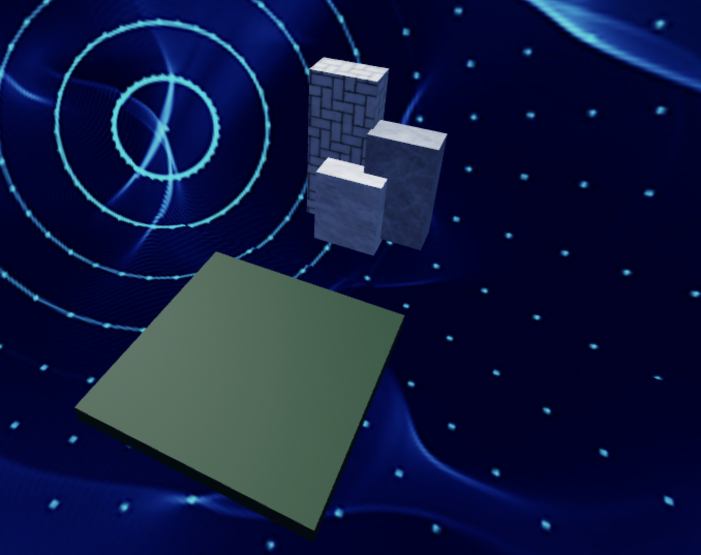
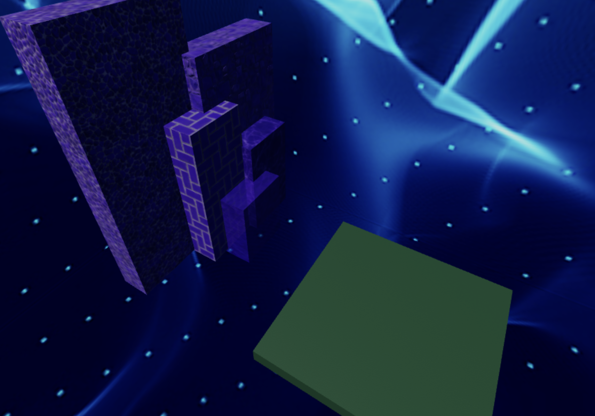
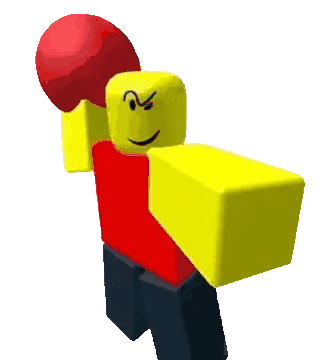

import ReactPlayer from 'react-player'
import ReactAudioPlayer from 'react-audio-player';
import audioFile from '../../static/audio/rblx1/baller-roblox.mp3';

# Stage 1: Ascending Walls

:::info

    
**Prerequisites: Before You Dive In!**

    Before diving into the excitement of Stage 1, make sure you've completed these fun and essential steps!
    
    **1. Intro**
    
    Did you enjoy the grand introduction to Roblox Part 1: Launch Your Own Obby Game? We hope you're pumped up and ready to embark on this coding adventure!
    
    **2. Setup**
    
    Time to gear up! You've gone through the setup phase, getting everything ready for your Obby journey. From setting up your workspace to getting familiar with the tools, you're all set to unleash your creativity!

    **Now, let's dive into Stage 1 and start building your very own Obby masterpiece! Are you ready? Let's do this! 🎉**

:::

 

      <iframe src="https://player.vimeo.com/video/952979949?h=7410beb1a2" frameborder="0" allow="autoplay; fullscreen; picture-in-picture; clipboard-write" style="position:absolute;top:0;left:0;width:100%;height:100%;" title="Roblox Part 1 - Stage 1"></iframe>
    

    
  `
}} />

## Objective 🧐🗿

Welcome to the first stage of our exciting Obby adventure! Get ready to climb to new heights as we conquer the Ascending Walls!

## Step 1 - Create the First Checkpoint 🚩

Let's kick things off by setting up our checkpoint. It's like marking the start of our epic journey!

### 1.1 Select the SpawnLocation
Find the SpawnLocation and get ready to customize.

### 1.2 Customize Properties
Here's where the magic happens!

- Choose a color that screams "awesome" to you.
- Tick the box for AllowTeamChangeOnTouch (because who doesn't love changing things up?).
- Uncheck Neutral to make it clear whose team you're on.
- And finally, set the TeamColor to match your SpawnLocation color for that perfect coordination!

### 1.3 Team Building
Head over to the Explorer tab and add a Team in the Teams folder. 

- Let's give it a name that suits its importance - "Stage 1".
- And don't forget to match the TeamColor to your SpawnLocation for that extra style point!

## Step 2 - Creating the Staircase 📐🏃

Hey there, future coding champs! Are you ready to kick off our Obby adventure with a climb to the top? Let's make coding magic happen together!

    

### 2.1 Get Your Building Blocks Ready

Time to pick out your favorite colors and materials! The stage is set for your creativity to shine.

### 2.2 Customize Your Blocks

Splash some color and personality onto those blocks! Remember, this is your staircase to success, so make it pop!

### 2.3 Size Matters

Let's make this climb a breeze. Adjust the sizes of your blocks to fit the challenge perfectly:
- Block 1: Make it [4, 5, 2]. It's like taking a small step towards greatness!
- Block 2: Extend it to [4, 7, 2]. We're reaching new heights now!
- Block 3: Stretch it even further to [4, 10, 2]. You're climbing like a pro!

### 2.4 Build Your Stairway

Arrange your blocks with care, creating a staircase that's as easy as pie to ascend. Each step is a victory waiting to happen!

And hey, if you ever feel stuck or just want to show off your awesome progress, don't forget about your friendly Code Coach! They're here to lend a hand, offer guidance, and celebrate your coding triumphs with you.

So, let's climb together towards coding greatness, one block at a time! Your adventure awaits! 🚀🌟

    
**Medium: Paint your walls with your favorite colors and patterns.**

    

        
    

     

    **2.1 Gather Your Blocks**

    Grab those Block Parts and get ready to build!

    **2.2 Customize Away**

    It's your time to shine! Pick your favorite Color and Material for each block. Let your creativity run wild!

    **2.3 Assemble the Stairs**

    Arrange your blocks to form a steep staircase, just waiting for brave adventurers like you to conquer it!

## Step 3 - Creating the Second Checkpoint 🚩

But wait, our journey doesn't end here! Let's prepare for what lies ahead.

### 3.1 Add Another SpawnLocation

Head back to the Workspace and add a new SpawnLocation. It's like setting up camp for the night - a safe haven for weary travelers.

### 3.2 Customize Properties

Customize this new SpawnLocation just like before:
- Color
- AllowTeamChangeOnTouch
- Neutral... you know the drill!

### 3.3 Team Building

Don't forget to add another Team in the Teams folder.

- Uncheck AutoAssignable to keep things organized.
- This time for "Stage 2".
- Keep that coordination going with matching TeamColor!

    
**Hard: Brace yourself for moving platforms that will test your skills.**

    
    **If you want more of a challenge by recreating the video yourself, follow these steps:**

    Hey there, fearless coders! Are you ready to take on the ultimate challenge and show off your coding prowess? Get ready to conquer the Ascending Walls like never before!

    

        <iframe src="https://player.vimeo.com/video/952502252?h=f64bae7761" frameborder="0" allow="autoplay; fullscreen; picture-in-picture; clipboard-write" style="position:absolute;top:0;left:0;width:100%;height:100%;" title="Roblox Part 1 - Stage 1"></iframe>
        

        
    `
    }} />

    **Description**

    We are going to create a script that makes a part in Roblox move up and down between two heights. Here's what we want to accomplish: 

    **Step 1 - Start at a Position:**
    
    The part will start at a certain position. 

    **Step 2 - Move Up and Down:**
    
    The part will move up to a maximum height, then move down to a minimum height, and keep repeating this movement. 

    **Step 3 - Direction Change:**
    
    When the part reaches the maximum height, it will change direction and start moving down. When it reaches the minimum height, it will change direction and start moving up again. 

    **Step 4 - Smooth Movement:**
    
    The part will move smoothly, pausing for a short time during each step of movement. 

    By doing this, the part will continuously move up and down in a loop, creating a nice animation effect. 

     

    **Instructions and Code Logic** 

    **Step 1 - Set Up Starting Variables:**

    - Create a variable to hold the part by setting it to the `Parent` of the script. 

    - Make a variable to remember the starting position of the part. 

    - Create variables for the highest point (`maxHeight`), lowest point (`minHeight`), and how fast it moves (`speed`). 

    - Create a true/false variable (`goingUp`) to know if the part is moving up, starting with `true`. 

    **Step 2 - Make an Infinite Loop:**

    - Use a loop that runs forever. In Lua, this is done with `while true do`. 

    **Step 3 - Check the Direction:**

    - Inside the loop, use an `if` statement to see if the part is moving up. This is checked using the `goingUp` variable. 

    **Step 4 - Move the Part Up:**

    - If `goingUp` is `true`, change the part's position to move it up. Use a vector to do this. 

    - Specifically, add to the Y-coordinate by the speed value. 

    **Step 5 - Check Maximum Height:**

    - After moving the part up, check if the part's Y-coordinate has reached or gone above the `maxHeight`. 

    - If it has, set `goingUp` to `false` to start moving down. 

    **Step 6 - Move the Part Down:**

    - If `goingUp` is `false`, change the part's position to move it down. Use a vector to do this. 

    - Specifically, subtract from the Y-coordinate by the speed value. 

    **Step 7 - Check Minimum Height:**

    - After moving the part down, check if the part's Y-coordinate has reached or gone below the `minHeight`. 

    - If it has, set `goingUp` to `true` to start moving up again. 

    **Step 8 - Pause the Loop:**

    - Use the `wait` function to pause the loop for a short time, like 0.1 seconds, before repeating the loop. 

     

    **Putting It All Together**

    - Start by setting up your starting variables. 

    - Create an infinite loop using `while true do`. 

    - Inside the loop, use an `if` statement to check the direction (`goingUp`). 

    - If `goingUp` is `true`, move the part up by adding to its Y-coordinate using a vector. 

    - Check if the part's Y position has reached the maximum height. If it has, set `goingUp` to `false`. 

    - If `goingUp` is `false`, move the part down by subtracting from its Y-coordinate using a vector. 

    - Check if the part's Y position has reached the minimum height. If it has, set `goingUp` to `true`. 

    - Use the `wait` function to pause the loop for a short time. 

    - Repeat the loop to keep the part moving up and down. 

    {/*  

    **Extra Points Challenge:**

    Feeling confident? Copy your completed script and paste it into the other walls. Can you conquer the Stage without needing any help from your Code Coach? Show off your skills and aim for that perfect run!

    And remember, even superheroes need a little help sometimes. Don't hesitate to ask your Code Coach if you need a guiding hand. But hey, if you can tackle this challenge on your own, you'll earn some serious coding bragging rights!

    So, gear up, brave coders, and get ready to tackle the moving platforms of **Stage 1 - Hard**! Your coding adventure awaits! 🚀💻 */}

 

- [x] **Congratulations! You've conquered Stage 1 like a true coding champion! Now, gear up for even more thrilling challenges as we dive into Stage 2! Let the coding adventure continue! 🚀🎉**

    

    <ReactAudioPlayer
        src={audioFile}
        controls
    />

