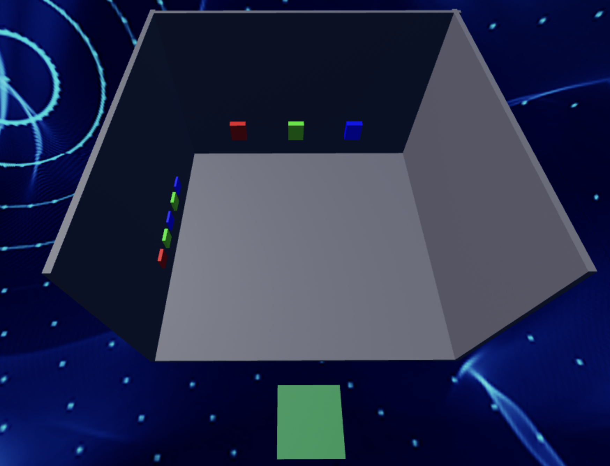
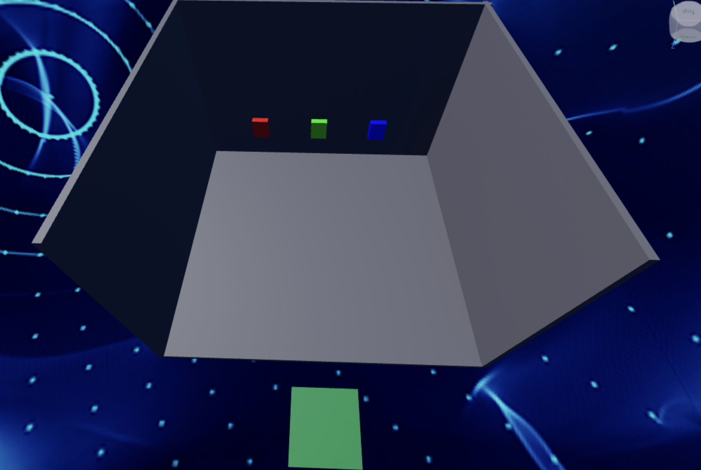

import ReactPlayer from 'react-player'

# Stage 10: Puzzle Room

:::info
<details style={{border:'none'}}>
    <summary>**Prerequisites: Before You Dive In!**</summary>

    Prepare yourself for the thrilling challenge of Stage 10: Puzzle Room! Make sure to reach these requirements before jumping in!

    **1. Intro**

    Get acquainted with the basics of Roblox Studio and Obby creation.

    **2. Setup**

    Learn how to set up your workspace and get ready for Obby building.

    **3. Stage 1: Ascending Walls**

    Conquer the heights by navigating ascending walls.

    **4. Stage 2: Sphere Stairs**

    Climb your way up through spheres arranged as stairs.

    **5. Stage 3: Plank Walkway**

    Balance your way across a precarious plank walkway.

    **6. Stage 4: KillBrick Path**

    Maneuver through a path filled with dangerous kill bricks.

    **7. Stage 5: Fireball Footpath**

    Dodge fireballs as you traverse through a fiery obstacle course.

    **8. Stage 6: Military Minefield**

    Navigate through a treacherous minefield, avoiding deadly explosives.

    **9. Stage 7: Rolling Rocks**

    Dodge rolling boulders as you make your way through rocky terrain.

    **10. Stage 8: Spinning KillBricks**

    Face the challenge of spinning kill bricks, testing your reflexes and agility.

    **11. Stage 9: Kinetic KillWall**

    Navigate through a wall of kinetic obstacles, requiring quick thinking and precise movements.

    **Once you've conquered these stages, you'll be ready to tackle the mind-bending challenges of the Puzzle Room!🚀🌟**
</details>
:::

<br  />

<div dangerouslySetInnerHTML={{
  __html: `
    <div style="padding:56.25% 0 0 0;position:relative;border:3px solid #47c621;">
      <iframe src="https://player.vimeo.com/video/952505986?h=42cb31d4eb" frameborder="0" allow="autoplay; fullscreen; picture-in-picture; clipboard-write" style="position:absolute;top:0;left:0;width:100%;height:100%;" title="Roblox Part 1 - Stage 10"></iframe>
    </div>
    <script src="https://player.vimeo.com/api/player.js"></script>
  `
}} />

<br  />

Congratulations on reaching this point, brave adventurer! The Puzzle Room awaits with its intricate challenges and thrilling puzzles. Prepare yourself for an unforgettable experience in the world of Roblox. Let the adventure continue!

## Objective 🧐🗿

Gear up for the ultimate adventure! You're about to embark on the final leg of our Obby journey! Brace yourselves as we dive into the exhilarating challenge of Stage 10: Puzzle Room!

## Step 1 - Piecing the Puzzle 🧩🤔

Get ready for a brain-teasing challenge! In this stage, we'll be diving into the Puzzle Room, where your problem-solving skills will be put to the test!

<div className='image-wrapper'>
    
</div>

### 1.1 Crafting the Room

Let's kick things off by building the room itself.
- Use Block Parts to create a floor and three walls.
- Don't forget to add your own flair with colors and materials!

### 1.2 Adding the Buttons

Now, let's introduce the interactive elements that will make our puzzle room thrilling!    - Search for "55hpmonk" in the Toolbox
- Find "Buttons" and import them.
- Place the Buttons on the back wall.
- Don't forget to name the wall for scripting later.
- Customize the buttons with your own Color and Material to match your style.

### 1.3 Crafting the Clues

Time to set the stage for our puzzle!
- Edit the `buttonOrder` variable to be:
```lua
local buttonOrder = {"Green", "Red", "Blue"}
```
- Inside the function, change the `wall` variable:
```lua
local wall = game.Workspace:FindFirstChild("**NAME OF YOUR PART**")
```
- Finally, add the password on a side wall, add the password or clues that players will need to solve the puzzle. Make it visible and intriguing, sparking curiosity and excitement!

<details>
    <summary>**Medium: Give the puzzle some extra steps to tease the Player!**</summary>

    <div className='image-wrapper'>
        
    </div>

    <br  />

    **1.1 Constructing the Room**

    Create a room made with a floor and three walls using Block Parts.
    - Customize the Color and Material

    **1.2 Importing the Buttons**

    Lets add the buttons for the Player to click:
    - Navigate to the Toolbox and search for the creator, "55hpmonk".
    - Find "Buttons" and import it into your game.
    - Place the Buttons on the back wall.
    - Name the back wall so we can use it in our Script later.
    - Customize your kill brick with your preferred Color and Material.

    **1.3 Creating the Password**

    Now, lets create our password and add some hints:
    - Edit the `buttonOrder` Script to have your own password
    ```lua
    local buttonOrder = {**YOUR PASSWORD HERE**}
    ```
    - Inside the function, change the `wall` variable:
    ```lua
    local wall = game.Workspace:FindFirstChild("**NAME OF YOUR PART**")
    ```
    - Then, display hints and the password on a side wall to help players solve the puzzle. Make the clues visible and engaging to add excitement to the challenge.
</details>

<details>
    <summary>**Hard: Get rid of the hints and make the Player's brain more wrinkly!**</summary>
    
    **If you want more of a challenge by recreating the video yourself, follow these steps:**

    Ready to tackle the ultimate challenge? Let’s dive into the mind-bending adventure of Stage 10: Puzzle Room! Prepare to push your limits as you solve clever puzzles and unlock the secrets of this tricky room. Are you up for the challenge?    

    **Description**

    We are going to create a script that makes buttons in Roblox follow a specific order. When the buttons are pressed in the correct order, a wall will be destroyed. Here's what we want to accomplish: 

    **Step 1 - Define Button Order:**
    
    The script will have a specific order in which buttons need to be pressed. 

    **Step 2 - Check Button Presses:**
    
    The script will check if the buttons are pressed in the correct order. 

    **Step 3 - Play Sounds:**
    
    The script will play a sound when the correct or incorrect button is pressed. 

    **Step 4 - Destroy Wall:**
    
    When all buttons are pressed in the correct order, a wall will be destroyed, and the buttons will be removed. 

    By doing this, we will create a fun challenge for players to press the buttons in the correct order to destroy the wall. 

    <br  />

    **Instructions and Code Logic**

    **Step 1 - Set Up Starting Variables:**

    - Create a variable for the order of button colors (`buttonOrder`). 

    - Create a variable to keep track of the current button index (`currentButtonIndex`). 

    - Create variables for the red, green, and blue buttons by setting them to their respective parents (`redButton`, `greenButton`, `blueButton`). 

    - Create a table to store references to all the buttons (`buttons`). 

    - Create variables for the correct and incorrect sounds (`correctSound`, `incorrectSound`). 

    **Step 2 - Create the Functions:**

    - Define a function named `checkButtonOrder` that takes a `buttonPressed` argument. 

    - Inside the function, check if the `buttonPressed` matches the current button in the order. 

    - If correct, play the correct sound and move to the next button in the order. 

    - If all buttons are pressed correctly, destroy the wall and remove the buttons. 

    - If incorrect, reset the button index and play the incorrect sound. 

    - Define a function named `buttonClicked` that takes a `color` argument. 

    - Return a function that calls `checkButtonOrder` with the given color. 

    - Connect the `buttonClicked` function to each button's `MouseClick` event, passing the respective color. 

    <br  />
    
    **Putting It All Together**

    - Start by setting up your button order, index, buttons, and sounds. 

    - Define a function named `checkButtonOrder` to handle checking the button presses. 

    - Define a function named `buttonClicked` to handle button clicks. 

    - Connect the `buttonClicked` function to each button's `MouseClick` event. 

    {/* <br  />

    **Extra Points Challenge:**

    Prepare yourself for the ultimate challenge! Change up the Scripts across all your spinning kill bricks. Then, test your limits and demonstrate your expertise in navigating through the spinning chaos. Are you ready to emerge victorious, earning the respect of your fellow adventurers and the admiration of your Code Coach?

    While this challenge may present obstacles, don't hesitate to seek guidance from your Code Coach if necessary. However, if you can conquer this task independently, you'll earn some serious coding accolades!

    So, gear up, courageous coders, and get ready to face the spinning madness of **Stage 8 - Hard**! Let's spin! 🚀💻 */}
</details>

## Step 2 - Congratulations! 🥳🎉

You did it! The final piece of the puzzle is in place, and victory is within reach!

### 2.1 Have a Party!

Now it's time to celebrate your triumph! Create a vibrant party area filled with:
- Decorations,
- Exciting rewards for the Player,
- Let your imagination run wild as you design a space that reflects the excitement of completing the Obby.

<br  />

**Congratulations on conquering all 10 stages of the Obby! Now, it's time to share your creation with friends and family and see if they can rise to the challenge!**

<div align='center'>
    <iframe width="70%" height="400" src="https://www.youtube.com/embed/RLadrIPM3dM" title="[Five Nights at Freddy&#39;s] - 6 AM" frameborder="0" allow="accelerometer; autoplay; clipboard-write; encrypted-media; gyroscope; picture-in-picture; web-share" referrerpolicy="strict-origin-when-cross-origin" allowfullscreen></iframe>
</div>