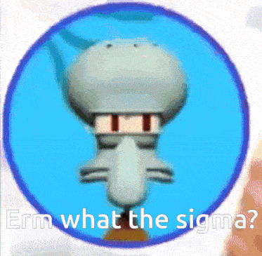

import ReactPlayer from 'react-player'
import ReactAudioPlayer from 'react-audio-player';
import audioFile from '../../static/audio/rblx1/erm-what-the-sigma.mp3';

# Stage 3: Plank Walkway

:::info

    
**Prerequisites: Before You Dive In!**

    
    Before diving into the thrilling challenges of Stage 3, make sure you've conquered these epic quests:
    
    **1. Intro**

    You've embarked on this epic coding adventure with excitement and curiosity. Now, let's take it to the next stage!

    **2. Setup**

    You've set the stage for your Obby journey, ensuring everything's in place for your creative endeavors. Time to unleash your coding superpowers!

    **3. Stage 1: Ascending Walls**

    You've scaled the heights of Ascending Walls, mastering the basics of obstacle creation. Now, let's elevate your skills even further!

    **4. Stage 2: Sphere Stairs**

    You've bravely navigated the Sphere Stairs, showing off your building prowess. Get ready to build on that success and take on the next challenge!

    **You're well-prepared and pumped up to tackle Stage 3 like a true coding hero! 🚀**

:::

 

      <iframe src="https://player.vimeo.com/video/952505925?h=f5e14aefc9" frameborder="0" allow="autoplay; fullscreen; picture-in-picture; clipboard-write" style="position:absolute;top:0;left:0;width:100%;height:100%;" title="Roblox Part 1 - Stage 3"></iframe>
    

    
  `
}} />

## Objective 🧐🗿

Welcome to the heart-pounding third stage of our Obby adventure! Get ready to tackle the daring challenge of creating the Plank Walkway.

## Step 1 - Crafting the Walkway 📊🚶

Hey there, Obby builders! Ready to take it easy and breeze through Stage 3? Let's lay down those planks like pros, with a little help from your trusty Code Coach!

    

### 1.1 Craft Your Planks

Grab your paintbrush and let's get creative! Create three long Block Parts with your favorite Colors and Materials. Remember, you're the artist here!

### 1.2 Adjust Sizes

Time to size things up! Make sure all your Block Parts are set to [2, 1, 21]. Perfect for a smooth and steady walkway!

### 1.3 Create a Rest Stop

Every adventurer needs a break! Create a Block Part at the end of your walkway, using your favorite Color and Material. Let's make it cozy with a size of [13, 1, 6].

Remember: If you ever feel stuck or need a helping hand, don't hesitate to ask your Code Coach for assistance. They're here to guide you through every step of the way!

Now, let's lay down those planks and make this walkway a breeze! 🌟

    
**Medium: Keep players guessing by tweaking the collision on your path.**

    

        
    

     
    
    **1.1 Craft Your Planks**

    Time to unleash your inner architect! Create three long block parts, each with your own Color and Material. Make them as vibrant and sturdy as your imagination!

    **1.2 Rest Stop**

    Even adventurers need a break! Place a block part at the end of your walkway, like a cozy spot to catch your breath before the next challenge.

    **1.3 Double Trouble**

    Duplicate your three planks and the resting spot, then place them twice along your Obby path. It's like creating your own roadmap to success!

## Step 2 - Setting Up the Checkpoint 🚩

The adventure is far from over! Let's get ready for the next thrilling stage.

### 2.1 Add Another SpawnLocation

Head over to the Workspace and bring in another SpawnLocation. This checkpoint is like a pit stop for champions like you!

### 2.2 Customize Properties

Let's make it stand out like a beacon of success!
- Choose a Color that matches your Obby's theme.
- Check AllowTeamChangeOnTouch. It's like giving a high-five to your fellow players!
- Uncheck Neutral to show that this checkpoint means business!
- Match the TeamColor to your SpawnLocation color. Team unity!

### 2.3 Team Building

Now, let's add another team member to our Obby crew for some extra fun!

Head to the Teams folder in the Explorer tab and add a Team to bring in a new teammate.
- Uncheck AutoAssignable to keep things neat.
- Rename this team to "Stage 4" and get pumped up for the next challenge!
- Make sure the TeamColor matches the Color of your SpawnLocation to keep the team spirit high!

    
**Hard: Get ready for some chaos as we swap planks around for an extra twist!**

    **If you want more of a challenge by recreating the video yourself, follow these steps:**

    Hey fearless adventurers! Stage 3 just got a whole lot trickier, but I know you're up for the challenge! Get ready to swap those planks and bring on the chaos – but remember, your Code Coach is always here to lend a hand if you need it. Let's dive in and see if you can tackle this challenge all on your own!

    **Description** 

    We are going to create a script that makes three parts in Roblox swap positions randomly. Here's what we want to accomplish: 

    **Step 1 - Start with Three Parts:**
    
    We will have three parts in our game. 

    **Step 2 - Swap Positions**
    
    The parts will switch places with each other randomly. 

    **Step 3 - Keep Swapping:**
    
    The parts will keep swapping positions continuously, creating a fun effect. 

    By doing this, the parts will keep moving to each other's positions randomly, making the game more interesting. 

     
    
    **Instructions and Code Logic** 

    **Step 1 - Set Up Starting Variables:**

    - Create variables for each of the three parts (`part1`, `part2`, and `part3`). 

    **Step 2 - Create a Function:**

    - Define a function named `swapPositions` that takes two parts (`partA` and `partB`) and swaps their positions. 

    **Step 3 - Make an Infinite Loop:**

    - Create a loop that runs forever using `while true do`. 

    **Step 4 - Choose a Random Swap:**

    - Inside the loop, choose a random number between 1 and 3. 

    **Step 5 - Swap Based on Random Choice:**

    - If the random number is 1, swap the positions of `part1` and `part2`. 

    - If the random number is 2, swap the positions of `part2` and `part3`. 

    - If the random number is 3, swap the positions of `part3` and `part1`. 

    **Step 6 - Pause the Loop:**

    - Use the `wait` function to pause the loop for a short time, such as 2 seconds, before repeating the loop. 

     

    **Putting It All Together**

    - Start by setting up your three parts. 

    - Define a function named `swapPositions` that swaps the positions of two parts. 

    - Create an infinite loop using `while true do`. 

    - Inside the loop, choose a random number between 1 and 3. 

    - Swap the positions of the parts based on the random number. 

    - Use the `wait` function to pause the loop for a short time. 

    - Repeat the loop to keep swapping the parts' positions randomly. 

    {/*  

    **Extra Points Challenge:**

    Feeling up for a challenge? Take your completed script and duplicate it onto the remaining planks. Can you conquer this stage solo, without any assistance from your Code Coach? It's time to put your skills to the test and strive for that flawless run!

    But remember, even the greatest heroes need support from time to time. If you find yourself in need of guidance, don't hesitate to reach out to your Code Coach. However, if you're able to conquer this challenge independently, you'll earn some serious coding bragging rights!

    So, gear up, fearless coders, and prepare to conquer the dynamic platforms of **Stage 3 - Hard**! Your coding journey awaits! 🚀💻 */}

 

- [x] **Congratulations! You've built Stage 3 like a true Obby master! Now, gear up and get ready to conquer Stage 4 with even more excitement and determination! Keep building, keep coding, and keep shining bright! 🌟**

    

    <ReactAudioPlayer
        src={audioFile}
        controls
    />

