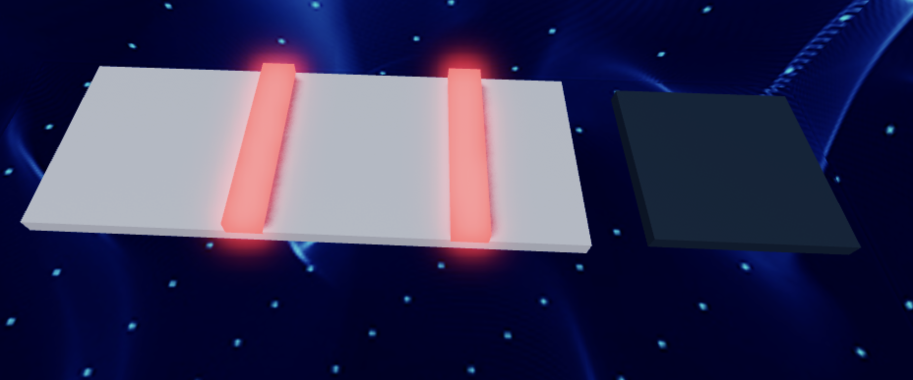
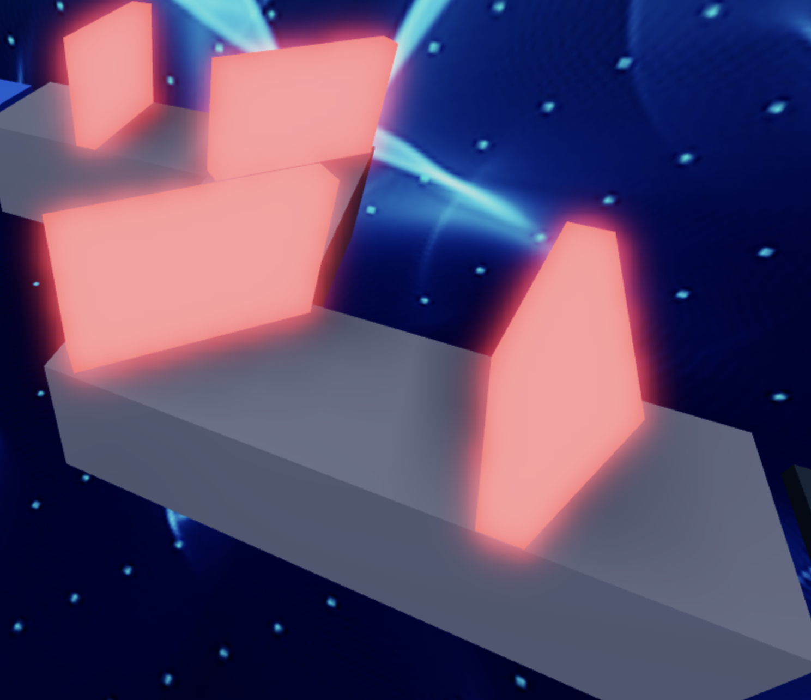

import ReactPlayer from 'react-player'
import MyVideoUrl from './video/Stage4.mp4';
import ReactAudioPlayer from 'react-audio-player';
import audioFile from './video/giga-chad-theme.mp3';

# Stage 4: KillBrick Path

    
**Prerequisites: Before You Dive In!**

    Before you dive into the excitement of Stage 4 and conquer the challenging Killbrick Path, make sure you've conquered these thrilling adventures:

    **1. Intro**

    You've embarked on this coding journey with eagerness and excitement, now get ready to take it up a notch!
    
    **2. Setup**

    You've laid the groundwork for your Obby adventure, ensuring everything is ready for your creative genius to shine.

    **3. Stage 1: Ascending Walls**

    You've scaled heights and overcome obstacles, mastering the basics of obstacle creation. Now, let's push those boundaries even further!

    **4. Stage 2: Sphere Stairs**

    You've navigated through spheres and conquered stairs, showcasing your building skills. Get ready to elevate your game even more!

    **5. Stage 3: Plank Walkway**

    You've walked the plank with finesse, creating a path of adventure. Now, let's gear up for the next challenge and keep the excitement going!

    **You're all set and pumped up to tackle Stage 4 like a true Obby champion! 🚀**

  <ReactPlayer controls url={MyVideoUrl}/>

## Objective 🧐🗿

Welcome to the adrenaline-pumping fourth stage of our Obby! Get ready to unleash your creativity as we construct the thrilling KillBrick Path.

## Step 1 - Crafting the Path ⛏️👣

Hey there, Obby builders! Stage 4 is here, and we're kicking it off with a teamwork challenge! Let's work together to create a thrilling KillBrick Path. Remember, if you ever need a hand, your Code Coach is just a shout away!

    

### 1.1 Building a Straight Pathway

Let's start by building a straight pathway:
- Using your favorite Color and Material.
- Keep it simple and steady for now!

### 1.2 Import Kill Bricks

Now, let's bring in the excitement! 
- Head to the Toolbox and and click on the symbol to the right of the search bar.
- Search for "55hpmonk". 
- Import the "KillBrick" Part and place them strategically along your path.
- Customize the Color and Material to make them stand out!

    
**Medium: Let your imagination run wild as you design your own killer path!**

    

        
    

     
    
    **1.1 Create a Pathway**

    Let your imagination run wild as you design a pathway full of twists and turns! Use your favorite colors and materials to make it uniquely yours.

    **1.2 Import Kill bricks**

    Now, let's add some excitement! 
    - Head to the Toolbox and and click on the symbol to the right of the search bar.
    - Search for "55hpmonk". 
    - Import the "KillBrick" Part and place them strategically along your path.
    - Customize the Color and Material to make them stand out!

## Step 2 - Setting Up the Checkpoint 🚩

But wait, the adventure continues! Let's get ready for the next part of our journey.

### 2.1 Add Another SpawnLocation

Navigate to the Workspace and bring in another SpawnLocation. This checkpoint is like a beacon of progress on your epic Obby journey!

### 2.2 Customize Properties

Make your checkpoint stand out!
- Choose a vibrant color.
- Check AllowTeamChangeOnTouch.
- Uncheck Neutral
- Match the TeamColor to your SpawnLocation to keep the team spirit high!

### 2.3 Team Building

Let's spice things up with a new team addition in the Teams folder:
- Uncheck AutoAssignable to keep things in order.
- Give the team a cool new name like "Stage 5" to amp up the excitement!
- Make sure the TeamColor matches the vibrant colors of your SpawnLocation for that extra pop of fun!

    
**Hard: Make things interesting by setting those kill bricks in motion!**

    **If you want more of a challenge by recreating the video yourself, follow these steps:**

    Hey fearless adventurers! Stage 4 just got a whole lot trickier, but I know you're up for the challenge! Get ready to add an extra twist to the KillBrick Path by setting those bricks in motion. Remember, your Code Coach is here to help, but if you tackle this challenge solo, you'll earn some serious bonus points!

    **Description** 

    We are going to create a script that makes a brick in Roblox grow and shrink continuously. Additionally, when a player touches the brick, it will cause the player's character to lose all health. Here's what we want to accomplish: 

    **Step 1 - Start with a Brick:**
    
    We have a brick that starts at a certain height. 

    **Step 2 - Grow and Shrink:**
    
    The brick will grow taller until it reaches a maximum height, then shrink back to its original height, and keep repeating this process. 

    **Step 3 - Player Touch Detection:**
    
    If a player touches the brick, their character will lose all health. 

    By doing this, the brick will keep growing and shrinking, and it will affect players when they touch it. 

     

    **Instructions and Code Logic**
    
    **Step 1 - Set Up the Starting Variables:**

    - Create a variable for the brick by setting it to the `Parent` of the script. 

    - Create a variable to remember the original height of the brick. 

    - Create a variable for the maximum height the brick can grow to (`maxHeight`). 

    - Create a variable for how fast the brick will grow and shrink (`speed`). 

    - Create a true/false variable (`isAscending`) to know if the brick is growing, starting with `true`. 

    **Step 2 - Create a Function:**

    - Define a function named `PlayerTouched` that takes a part (`Part`) as an argument. 

    - Inside the function, check if the part's parent is a player's character. 

    - If it is, set the player's character's health to 0. 

    **Step 3 - Connect the Function:** 

    - Connect the `PlayerTouched` function to the brick's `Touched` event. 

    **Step 4 - Make an Infinite Loop:**

    - Create a loop that runs forever using `while true do`. 

    **Step 5 - Grow the Brick:**

    - Inside the loop, check if `isAscending` is `true`. 

    - If it is, create another loop to make the brick grow taller until it reaches `maxHeight`. 

    **Step 6 - Shrink the Brick:** 

    - If `isAscending` is `false`, create another loop to make the brick shrink back to its original height. 

    **Step 7 - Pause the Loop:**

    - Use the `wait` function to pause the loop for a short time during each step of growing and shrinking. 

    **Step 8 - Change Direction**

    - After the brick has grown to `maxHeight`, set `isAscending` to `false` to start shrinking. 

    - After the brick has shrunk to its original height, set `isAscending` to `true` to start growing again. 

     

   **Putting It All Together**

    - Start by setting up your brick and other variables. 

    - Define a function named `PlayerTouched` to handle when a player touches the brick. 

    - Connect the `PlayerTouched` function to the brick's `Touched` event. 

    - Create an infinite loop using `while true do`. 

    - Inside the loop, make the brick grow if `isAscending` is `true`. 

    - If `isAscending` is `false`, make the brick shrink. 

    - Use the `wait` function to pause the loop during each step. 

    - Change the direction of growth when the brick reaches the maximum or original height. 

    {/*  

    **Extra Points Challenge:**

    Feeling ready for a challenge? Copy your completed script and apply it to the remaining kill bricks. Can you conquer this stage solo, without any help from your Code Coach? It's time to test your skills and aim for that flawless execution!

    But remember, even the mightiest heroes seek support from time to time. If you need guidance, don't hesitate to ask your Code Coach for assistance. However, if you manage to conquer this challenge independently, you'll earn some serious coding bragging rights!

    So, gear up, brave coders, and prepare to conquer the moving kill bricks of **Stage 4 - Hard**! Your coding journey is about to begin! 🚀💻 */}

 

**Congratulations! You've completed Stage 4 with flying colors! Now, gear up and get ready to conquer Stage 5 with even more excitement and determination! You're one step closer to Obby mastery! 🌟**

    

    <ReactAudioPlayer
        src={audioFile}
        controls
    />

