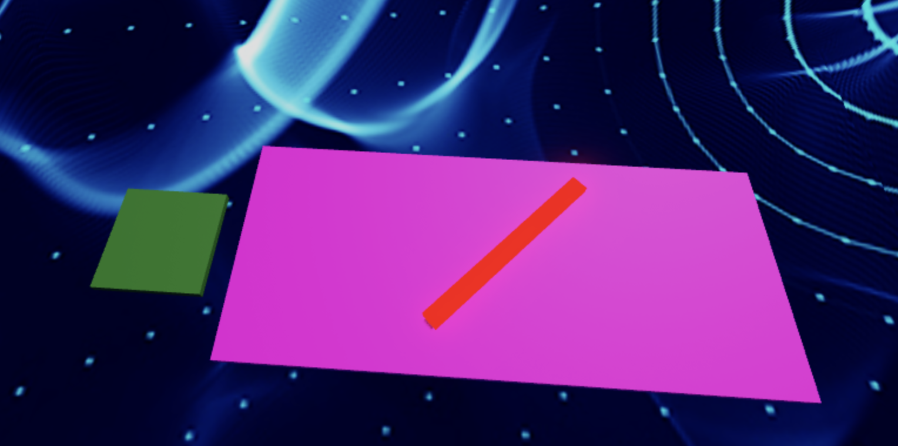
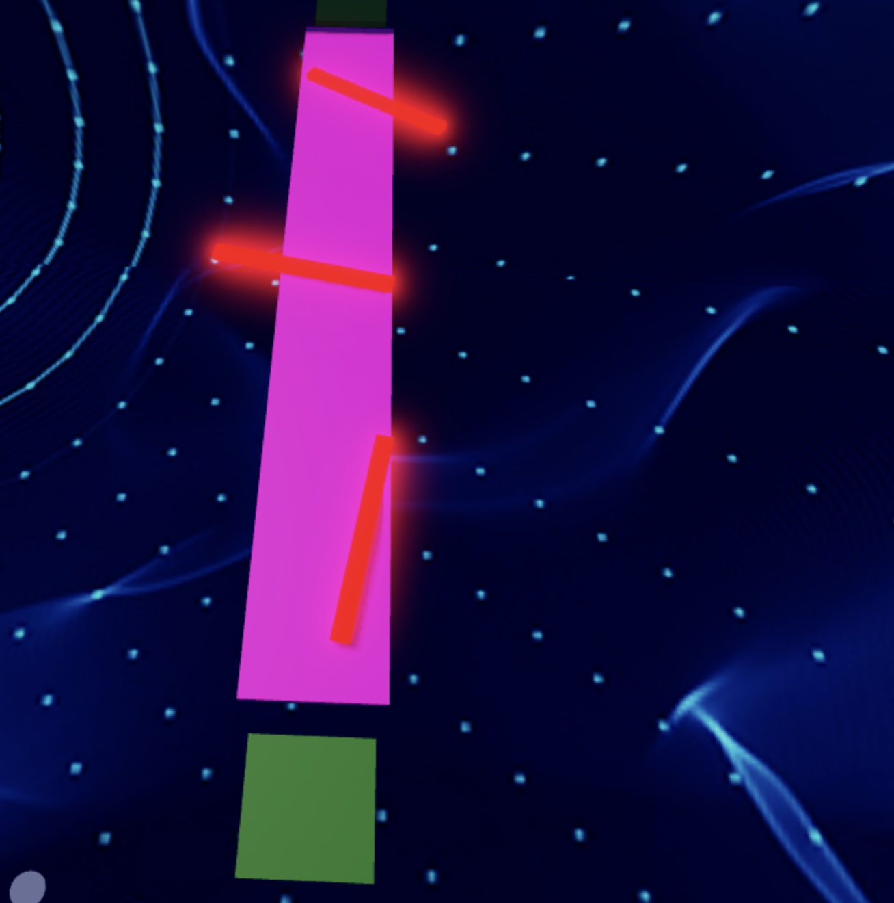

import ReactPlayer from 'react-player'

# Stage 8: Spinning KillBricks

:::info

    
**Prerequisites: Before You Dive In!**

    Prepare yourselves, brave adventurers, as you stand on the brink of Stage 8! But first, ensure you've conquered the twists and turns of the preceding challenges.

    **1. Intro**

    Lay the groundwork for your coding conquest.

    **2. Setup**

    Equip yourself with the necessary tools and knowledge.

    **3. Stage 1: Ascending Walls**

    Scale new heights and overcome obstacles.

    **4. Stage 2: Sphere Stairs**

    Navigate the spherical staircase with finesse.

    **5. Stage 3: Plank Walkway**

    Balance and coordination are key on this precarious path.

    **6. Stage 4: KillBrick Path**

    Dodge deadly obstacles in this challenging terrain.

    **7. Stage 5: Fireball Footpath**

    Brave the fiery path and emerge victorious.

    **8. Stage 6: Military Minefield**

    Navigate through hidden dangers and traps.

    **9. Stage 7: Rolling Rocks**

    Roll with the punches and conquer the rocky terrain.

    **With each victory, you edge closer to the ultimate test: the Spinning KillBrick challenge!🚀🌟**

:::

 

      <iframe src="https://player.vimeo.com/video/952980200?h=205f87c724" frameborder="0" allow="autoplay; fullscreen; picture-in-picture; clipboard-write" style="position:absolute;top:0;left:0;width:100%;height:100%;" title="Roblox Part 1 - Stage 1"></iframe>
    

    
  `
}} />

## Objective 🧐🗿

Prepare to be swept into the heart-pounding chaos of Stage 8: Spinning Killbricks! Feel the rush as you plunge into a whirlwind of motion and strategy.

## Step 1 - Creating the Path 🔄🩻

Let's dive into Stage 8: Spinning KillBricks! For an easy start, place a spinning kill brick and watch it go! Get ready for some fun as you navigate through the spinning obstacles!

    

### 1.1 Constructing the Walkway

Create a straight path to fit your spinning kill brick.
- Customize the Color and Material of your walkway.

### 1.2 Importing the Spinning Kill Brick

Lets add the spinning kill brick:
- Navigate to the Toolbox and search for the creator, "55hpmonk".
- Find the "SpinningKillBrick" and import it into your game.
- Place the SpinningKillBrick on your pathway.
- Customize your kill brick with your preferred Color and Material.

    
**Medium: Spin things up with an array of spinning blocks.**

    

        
    

     
    
    **1.1 Constructing the Walkway**

    Create a straight path to fit multiple spinning kill bricks.
    - Customize the Color and Material of your walkway.

    **1.2 Adding Spinning Kill Bricks**

    Lets add spinning kill bricks:
    - Navigate to the Toolbox and search for the creator, "55hpmonk".
    - Find the "SpinningKillBrick" and import it into your game.
    - Place multiple SpinningKillBricks on your pathway.
    - Customize your kill bricks with your preferred Color and Material.

## Step 2 - Setting Up the Checkpoint 🚩

We've accomplished so much, and that's something to celebrate! Now, let's get ready to take on an even more amazing experience! The next challenge is just around the corner, and it's going to be totally awesome!

### 2.1 Add Another SpawnLocation

Enter the Workspace and plant a new SpawnLocation to chart our course through this thrilling adventure.

### 2.2 Customize Properties

Let your creativity soar as you customize these properties:
- Select a Color that resonates with your daring spirit.
- Activate AllowTeamChangeOnTouch to empower your journey.
- Banish any uncertainties by unchecking Neutral and embracing confidence.
- Ensure the TeamColor mirrors your SpawnLocation, harmonizing with your bravery.

### 2.3 Team Building

Take the next step! Add a new team to your Teams folder and keep growing!
- Remember to uncheck the "AutoAssignable" box, so we can keep our workspace neat and easy to navigate!
- Name it "Stage 9," honoring your courage amidst the spinning challenges.
- Let its TeamColor echo the bravery of your SpawnLocation.

    
**Hard: Ready for the ultimate challenge? Experiment with different speeds and directions!**

    **If you want more of a challenge by recreating the video yourself, follow these steps:**

    Ready to take on the ultimate challenge? Let's dive into the whirlwind of Stage 8: Spinning Killbricks! Prepare to push your limits as you experiment with different speeds and directions, navigating through a maze of spinning obstacles. Are you up for the challenge?

  

        <iframe src="https://player.vimeo.com/video/952505977?h=1808f5e862" frameborder="0" allow="autoplay; fullscreen; picture-in-picture; clipboard-write" style="position:absolute;top:0;left:0;width:100%;height:100%;" title="Roblox Part 1 - Stage 8"></iframe>
      

      
    `
  }} />

    **Description**

    We are going to create a script that makes a part in Roblox spin continuously and cause any player who touches it to lose all their health. Here's what we want to accomplish: 

    **Step 1 - Spin the Part:**
    
    The part will spin around smoothly. 

    **Step 2 - Detect Touch:**

    The script will detect when a player touches the spinning part. 

    **Step 3 - Affect the Player:**
    
    If a player touches the part, their health will be set to 0. 

    By doing this, we will create a spinning part that creates a challenge for players in the game. 

     

    **Instructions and Code Logic**

    **Step 1 - Set Up the Starting Variables:**

    - Create a variable for the part by setting it to the `Parent` of the script. 

    - Create a variable for the speed of the spin (`spinSpeed`). 

    **Step 2 - Create the Functions:**

    - Define a function named `rotatePart` that spins the part. 

    - Inside the function, update the part's rotation using `CFrame` and the `spinSpeed`. 

    - Define a function named `onPartTouched` that checks if something touching the part is a player. 

    - Inside the function, if the part that touched has a "Humanoid" (indicating a player), set the player's health to 0. 

    - Use the `RunService.Heartbeat` event to call the `rotatePart` function continuously, making the part spin. 

    - Connect the `onPartTouched` function to the part's `Touched` event to detect when it is touched. 

     

    **Putting It All Together**

    - Start by setting up your spinning part and spin speed. 

    - Define a function named `rotatePart` to make the part spin. 

    - Define a function named `onPartTouched` to handle when the part is touched. 

    - Use the `RunService.Heartbeat` event to call the `rotatePart` function continuously. 

    - Connect the `onPartTouched` function to the part's `Touched` event. 
 
    {/*  

    **Extra Points Challenge:**

    Prepare yourself for the ultimate challenge! Change up the Scripts across all your spinning kill bricks. Then, test your limits and demonstrate your expertise in navigating through the spinning chaos. Are you ready to emerge victorious, earning the respect of your fellow adventurers and the admiration of your Code Coach?

    While this challenge may present obstacles, don't hesitate to seek guidance from your Code Coach if necessary. However, if you can conquer this task independently, you'll earn some serious coding accolades!

    So, gear up, courageous coders, and get ready to face the spinning madness of **Stage 8 - Hard**! Let's spin! 🚀💻 */}

 

**Kudos, fearless adventurers! You've triumphed over the whirlwind of challenges in Stage 8! Now, brace yourselves as we journey onward to conquer even greater heights in Stage 9! 🌟**

    <iframe width="70%" height="400" src="https://www.youtube.com/embed/MCB_A8N1DNU" title="LeBron James, scream if you love Roblox" frameborder="0" allow="accelerometer; autoplay; clipboard-write; encrypted-media; gyroscope; picture-in-picture; web-share" referrerpolicy="strict-origin-when-cross-origin" allowfullscreen></iframe>

