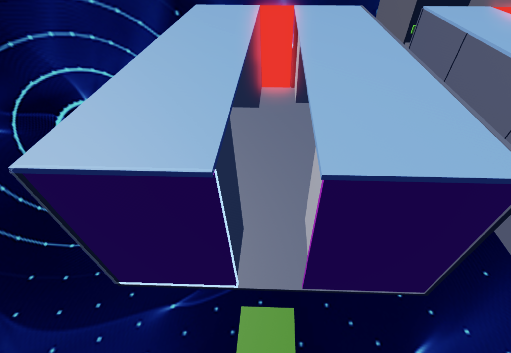
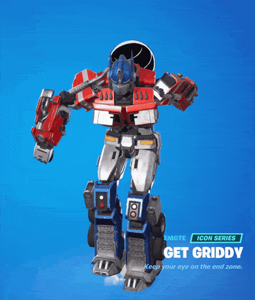

import ReactPlayer from 'react-player'
import ReactAudioPlayer from 'react-audio-player';
import audioFile from '../../static/audio/rblx1/griddy.mp3';

# Stage 9: Kinetic KillWall

:::info

    
**Prerequisites: Before You Dive In!**

    Prepare yourselves for the next adventure! Before embarking on Stage 9's thrilling journey through the Kinetic KillwWall, ensure you've conquered the following challenges:

    **1. Intro**

    Begin your journey into the world of obstacles and challenges.

    **2. Setup**

    Lay the groundwork for your adventure by preparing your environment.

    **3. Stage 1: Ascending Walls**

    Scale towering walls to reach new heights.

    **4. Stage 2: Sphere Stairs**

    Navigate a staircase of spheres to advance.

    **5. Stage 3: Plank Walkway**

    Traverse a precarious path made of planks.

    **6. Stage 4: KillBrick Path**

    Brave a path littered with deadly obstacles.

    **7. Stage 5: Fireball Footpath**

    Dodge fireballs as you make your way forward.

    **8. Stage 6: Military Minefield**

    Navigate through a field of hidden dangers.

    **9. Stage 7: Rolling Rocks**

    Evade rolling boulders as you progress.

    **10. Stage 8: Spinning KillBricks**

    Conquer platforms while avoiding spinning obstacles.

    **Once you've triumphed over these trials, you'll be ready to face the Kinetic KillWall head-on!🚀🌟**

:::

 

      <iframe src="https://player.vimeo.com/video/952980235?h=6678762589" frameborder="0" allow="autoplay; fullscreen; picture-in-picture; clipboard-write" style="position:absolute;top:0;left:0;width:100%;height:100%;" title="Roblox Part 1 - Stage 1"></iframe>
    

    
  `
}} />

## Objective 🧐🗿

Get ready for the pulse-pounding excitement of Stage 9: Kinetic Killwall! Brace yourselves as you dive into a whirlwind of action and strategy.

## Step 1 - Creating the Stage 🧱☠️

Get ready for some thrilling adventures in Stage 9: Kinietic KillWall! Let's construct a hallway filled with excitement.

    

### 1.1 Building the Hallway

Create the area for the Player's daring escapades:
- Craft a hallway with enticing doorways to explore.
- Create walls around to create an enclosed space.
- Use your favorite Color and Material to bring it to life!

### 1.2 Adding the Kill Wall

Now, let's make things interesting!
- Head to the Toolbox and search for "55hpmonk".
- Fetch the "KillWall" and position it at the hallway's end.
- Customize it with your chosen Color and Material to match your theme.  

### 1.3 Tweaking the Script

To ensure your kill wall moves smoothly across the hallway:
- Adjust the speed of its movement to fit the pace.
- Edit the end index of the "for" loop.
    - Calculated using the hallway's Z-Value divided by the speed.

Don't hesitate to ask your Code Coach for help if you're stuck!

    
**Medium: Construct a fun-filled walkway with lots of rooms to explore and keep you on the move!**

    

        
    

     

    **1.1 Creating the Hallway**

    Let's set the stage for our player's epic journey:
    Infuse your creation with vibrant colors and exciting materials.
    - Construct sturdy walls to enclose our daring explorer.
    - Infuse your creation with vibrant colors and exciting materials.

    **1.2 Implementing the Kill Wall**

    Time to add some action into the mix!
    - Navigate to the Toolbox and search for the creator, "55hpmonk".
    - Find the "KillWall" and place it at the end of the hallway.
    - Customize the kill wall with your preferred Color and Material.

    **1.3 Editing the Script**

    To make your kill wall move properly across your hallway:
    - Adjust the speed to ensure it's just right for our journey.
    - Edit the end index of the "for" loop.
        - The formula is the hallway's Z-Value divided by the speed.

## Step 2 - Setting Up the Checkpoint 🚩

We've come so far, and that's a reason to celebrate! Now, let's get ready for an even more amazing adventure! The next challenge is just around the corner, promising an unforgettable experience!

### 2.1 Add Another SpawnLocation

Enter the Workspace and plant a new SpawnLocation to mark our path through this daring journey.

### 2.2 Customize Properties

Let your imagination run wild as you tweak these properties:
- Choose a Color that matches your adventurous spirit.
- Activate AllowTeamChangeOnTouch to empower your progress.
- Banish any doubts by unchecking Neutral and embracing confidence.
- Ensure the TeamColor matches your SpawnLocation, aligning with your courage.

### 2.3 Team Building

Keep moving forward! Create a new team in your Teams folder and explore new possibilities!
- Let's keep things organized! Make sure to uncheck the 'AutoAssignable' box.
- Bestow upon it the name "Stage 10," a testament to your resilience amid challenges.
- Let its TeamColor reflect the boldness of your SpawnLocation.

    
**Hard: Make the doorways flicker on and off to add an exciting twist!**

    **If you want more of a challenge by recreating the video yourself, follow these steps:**

    Let's raise the stakes in Stage 9 by adding a thrilling twist to our doorways - they'll flicker on and off, adding an extra layer of excitement to our adventure!

    

        <iframe src="https://player.vimeo.com/video/952505980?h=f06472c96d" frameborder="0" allow="autoplay; fullscreen; picture-in-picture; clipboard-write" style="position:absolute;top:0;left:0;width:100%;height:100%;" title="Roblox Part 1 - Stage 9"></iframe>
        

        
    `
    }} />

    **Description** 

    We are going to create a script that makes a part in Roblox change its color and whether it can be collided with or not. Here's what we want to accomplish: 

    **Step 1 - Change Color:**
    
    The part will switch between green and red. 

    **Step 2 - Toggle Collision:**
    
    The part will change whether it can be collided with or not when it changes color. 

    **Step 3 - Repeat Continuously:**
    
    The part will keep changing color and collision status in a loop. 

    By doing this, the part will keep switching colors and collision states, creating an interesting effect. 

     

    **Instructions and Code Logic**

    **Step 1 - Set Up the Starting Variables:**

    - Create a variable for the part by setting it to the `Parent` of the script. 

    - Create a variable for the green color. 

    - Create a variable for the red color. 

    - Create a variable for the delay between swaps (`swapDelay`). 

    **Step 2 - Create a Function:**

    - Define a function named `swapColor`. 

    - Inside the function, change the part's color to green and set `CanCollide` to false. 

    - Pause the function for the `swapDelay`. 

    - Change the part's color to red and set `CanCollide` to true. 

    - Pause the function for the `swapDelay`. 

    **Step 3 - Create an Infinite Loop:**

    - Create a loop that runs forever using `while true do`. 

    - Inside the loop, call the `swapColor` function to keep swapping the part's color and collision status. 

     

    **Putting It All Together**

    - Start by setting up your part and color variables. 

    - Define a function named `swapColor` to change the part's color and collision status. 

    - Inside the function, switch the part's color and collision state and pause for the `swapDelay`. 

    - Create an infinite loop using `while true do` to keep calling the `swapColor` function. 

    {/*  

    **Extra Points Challenge:**

    Prepare for the ultimate trial! Apply this code to all your doorways and witness the chaos unfold. Push your limits and demonstrate your mastery over the flickering doorway mayhem. Are you ready to conquer this challenge, earning the respect of your fellow adventurers and the admiration of your Code Coach?

    While this challenge may seem daunting, don't hesitate to seek guidance from your Code Coach if needed. However, if you can conquer this feat independently, you'll earn prestigious coding accolades!

    So, gear up, bold coders, and prepare yourselves for the flickering frenzy of **Stage 9 - Hard**! Let the adventure begin! 🚀💻 */}

 

**Hooray! By navigating the twists and turns of Stage 9: Kinetic KillWall, you've showcased incredible bravery and ingenuity! Onward to Stage 10, where new adventures eagerly await your arrival! 🌟**

    

    <ReactAudioPlayer
        src={audioFile}
        controls
    />

