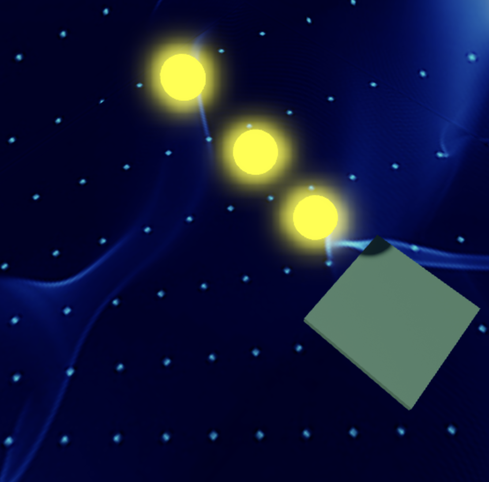
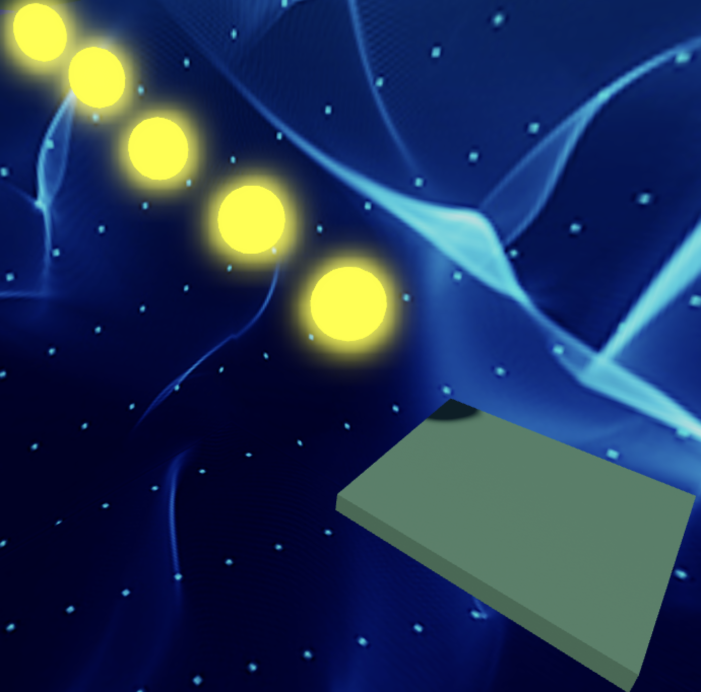

import ReactPlayer from 'react-player'
import ReactAudioPlayer from 'react-audio-player';
import audioFile from '../../static/audio/rblx2/gegagedigedagedago.mp3';

# Stage 2: Sphere Staircase

:::info

    
**Prerequisites: Before You Dive In!**

    
    Before diving into this stage of coding awesomeness, let's make sure you've got all the skills from the previous challenges under your belt!
    
    **1. Intro**
    
    You've already embarked on this exciting journey into the world of Roblox Obby creation! You've learned what an Obby is and why it's so much fun. Now, get ready to put that knowledge into action!
    
    **2. Setup**
    
    You've set the stage for your VR Obby adventure by getting your Roblox environment all ready to go! From creating your account to setting up your workspace, you've got everything in place to unleash your creativity and step into your virtual world.

    **3. Stage 1: Ascending Walls**

    Congratulations! You've successfully conquered Stage 1 by creating a challenging staircase obstacle course! You've learned how to set up checkpoints, customize properties, and build obstacles in VR like a pro.

    **Now that you've mastered these prerequisites, it's time to level up and tackle the next challenge in your virtual coding journey! Get ready to take your Obby game to new heights in the exciting world of VR! 🌟**

:::

 

      <iframe src="https://player.vimeo.com/video/952506237?h=ef3c77a6c4" frameborder="0" allow="autoplay; fullscreen; picture-in-picture; clipboard-write" style="position:absolute;top:0;left:0;width:100%;height:100%;" title="Roblox Part 2 - Stage 2"></iframe>
    

    
  `
}} />

## Objective 🧐🗿

Welcome to the second stage of our thrilling Obby journey! Prepare to elevate your skills as we dive into the exhilarating world of Sphere Stairs and ascend to greater heights in virtual reality!

## Step 1 - Creating the Staircase 🔵↖️

Hey there, young coders! Are you ready to roll into the next stage of our Obby adventure in virtual reality? Get ready to build some stairways to success with a little bit of sphere magic in VR!

    

### 1.1 Gather Your Spheres

It's time to get spherical! Collect three Sphere Parts and get ready to roll into action. Imagine grabbing these spheres right out of the virtual world, ready to shape your adventure!

### 1.2 Customize Your Spheres

Let your imagination run wild as you pick out colors and materials for your spheres. Make them as bright and colorful as your coding dreams! Picture your spheres glowing and shining in your VR environment.

### 1.3 Size Matters

Time to make these spheres the perfect size for our staircase. Set all their sizes to [4, 4, 4] and watch them grow into the perfect stepping stones! Feel like a virtual architect as you see your creations take shape before your eyes.

### 1.4 Build Your Stairway

Arrange your spheres in a way that creates a staircase fit for champions! Imagine each sphere as a step towards your coding goals, ready to support you on your journey. See yourself climbing these vibrant steps in your VR world, each one bringing you closer to coding greatness.

Remember, coding is all about creativity and fun! And if you ever need a little boost or a nudge in the right direction, your trusty Code Coach is always here to lend a helping hand.

So, let's roll into Stage 2 together and create some epic staircases! Your virtual coding adventure awaits! 🌟🎮

    
**Medium: Get creative with different sizes and placements for your steps.**

    

        
    

     

    Are you ready to take your Obby to the next stage in virtual reality? Let's soar to new heights with our staircase of spheres!

    **1.1 Craft Your Spheres**

    Get those creative juices flowing! Pick your favorite colors and materials for each sphere. Make them shine like stars in the night sky in your virtual world!

    **1.2 Set Up Your Stairs**

    Stack those spheres in a way that challenges even the bravest of adventurers! Each step is a leap towards victory as you ascend through your vibrant VR landscape!

## Step 2 - Creating the Checkpoint 🚩

It's time to mark our progress and gear up for the next challenge in our virtual reality adventure!

### 2.1 Add Another SpawnLocation

Head over to the Workspace and bring in a fresh SpawnLocation. This checkpoint is like a pit stop for champions in the VR realm!

### 2.2 Customize Properties

Let's make it stand out like a beacon of success!

- Choose a Color that radiates positivity and energy.
- Keep that AllowTeamChangeOnTouch checked. High-fives all around!
- Uncheck Neutral to show that this checkpoint means business!
- Match the TeamColor to your SpawnLocation color. Team unity!

Add another Team in the Teams folder

- Uncheck AutoAssignable to keep everything organized.
- Change the name to "Stage 3"
- Match the TeamColor to your SpawnLocation Color

### 2.3 Team Building

Time to bring your crew together and conquer this Obby journey!

Head over to the Explorer tab and assemble your dream team in the Teams folder.
- Let's make this journey even more epic by naming your team to "Stage 3"
- And setting its color to match your SpawnLocation.

    
**Hard: Hold on tight as we add strafing platforms to up the challenge!**

    
    **If you want more of a challenge by recreating the video yourself, follow these steps:**

    Hey there, brave coders! Are you ready to take your Obby skills to the next stage? Get ready to navigate through a maze of strafing platforms and show off your coding prowess like never before!
 
    **Description**

    We are going to create a script that makes a part in Roblox move side to side between two points. Here's what we want to accomplish: 

    **Step 1 - Start at a Position:**
    
    The part will start at a certain position. 

    **Step 2 - Move Side to Side:**
    
    The part will move to one side up to a set distance, then move back to the starting position, and keep repeating this movement. 

    **Step 3- Direction Change:**
    
    When the part reaches the set distance on one side, it will change direction and move back to the starting position. 

    **Step 4 - Smooth Movement:**
    
    The part will move smoothly using a tweening effect, pausing for a short time between movements. 

    By doing this, the part will continuously move side to side in a loop, creating a smooth and continuous animation effect. 

     

    **Instructions and Code Logic**
    
    **Step 1 - Set Up Starting Variables:**

    - Create a variable to hold the part by setting it to the `Parent` of the script. 

    - Create a variable for how fast the part will move (`speed`). 

    - Create a variable for how far the part will move (`distance`). 

    - Make a variable to remember the starting position of the part. 

    - Create a variable to set the direction of movement using a vector (`direction`). 

    **Step 2 - Create a Function:**

    - Define a function named `moveSideToSide` to hold the moving logic. 

    **Step 3 - Make an Infinite Loop:**

    - Inside the function, use a loop that runs forever. In Lua, this is done with `while true do`. 

    **Step 4 - Calculate Goal Position:**

    - Calculate the position where the part should move by adding the `direction` multiplied by the `distance` to the starting position (`startPos`). 

    **Step 5 - Calculate Distance and Time:**

    - Calculate the distance from the current position to the goal position. 

    - Calculate the time it should take to move to the goal position by dividing the distance by the speed. 

    **Step 6 - Create a Tween:**

    - Create a `TweenInfo` object with the calculated time and set the easing style to `Linear`. 

    - Use the `TweenService` to create a tween that moves the part to the goal position. 

    **Step 7 - Play the Tween:**

    - Play the tween and wait for it to complete. 

    **Step 8 - Change Direction:**

    - After reaching the goal position, change the direction to the opposite by multiplying the `direction` by -1. 

    **Step 9 - Pause the Loop:** 

    - Use the `wait` function to pause the loop for a short time, such as 1 second, before repeating the loop. 

    **Step 10 - Call the Function:**

    - Outside the function, call `moveSideToSide` to start the movement. 

     

    **Putting It All Together**

    - Start by setting up your starting variables. 

    - Define a function named `moveSideToSide` to hold the moving logic. 

    - Inside the function, create an infinite loop using `while true do`. 

    - Calculate the goal position by adding the `direction` multiplied by the `distance` to the starting position. 

    - Calculate the distance to the goal position and the time it should take to move there. 

    - Create a `TweenInfo` object with the calculated time and set the easing style to `Linear`. 

    - Use the `TweenService` to create a tween that moves the part to the goal position. 

    - Play the tween and wait for it to complete. 

    - Change the direction to the opposite by multiplying the `direction` by -1. 

    - Use the `wait` function to pause the loop for a short time. 

    - Outside the function, call `moveSideToSide` to start the movement. 

    {/*  

    **Extra Points Challenge:**

    Feeling confident? Copy your completed script and paste it into the other spheres. Can you conquer the stage without needing any help from your Code Coach? Show off your skills and aim for that perfect run!

    And remember, even the bravest adventurers need a little guidance sometimes. Don't hesitate to ask your Code Coach if you need a guiding hand. But hey, if you can tackle this challenge on your own, you'll earn some serious coding bragging rights!

    So, buckle up and get ready to navigate through the strafing platforms of **Stage 2 - Hard**! Your coding adventure awaits! 🚀💻 */}

 

- [x] **Fantastic work! You've conquered Stage 2 like a true coding superstar! Now, let's gear up and prepare to tackle Stage 3 with even more enthusiasm and determination! Keep shining bright, Obby builders! 🌟**

    

    <ReactAudioPlayer
        src={audioFile}
        controls
    />

