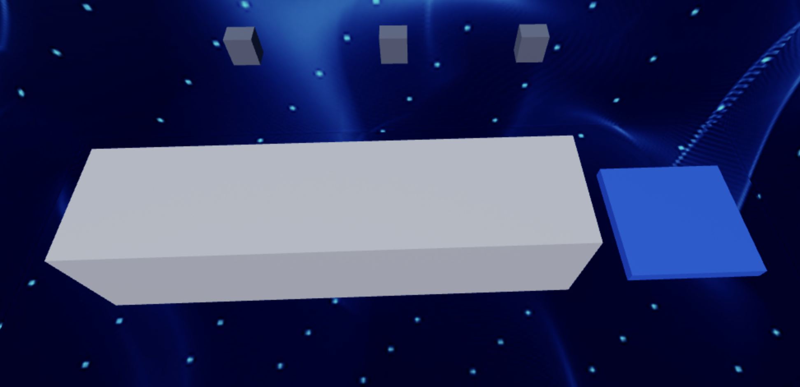
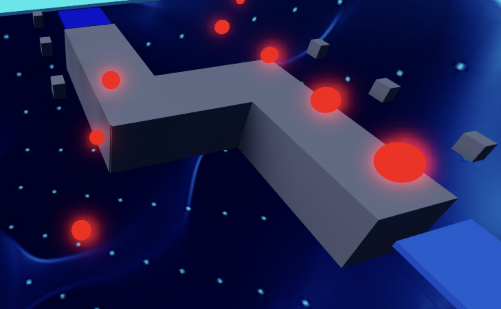

import ReactPlayer from 'react-player'
import MyVideoUrl from './video/robloxVR5.mp4';
// import ReactAudioPlayer from 'react-audio-player';
// import audioFile from './video/quandale-dingle.mp3';

# Stage 5: Fireball Footpath

    
**Prerequisites: Before You Dive In!**

    To embark on the fiery adventure of Stage 5: Fireball Footpath, you'll need to complete a series of exciting challenges to prepare yourself! Here's what you need to master before diving into the flames:

    **1. Intro**

    Get ready to ignite your coding journey with an introduction to the basics in VR!

    **2. Setup**

    Equip yourself with the essential tools and knowledge to navigate the Roblox world like a true coding champion!

    **3. Stage 1: Ascending Walls**

    Conquer the heights and sharpen your skills by scaling the walls of coding excellence in VR!

    **4. Stage 2: Sphere Stairs**

    Roll into the next stage of coding expertise as you ascend the spherical steps towards mastery in the virtual realm!

    **5. Stage 3: Plank Walkway**

    Roll into the next stage of coding expertise as you ascend the spherical steps towards mastery in the virtual realm!

    **6. Stage 4: KillBrick Path**

    Roll into the next stage of coding expertise as you ascend the spherical steps towards mastery in the virtual realm!

    **Once you've conquered these stages, you'll be ready to face the blazing inferno of Stage 5: Fireball Footpath! Are you prepared to dance through the flames and emerge victorious? Let's find out! 🌟🔥**

  <ReactPlayer controls url={MyVideoUrl}/>

## Objective 🧐🗿

Welcome to the fiery challenge of Stage 5! Brace yourself as we venture into the blazing realm of the Fireball Footpath in virtual reality.

## Step 1 - Blaze a Trail 🔥🏃

Welcome to Stage 5: Fireball Footpath, where we'll ignite the virtual skies with our coding prowess! Are you ready for an eruption of fireball fun? Let's dive into the virtual realm and unleash our creativity!

    

### 1.1 Crafting a Pathway

Let's start by forging a straight and simple pathway using your favorite colors and materials. Keep it flowing smoothly like a river of lava in the immersive VR landscape!

### 1.2 Bringing in the Fire

Now, it's time to add some sizzle!
- Head to the Toolbox and find the creator, "55hpmonk".
- Find the "FireballCannon" and import it.
- Sprinkle these fireball cannons along your path like fiery sentinels.
- Don't forget to give your fireball cannons a personal touch! Customize their Color and Material to make them truly stand out in the inferno.

    
**Medium: Add some twists and turns to keep things exciting!**

    

        
    

     

    **1.1 Create a Path**

    Craft a pathway with twists and turns that will ignite your coding creativity in VR. Choose your colors and materials wisely to make it stand out in the virtual world!

    **1.2 Importing Parts**

    Now, let's add some heat with fireball cannons. Here's how:
    - Open the Toolbox and search for the creator "55hpmonk".
    - Import the "FireballCannon" Part.
    - Strategically place these cannons along your path.
    - Craft a pathway with twists and turns that will ignite your coding creativity in VR.
    - Choose your Color and Material wisely to make it stand out in the virtual world!

## Step 2 - Setting Up the Checkpoint 🚩

But hold on, the adventure isn't over yet! Let's gear up for the next thrilling part of our journey in virtual reality.

### 2.1 Add Another SpawnLocation

Navigate to the Workspace and add a new SpawnLocation to mark your progress in the immersive VR world.

### 2.2 Customize Properties

Adjust these properties to match your fiery spirit:
- Choose a Color that ignites your passion for coding and VR exploration.
- Check AllowTeamChangeOnTouch to keep the flames burning.
- Uncheck Neutral to blaze your trail with confidence.
- Make sure the TeamColor matches the SpawnLocation's vibrant hue for a cohesive and visually engaging experience in VR.

### 2.3 Team Building

Add another Team to your Teams folder:
- Don't forget to uncheck AutoAssignable to make sure everything stays organized.
- Rename it to "Stage 6" to signify our triumphant progress in the virtual realm.
- Let its TeamColor burn bright in alignment with your SpawnLocation.

    
**Hard: Feel the heat as we crank up the fireball frequency and size!**

    **If you want more of a challenge by recreating the video yourself, follow these steps:**

    Welcome to Stage 5: Fireball Footpath, where things are heating up as we crank up the challenge! Get ready to feel the burn as we dial up the fireball frequency and size! Are you prepared to brave the flames and emerge victorious?

    **Description** 

    We are going to create a script that makes a part in Roblox shoot fireballs. The fireballs will be created at random times, move in a straight line, and explode when they touch a player. Here's what we want to accomplish: 

    **Step 1 - Create Fireballs:**
    
    The script will create new fireballs at random intervals. 

    **Step 2 - Move Fireballs:**
    
    Each fireball will move forward at a random speed. 

    **Step 3 - Explode on Touch:**
    
    If a fireball touches a player, it will explode and disappear. 

    **Step 4 - Remove Fireballs After Time:**
    
    Fireballs will automatically be removed after a short time if they don't touch anything. 

    By doing this, we will create an exciting effect where fireballs are continuously shot from a part, creating dynamic gameplay. 

     
    
    **Instructions and Code Logic**

    **Step 1 - Set Up the Starting Variables:**

    - Create a variable for the part by setting it to the `Parent` of the script. 

    - Get the `ServerStorage` and `Players` services from the game. 

    - Get the `Debris` service from the game to help remove items. 

    - Create a variable for the speed of the fireballs with a random value between 10 and 20. 

    - Create a variable for the time after which the fireballs will be removed (`removalTime`). 

    - Create a variable for the time between each fireball spawn with a random value between 1 and 5 (`spawnTime`). 

    - Create a variable for the color of the fireballs (`myBrickColor`). 

    **Step 2 - Create a Function:** 

    - Define a function named `createFireBall` to handle making new fireballs. 

    - Inside the function, create a new part and set it up to look like a fireball. 

    - Set the fireball's size to a random value between 2 and 5. 

    - Make the fireball's color neon red. 

    - Add a `BodyVelocity` to the fireball to make it move forward. 

    **Step 3 - Set Fireball Movement:**

    - Set the velocity of the fireball to make it move in the direction the part is facing, multiplied by the speed. 

    **Step 4 - Set Fireball Position:**

    - Set the position of the fireball to be just in front of the part. 

    **Step 5 - Handle Fireball Touch:**

    - Connect a function to the fireball's `Touched` event to check if it hits a player. 

    - If the fireball touches a player, create an explosion at the fireball's position and destroy the fireball. 

    **Step 6 - Remove Fireballs After Time:**

    - Use the `Debris` service to remove the fireball after the `removalTime`. 

    **Step 7 - Create Fireballs Continuously:**

    - Create a loop that runs forever using `while true do`. 

    - Inside the loop, call the `createFireBall` function to make a new fireball. 

    - Pause the loop for the `spawnTime` before creating the next fireball. 

     

    **Putting It All Together**

    - Start by setting up your part, services, and fireball properties. 

    - Define a function named `createFireBall` to handle making new fireballs. 

    - Inside the function, create a new fireball and set its properties. 

    - Set the fireball to move forward and check for player touches to cause explosions. 

    - Use the `Debris` service to remove fireballs after a short time. 

    - Create an infinite loop to keep making new fireballs at random intervals. 

    {/*  

    **Extra Points Challenge:**
    
    Feeling fired up for a challenge? Duplicate your completed script and apply it to the remaining fireball cannons. Can you conquer this Stage solo, without any help from your Code Coach? It's time to put your coding skills to the test and aim for that flawless performance!

    But remember, even the bravest adventurers may need a guiding hand along the way. If you require assistance, don't hesitate to reach out to your Code Coach for support. However, if you're able to tackle this challenge independently, you'll earn some serious coding accolades!

    So, gear up, intrepid coders, and get ready to conquer the blazing fireball barrage of **Stage 5 - Hard**! Your coding journey awaits! 🚀💻 */}

 

**Congratulations! You've triumphed over the fiery challenges of Stage 5 and are now prepared to soar to even greater heights in Stage 6! Keep the adventure blazing in virtual reality! 🌟**

{/* 

<ReactAudioPlayer
    src={audioFile}
    controls
/> */}