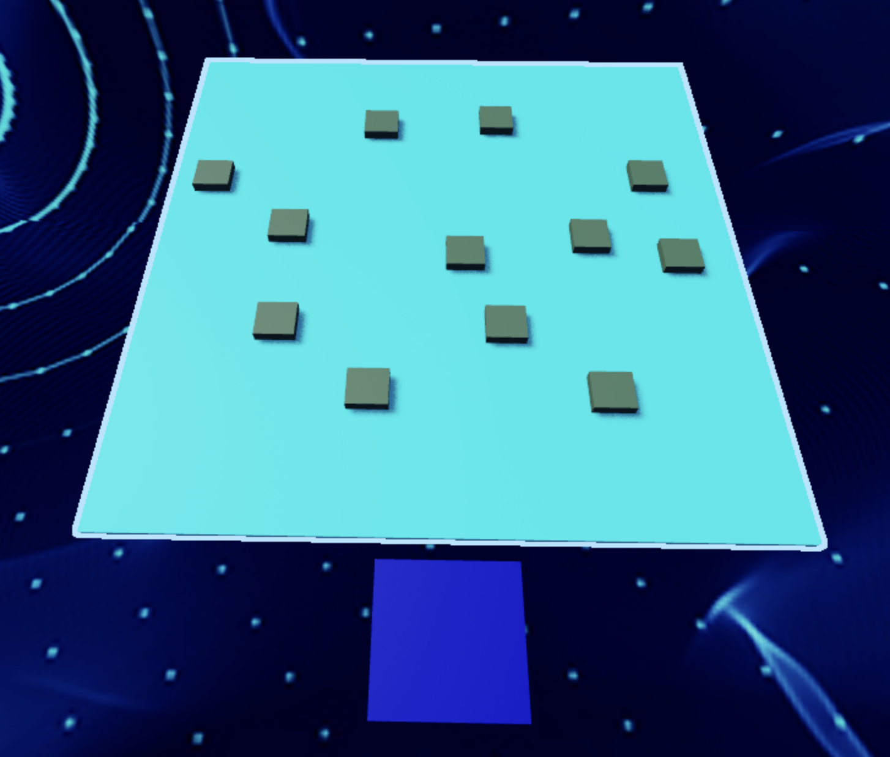
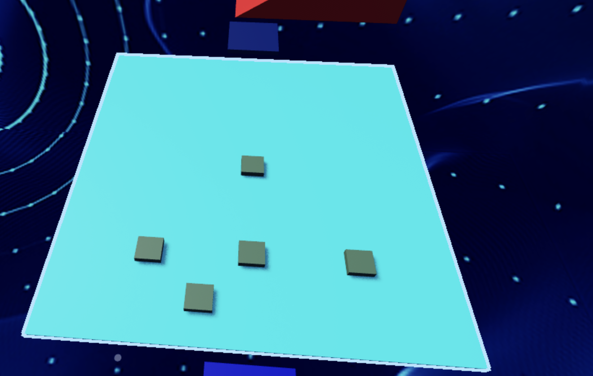

import ReactPlayer from 'react-player'
import MyVideoUrl from './video/robloxVR6.mp4';
// import ReactAudioPlayer from 'react-audio-player';
// import audioFile from './video/happy-happy-happy-song.mp3';

# Stage 6: Military Minefield

    
**Prerequisites: Before You Dive In!**

    Ready for the next adventure? Before diving into Stage 6: Military Minefield, make sure you've conquered the following challenges:

    **1. Intro**

    Embark on an exciting exploration into the realms of coding and gaming in the virtual reality universe!

    **2. Setup**

    Prepare the virtual stage for your immersive coding adventure.

    **3. Stage 1: Ascending Walls**

    Conquer the challenge of scaling to new altitudes in the immersive VR environment.

    **4. Stage 2: Sphere Stairs**

    Construct staircases using spheres and elevate your coding skills to new dimensions.

    **5. Stage 3: Plank Walkway**

    Navigate through intricate pathways with unwavering precision in the immersive VR landscape.

    **6. Stage 4: KillBrick Path**

    Navigate through a path filled with obstacles and carve your way to victory amidst the challenges.

    **7. Stage 5: Fireball Footpath**

    Brave the scorching heat as you maneuver through fiery obstacles in the immersive VR inferno.

    **Once you've completed these challenges, you'll be primed and ready to tackle the thrilling world of Stage 6: Military Minefield! 💣💥**

  <ReactPlayer controls url={MyVideoUrl}/>

## Objective 🧐🗿

Welcome to the electrifying journey into Stage 6 of our VR expedition! Prepare to traverse the perilous landscape of the Military Minefield in the immersive virtual world.

## Step 1 - Creating the Minefield 💣💥

Welcome to our daring expedition through the military minefield in the immersive virtual world! But fear not, for together, we shall chart safe routes through this perilous terrain! Here's our strategy for navigation:

    

### 1.1 Plotting the Course

Craft a direct pathway where we'll strategically position our mines.

### 1.2 Deploying the Mines

Lets scatter mines across the treacherous minefield!
- Head over to the Toolbox and seek out the creator, "55hpmonk".
- Locate the "Mine" asset and bring it into our world.
- Scatter the mines carefully along our path, ensuring there's enough space to navigate safely.
- Customize the appearance of the mines with your preferred Color and Material, adding your personal touch to the VR landscape.

    
**Medium: Keep players on edge with some sneaky hidden mines.**

    

        
    

     

    **1.1 Plotting Your Field**

    Prepare the virtual landscape where we'll unleash our formidable mines. Clear the path for our VR odyssey!

    **1.2 Arming Your Arsenal**

    - Open up the Toolbox and seek out the mastermind, "55hpmonk".
    - Locate the "Mine" asset, a key tool in our virtual arsenal, and bring it into the fray.
    - Strategically place the mines across our minefield, ensuring every step is a calculated move.
    - Adjust the Transparency property to 0.85, giving our mines an aura of mystery.
    - Let your creativity flow as you customize the Color and Material of the mines, ensuring they stand out amidst the VR chaos.

## Step 2 - Setting Up the Checkpoint 🚩

We've made amazing progress, and that's definitely worth a happy dance! Now, let's gear up for the next thrilling challenge that awaits us!

### 2.1 Add Another SpawnLocation

Head into the Workspace and plant another SpawnLocation to mark our progress through this perilous terrain.

### 2.2 Customize Properties

Let your creativity shine as you adjust these properties:
- Pick a Color that resonates with your adventurous spirit.
- Activate AllowTeamChangeOnTouch to empower your journey forward.
- Discard any doubts by unchecking Neutral, and let confidence guide your path.
- Ensure the TeamColor matches the SpawnLocation's, aligning with your courage.

### 2.3 Team Building

Forge ahead by adding another Team to your Teams folder:
- Make sure to turn off AutoAssignable to help keep everything neat and tidy.
- Give it the name "Stage 7", a testament to your bravery in the face of danger.
- Let its TeamColor mirror the boldness of your SpawnLocation.

    
**Hard: Mysterious mines that reveal their presence with a bang!**

    **If you want more of a challenge by recreating the video yourself, follow these steps:**

    Welcome, brave adventurers, to the heart-pounding challenge of Stage 6 - where mysterious mines lie hidden, waiting to reveal themselves with a bang! Are you ready to test your wits and courage in this perilous terrain?

    **Description** 

    We are going to create a script that makes a part in Roblox explode when it gets touched. Here's what we want to accomplish: 

    **Step 1 - Detect Touch:**
    
    The script will detect when the part is touched. 

    **Step 2 - Create an Explosion:**
    
    When the part is touched, it will create an explosion at the part's position. 

    **Step 3 - Change Part Appearance:**
    
    The part will become fully visible when it explodes. 

    By doing this, we will create an exciting effect where the part explodes and becomes visible when touched. 

     

    **Instructions and Code Logic** 

    **Step 1 - Set Up the Starting Variables**: 

    - Create a variable to hold the part by setting it to the `Parent` of the script. 

    **Step 2 - Create a Function**

    - Connect a function to the part's `Touched` event to detect when the part is touched. 

    - Inside the function, create a new explosion. 

    - Set the explosion's parent to `workspace` so it appears in the game. 

    - Set the explosion's position to the part's position. 

    - Set the explosion's blast radius to 50. 

    - Make the part fully visible by setting its `Transparency` to 0. 

     

    **Putting It All Together**

    - Start by setting up your part variable. 

    - Connect a function to the part's `Touched` event to detect touches. 

    - Inside the function, create a new explosion and set its properties. 

    - Make the part fully visible when it is touched. 
    
    {/*  

    **Extra Points Challenge:**

    Take on the ultimate challenge by copying and pasting this code into all your mines. Then, push your limits and test your mastery of the minefield. Will you emerge victorious, earning the respect of your peers and the admiration of your Code Coach?
    
    Remember, even the toughest challenges are conquerable with determination and resilience. If you find yourself in need, don't hesitate to seek guidance from your Code Coach. But for those who dare to tackle this challenge solo, the rewards will be beyond measure!

    So, gear up, intrepid coders, and prepare to face the explosive trials of **Stage 6 - Hard**! Your journey to coding greatness begins here! 🚀💥 */}

 

**Congratulations! By conquering Stage 6, you've demonstrated your resilience amidst the perils of the military minefield in the virtual world! Onward to Stage 7, where thrilling new adventures await! 🌟**

{/* 

<ReactAudioPlayer
    src={audioFile}
    controls
/> */}