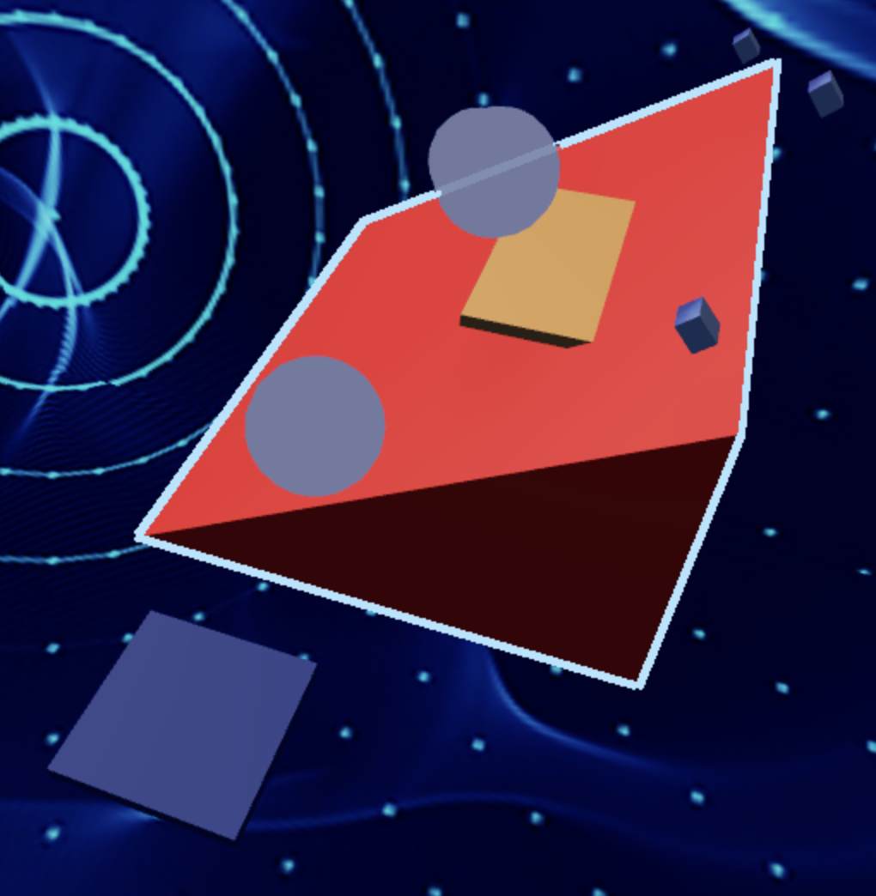
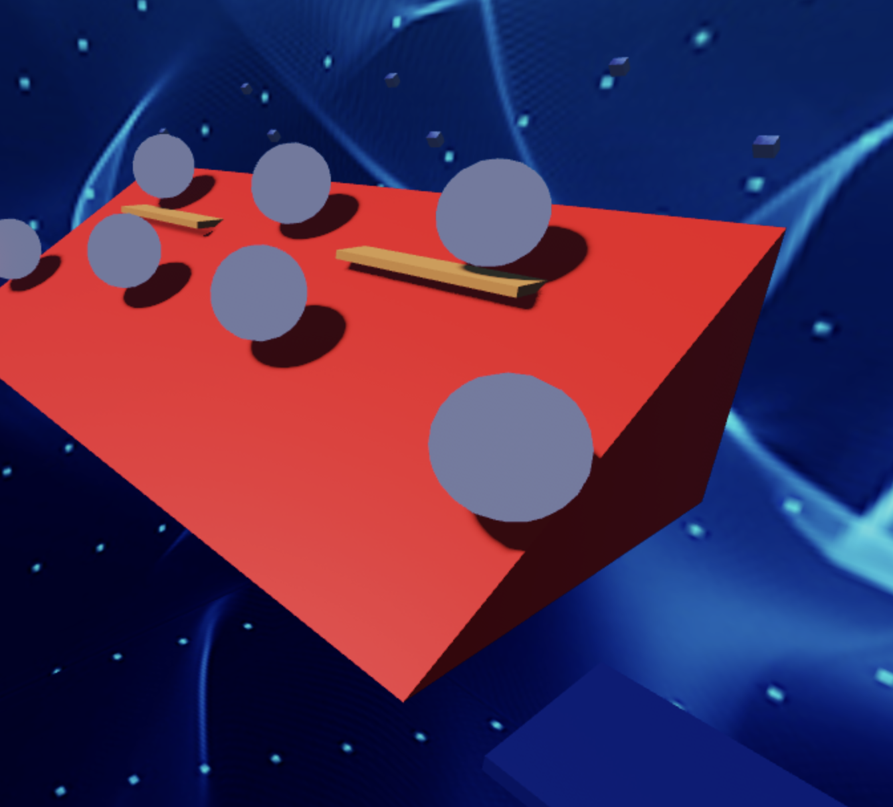

import ReactPlayer from 'react-player'
import ReactAudioPlayer from 'react-audio-player';
import audioFile from '../../static/audio/rblx2/monday-left-me-broken-cat.mp3';

# Stage 7: Rolling Rocks

:::info

    
**Prerequisites: Before You Dive In!**

    Welcome, adventurers, to the prerequisites for Stage 7: Rolling Rocks! Prepare to immerse yourselves in a thrilling VR journey through coding challenges that will sharpen your skills and ignite your creativity. To unlock the excitement of Stage 7, you must first conquer the following stages in our virtual world:

    **1. Intro**

    Lay the foundation for your VR coding adventure and embark on a quest filled with excitement and discovery.

    **2. Setup**

    Equip yourself with the tools and knowledge needed to navigate the VR challenges that lie ahead.

    **3. Stage 1: Ascending Walls**

    Climb to new heights in the virtual world as you learn to overcome obstacles with determination and perseverance.

    **4. Stage 2: Sphere Stairs**

    Ascend the stairway to VR coding success with confidence and precision.

    **5. Stage 3: Plank Walkway**

    Navigate the path of innovation as you build virtual bridges to your coding dreams.

    **6. Stage 4: KillBrick Path**

    Blaze a trail through virtual challenges as you learn to overcome obstacles with skill and strategy.

    **7. Stage 5: Fireball Footpath**

    Embrace the heat of VR coding creativity and forge your path to victory amidst fiery challenges.

    **8. Stage 6: Military Minefield**

    Navigate through the dangers of coding complexity with agility and resilience in the virtual battlefield.

    **With each challenge you conquer in this virtual world, you edge closer to the thrill and excitement of Stage 7: Rolling Rocks. So, gather your courage, sharpen your VR skills, and prepare to rock the coding world like never before! 🚀🌟**

:::

 

      <iframe src="https://player.vimeo.com/video/952506274?h=59c04c03b2" frameborder="0" allow="autoplay; fullscreen; picture-in-picture; clipboard-write" style="position:absolute;top:0;left:0;width:100%;height:100%;" title="Roblox Part 2 - Stage 7"></iframe>
    

    
  `
}} />

## Objective 🧐🗿

Welcome to the electrifying challenge of Stage 7: Rolling Rocks! Prepare to conquer the rocky terrain as you navigate through a maze of boulders and obstacles. Get ready to dodge, duck, and dive as you face the relentless onslaught of falling rocks in this dynamic VR environment.

## Step 1 - Creating the Rocky Slide ⚠️🪨

Welcome, VR adventurers! It's time to dive into the next thrilling challenge. Get ready to navigate through the rocky terrain, and don't worry—your Code Coach is here to help you every step of the way. Here's how we do it:

    

### 1.1 Constructing the Ramp

Let's kick things off by building an epic ramp:
- Using a Wedge Part, make sure it's sturdy and smooth!
- Create a wide cover spot along the ramp to provide a safe zone from the falling boulders!
- Get creative and jazz up your ramp and cover with a Color and Material of your choice, making it visually stunning in VR!

### 1.2 Adding the Boulder Spawner

Now, let's get rolling with those boulders and add some real excitement to our virtual world!
- Head over to the Toolbox and look for the talented creator, "55hpmonk".
- Grab the "BoulderSpawner" asset and bring it into your workspace.
- Strategically place the BoulderSpawners along the top of the ramp.
- Customize each BoulderSpawner with your preferred Color and Material.
- Adjust the Color and Material of the spawned boulders by tweaking the variables in the Script, adding a personal touch to your VR adventure.

    
**Medium: Let's roll! Create a challenging path with some cover!**

    

        
    

     

    **1.1 Constructing the Ramp**

    Let’s create the mountain from which our boulders will tumble in this thrilling VR adventure!
    - Get your creative juices flowing by designing a long pathway using a Wedge Part.
    - Remember to leave space for multiple cover spots where our fearless adventurers can seek refuge.
    - And don't forget to add your own unique touch to the ramp and cover with colors and materials that reflect your style! Make it as vibrant and exciting as the virtual world you're creating!

    **1.2 Adding the Boulder Spawner**

    Now, let's bring on the action by rolling out the rocks! 
    - Head over to the toolbox and search for "55hpmonk".
    - Find the "BoulderSpawner" asset and import it into the game
    - Strategically place the BoulderSpawners along the top of the ramp.
    - Customize them with your preferred colors and materials.
    - Don't hesitate to tweak the variables in the Script to enhance the VR experience and make those boulders truly rock!

## Step 2 - Setting Up the Checkpoint 🚩

You've made amazing progress by creating a thrilling rocky slide! Now, let’s set up a checkpoint to mark this achievement and prepare for the next exciting challenge.

### 2.1 Add Another SpawnLocation

Enter the Workspace and add a new SpawnLocation to your Workspace. This will serve as a checkpoint, marking your progress through this daring VR journey.

### 2.2 Customize Properties

Let your imagination run wild as you tweak these properties:
- Choose a Color that matches your adventurous spirit.
- Activate AllowTeamChangeOnTouch to empower your progress.
- Banish any doubts by unchecking Neutral and embracing confidence.
- Ensure the TeamColor matches your SpawnLocation, aligning with your courage.

### 2.3 Team Building

Forge ahead by adding another Team to your Teams folder:
- Remember to uncheck the "AutoAssignable" box, so we can keep things super organized!
- Name it "Stage 8," a tribute to your bravery amidst the rolling rocks.
- Let its TeamColor reflect the boldness of your SpawnLocation.

    
**Hard: Hold onto your hats as we add moving cover for extra chaos!**

    **If you want more of a challenge by recreating the video yourself, follow these steps:**

    For those seeking an extra challenge in Stage 7's rolling rocks chaos, get ready to up the ante with some moving cover madness! Here's how to take it to the next stage:
 
    **Description**

    We are going to create a script that makes a part in Roblox move back and forth smoothly using tweens. Here's what we want to accomplish: 

    **Step 1 - Set Up Movement:**
    
    The part will start at its initial position and move to a new position 10 studs away. 

    **Step 2 - Smooth Movement:**
    
    The part will move smoothly using a tween, taking 2 seconds for each movement. 

    **Step 3 - Repeat Movement:**
    
    The part will keep moving back and forth forever. 

    By doing this, the part will continuously move back and forth, creating a smooth animation effect. 

     

    **Instructions and Code Logic**

    **Step 1 - Set Up the Starting Variables:**

    - Create a variable for the part by setting it to the `Parent` of the script. 

    - Get the `TweenService` from the game. 

    - Create a variable for the starting position of the part (`startPos`). 

    - Create a variable for the ending position 10 studs away from the starting position (`endPos`). 

    - Create a `TweenInfo` object that defines how the tween will behave: 

        - Duration: 2 seconds. 

        - Easing style: Linear (smooth and consistent speed). 

        - Easing direction: Out (slows down at the end). 

        - Repeat count: -1 (infinite repeats). 

        - Reverses: true (moves back and forth). 

        - Delay time: 0 seconds (no delay). 

    **Step 2 - Create a Function:** 

    - Define a function named `startTween`. 

    - Inside the function, create a tween that moves the part from `startPos` to `endPos`. 

    - Connect a function to the tween's `Completed` event to swap `startPos` and `endPos` when the tween finishes, and then restart the tween. 

    - Start the tween by calling the `Play` method. 

    - Call the `startTween` function to begin the movement. 

     

    **Putting It All Together**

    - Start by setting up your part, tween service, and positions. 

    - Create a `TweenInfo` object to define the tween behavior. 

    - Define a function named `startTween` to create and manage the tween. 

    - Inside the function, create a tween to move the part and handle the completion event. 

    - Start the tween to begin the movement. 

    - Call the `startTween` function to kick off the process. 

    {/*  
 
    **Extra Points Challenge:**

    Gear up for the ultimate test! Duplicate and apply this code across all your boulders. Then, push your boundaries and showcase your mastery of the rolling rock chaos. Are you prepared to triumph, earning the recognition of your fellow adventurers and the admiration of your Code Coach?

    Remember, while this challenge may be tough, don't hesitate to seek guidance from your Code Coach if needed. But if you can conquer this feat solo, you'll earn some serious coding accolades!
    
    So, gear up, intrepid coders, and brace yourselves for the moving cover mayhem of **Stage 7 - Hard**! Let's roll! 🚀💻 */}

 

**Hooray! By conquering Stage 7’s rolling rocks and rocky terrain, you’ve shown incredible courage and skill! Onward to Stage 8, where even more thrilling VR adventures await! Keep pushing your limits and exploring new heights in the virtual world! 🌟**

    

    <ReactAudioPlayer
        src={audioFile}
        controls
    />

