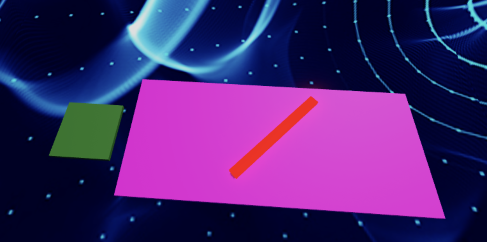
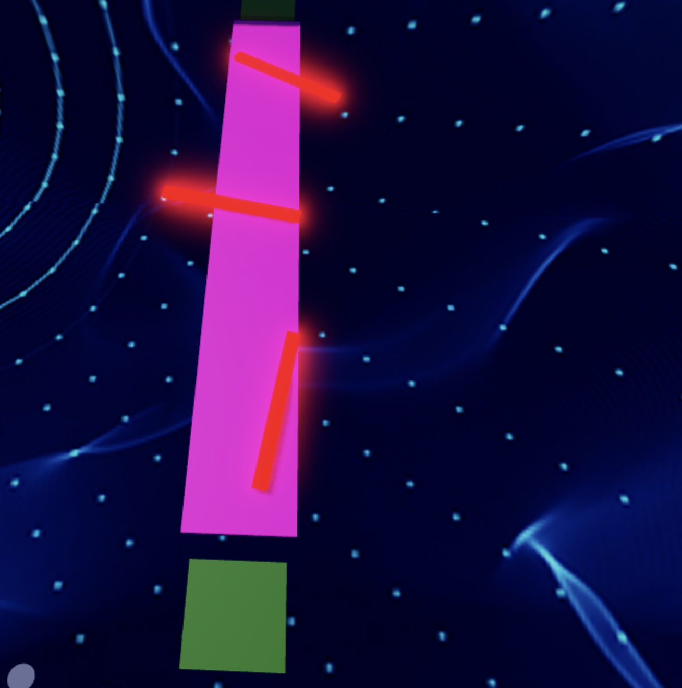

import ReactPlayer from 'react-player'
import MyVideoUrl from './video/robloxVR8.mp4';

# Stage 8: Spinning KillBricks

    
**Prerequisites: Before You Dive In!**

    Prepare yourselves, brave adventurers, as you stand on the brink of Stage 8! But first, ensure you've conquered the twists and turns of the preceding challenges in our thrilling VR journey.

    **1. Intro**

    Lay the groundwork for your coding conquest in this thrilling virtual world.

    **2. Setup**

    Equip yourself with the necessary VR tools and knowledge to navigate the challenges ahead.

    **3. Stage 1: Ascending Walls**

    Scale new heights and overcome obstacles, feeling the exhilaration of each climb in VR.

    **4. Stage 2: Sphere Stairs**

    Navigate the spherical staircase with finesse, experiencing the virtual world's dynamic movement.

    **5. Stage 3: Plank Walkway**

    Balance and coordination are key as you traverse this precarious path, fully immersed in the VR environment.

    **6. Stage 4: KillBrick Path**

    Dodge deadly obstacles in this challenging terrain, testing your agility and reflexes in VR.

    **7. Stage 5: Fireball Footpath**

    Brave the fiery path, maneuver through blazing challenges, and emerge victorious in this intense VR setting.

    **8. Stage 6: Military Minefield**

    Navigate through hidden dangers and traps, showcasing your strategic skills in the virtual world.

    **9. Stage 7: Rolling Rocks**

    Roll with the punches and conquer the rocky terrain, demonstrating your adaptability and courage in VR.

    **With each victory, you edge closer to the ultimate test: the Spinning KillBrick challenge! Get ready to face this thrilling obstacle with all the skills and experience you've gained in our VR adventure. Let’s continue our journey and push the boundaries of our virtual reality coding quest! 🚀🌟**

  <ReactPlayer controls url={MyVideoUrl}/>

## Objective 🧐🗿

Gear up for the heart-pounding adventure of Stage 8: Spinning Killbricks in our exhilarating VR experience! Get ready to be swept into a whirlwind of motion and strategy as you navigate through this thrilling virtual world.

## Step 1 - Creating the Path 🔄🩻

Welcome to the electrifying Stage 8: Spinning KillBricks in our virtual reality adventure! Get ready to spin and weave your way through the obstacles in this immersive VR experience!

    

### 1.1 Constructing the Walkway

Start by crafting a straight path for your spinning kill brick.
- Personalize your pathway by choosing the perfect Color and Material.

### 1.2 Importing the Spinning Kill Brick

Now, let's introduce the spinning kill brick into our virtual world:
- Navigate to the Toolbox and search for the creator, "55hpmonk".
- Find the "SpinningKillBrick" and import it into your game.
- Place the SpinningKillBrick on your pathway.
- Customize it with your favorite Color and Material to make it stand out in the VR environment.

    
**Medium: Spin things up with an array of spinning blocks.**

    

        
    

     

    **1.1 Constructing the Walkway**

    In our virtual realm, let's sculpt a direct route to accommodate numerous spinning kill bricks.
    - Personalize the Color and Material of your pathway to match your adventurous flair.

    **1.2 Adding Spinning Kill Bricks**

    Now, let's inject some excitement with spinning kill bricks:
    - Navigate to the Toolbox and search for the creator, "55hpmonk".
    - Find the "SpinningKillBrick" and import it into your VR experience.
    - Place multiple SpinningKillBricks on your pathway.
    - Customize your kill bricks with your preferred Color and Material.

## Step 2 - Setting Up the Checkpoint 🚩

We've achieved so much, and that's a reason to rejoice! Now, let's prepare for an even more remarkable adventure! The next challenge awaits, promising an experience beyond compare!

### 2.1 Add Another SpawnLocation

Enter the Workspace and plant a new SpawnLocation to chart our course through this thrilling virtual adventure.

### 2.2 Customize Properties

Let your imagination run wild as you personalize these properties:
- Select a Color that resonates with your daring spirit.
- Activate AllowTeamChangeOnTouch to empower your journey.
- Banish any uncertainties by unchecking Neutral and embracing confidence.
- Ensure the TeamColor mirrors your SpawnLocation, harmonizing with your bravery.

### 2.3 Team Building

Take the next step! Add a new team to your Teams folder and keep growing!
- Remember to uncheck the "AutoAssignable" box, so we can keep our workspace neat and easy to navigate!
- Name it "Stage 9," honoring your courage amidst the spinning challenges.
- Let its TeamColor echo the bravery of your SpawnLocation.

    
**Hard: Ready for the ultimate challenge? Experiment with different speeds and directions!**

    **If you want more of a challenge by recreating the video yourself, follow these steps:**

    Ready to take on the ultimate challenge? Let's dive into the whirlwind of Stage 8: Spinning Killbricks! Prepare to push your limits as you experiment with different speeds and directions, navigating through a maze of spinning obstacles. Are you up for the challenge?

    **Description**

    We are going to create a script that makes a part in Roblox spin continuously and cause any player who touches it to lose all their health. Here's what we want to accomplish: 

    **Step 1 - Spin the Part:**
    
    The part will spin around smoothly. 

    **Step 2 - Detect Touch:**

    The script will detect when a player touches the spinning part. 

    **Step 3 - Affect the Player:**
    
    If a player touches the part, their health will be set to 0. 

    By doing this, we will create a spinning part that creates a challenge for players in the game. 

     

    **Instructions and Code Logic**

    **Step 1 - Set Up the Starting Variables:**

    - Create a variable for the part by setting it to the `Parent` of the script. 

    - Create a variable for the speed of the spin (`spinSpeed`). 

    **Step 2 - Create the Functions:**

    - Define a function named `rotatePart` that spins the part. 

    - Inside the function, update the part's rotation using `CFrame` and the `spinSpeed`. 

    - Define a function named `onPartTouched` that checks if something touching the part is a player. 

    - Inside the function, if the part that touched has a "Humanoid" (indicating a player), set the player's health to 0. 

    - Use the `RunService.Heartbeat` event to call the `rotatePart` function continuously, making the part spin. 

    - Connect the `onPartTouched` function to the part's `Touched` event to detect when it is touched. 

     

    **Putting It All Together**

    - Start by setting up your spinning part and spin speed. 

    - Define a function named `rotatePart` to make the part spin. 

    - Define a function named `onPartTouched` to handle when the part is touched. 

    - Use the `RunService.Heartbeat` event to call the `rotatePart` function continuously. 

    - Connect the `onPartTouched` function to the part's `Touched` event. 
 
    {/*  

    **Extra Points Challenge:**

    Prepare yourself for the ultimate challenge! Change up the Scripts across all your spinning kill bricks. Then, test your limits and demonstrate your expertise in navigating through the spinning chaos. Are you ready to emerge victorious, earning the respect of your fellow adventurers and the admiration of your Code Coach?

    While this challenge may present obstacles, don't hesitate to seek guidance from your Code Coach if necessary. However, if you can conquer this task independently, you'll earn some serious coding accolades!

    So, gear up, courageous coders, and get ready to face the spinning madness of **Stage 8 - Hard**! Let's spin! 🚀💻 */}

 

**Congratulations, brave explorers! You've triumphed over the whirlwind of challenges in Stage 8! Now, prepare to amplify your experience as we venture into the immersive virtual world of Stage 9! Get ready to don your VR headsets and dive deeper into the thrilling depths of coding adventure! 🌟**

{/* <iframe width="900" height="500" src="https://www.youtube.com/embed/MCB_A8N1DNU" title="LeBron James, scream if you love Roblox" frameborder="0" allow="accelerometer; autoplay; clipboard-write; encrypted-media; gyroscope; picture-in-picture; web-share" referrerpolicy="strict-origin-when-cross-origin" allowfullscreen></iframe> */}