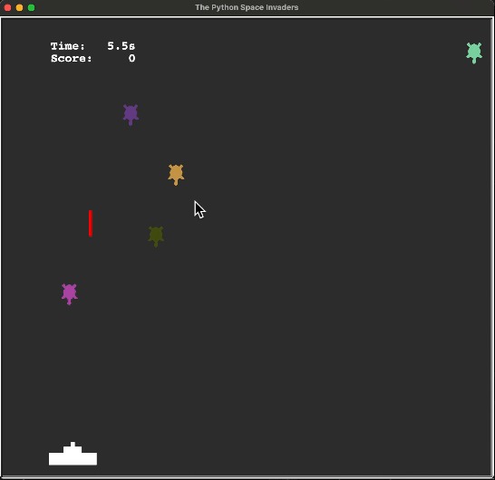

## Project Demo 

    

<figure align="center">
  <figcaption>
Hey space rangers! 🌌 Get ready to blast off into the coding universe with Python’s turtle module as we build our very own version of the legendary game—Space Invaders! 🚀👾 
 </figcaption>
</figure>

In this super fun tutorial, we're not just playing the game; we're going to create it! Using Python’s turtle module, which is like your digital drawing pad, you'll learn to animate characters and make them zip across your screen. 🖥️✨

## Here's What You're in Stock For!

- **Design a Classic**: Step into the shoes of a game designer and layout your own Space Invaders game.
- **Animate Sprites**: Bring your aliens and spaceships to life as they move around your game world.
- **Interact and React**: Make your game respond to your every command, making it as challenging or as fun as you like!
- **Control the Game**: Dive into creating a game loop that keeps your game running smoothly, making sure every alien move and laser blast looks cool.
- **Function like a Pro**: Use Python functions to make your spaceship shoot and aliens invade—each piece of your code will control a different part of the game.

Don't worry if you're new to Python or haven't used the turtle module before; this adventure is perfect for anyone who's got the basics down and wants to apply them to something awesome. 🎮💻
## Lesson Design

### Get Ready for Six Epic Coding Adventures with Python!
Some sessions will kick off with cool, essential info you'll need to turbocharge your coding journey. Make sure to check out this material first—it's your secret weapon for acing the sessions!

### Challenge Yourself!
Who says following instructions has to be boring? Dive into the fun of figuring things out on your own! Sometimes, we'll tuck the code away, nudging you to explore the Python documentation with your coach. It's like a treasure hunt where you discover how to bring your code to life—all while becoming a doc-navigating ninja!

### Learn at Your Own Pace
Not rushing through—it’s all about mastering the magic at your pace! If you’re feeling stuck or need a little more time, no worries at all. We’re loaded with tips and tricks, and there's an extra session to catch up or push further with game enhancements if you're up for it!

### Always Supported
Your code coach is your co-pilot on this coding adventure! Stumped by a bug or just curious about a function? Shoot your questions, and let’s sort it out together. We’re all about making this journey as fun and enlightening as possible.

### Let’s Have Fun Coding!
Get ready to play and code with Python's Turtle library. It’s not just about learning; it’s about creating, experimenting, and having a blast while doing it! Here’s what you’ll be mastering:

## Lesson 1: Launching Your Game Setup and Cannon 🎮
- **Create the Screen**: Kick off your space adventure by setting up your own game window!
- **Create the Laser Cannon**: Build the coolest cannon to defend Earth from aliens.
- **Move the Turtle Object**: Learn secret moves to make your Turtle dance with your commands.
- **Move the Entire Laser Cannon**: Become a pro at sliding your cannon side to side—just like in the arcades!

## Lesson 2: Mastering Cannon Control and Laser Deployment 🛡️
- **Control When Items Are Displayed**: Unlock the magic behind keeping your game looking awesome.
- **Prevent the Laser Cannon From Leaving the Screen**: Set up invisible walls to keep your cannon safe.
- **Create Lasers**: Zap! Design super lasers that look cool and fight off invaders.
- **Create the Game Loop to Move the Lasers**: Keep the action going non-stop with a game loop that never quits.

## Lesson 3: Introducing Enemies and Shooting Dynamics 👾 
- **Remove Lasers That Leave the Screen**: Zap away old lasers to keep your game running smooth.
- **Spawn New Aliens**: Watch out! New aliens are coming, and you need to be ready.
- **Move the Aliens**: Code the creepiest alien moves as they try to take over.
- **Collision Detection**: Boom! Make lasers meet aliens in spectacular explosions!

## Lesson 4: Finalizing Gameplay Mechanics 🚀 
- **Create a Timer**: Race against the clock in a thrilling countdown.
- **Add the Score**: Rack up points for each alien you zap—aim for the high score!
- **Enhance Movement Controls**: Make your cannon glide like a spaceship with new control tricks.
- **Frame Rate Control**: Keep your game running smoother than a hoverboard on a space station.

## Lesson 5: Enhancing Features and Customizations 🔫
- **Boost the Challenge with Difficulty Levels**: Turn up the heat with levels that test your ultimate gaming skills.
- **Manage Your Ammo: Limit the Number of Lasers**: Master the art of precision—every shot counts!
- **Spin that Cannon!**: Challenge yourself with a cannon that doesn’t move — think you can handle it?

 