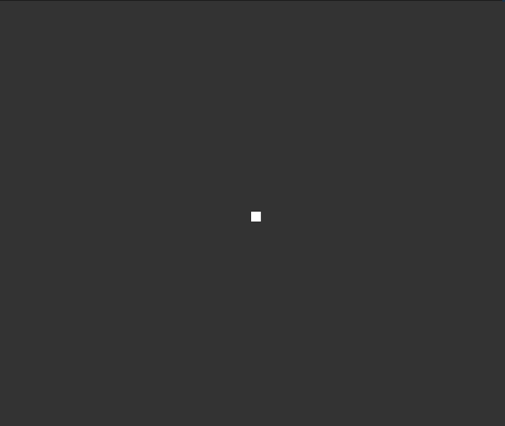

# Lesson 1: Launching Your Game Setup and Cannon 🎮🚀

:::info
<details style={{border:'none'}}>
<summary>**Prerequisites: Before You Dive In!**</summary>    

**Python Libraries**

Before you start coding in Python, let's talk about what a "library" is. 

Think of a library like a toolbox where you can borrow tools you need for a project. 
In programming, a library is similar, but instead of physical tools, it gives us special functions that you can use to make coding easier and faster.
    
**Getting to Know the Python turtle Library**

The Python turtle library is a built-in tool that lets you create pictures and shapes by providing a virtual canvas. The tool you use to draw on this canvas is called the "turtle," and that's how the library gets its name.

You can use it to draw all sorts of shapes and images. Here's an example of what you can do with the turtle:

<div align="center">
    
</div>

Pretty neat, isn't it? This is just one example of the many things you can create using the turtle library.
</details>
:::

## Objective 🧐🗿

Kick off the fun by setting up the game screen and creating a cool laser cannon that you can move around!

## Step 1. Import Turtle 🐢
Open up the file we made in our Setup section.

To use the Python Turtle library, we first need to import it into our environment. Type this command in:
``` python
# YourLastName_SpaceInvaders.py
import turtle

turtle.done()
```

Our code will go in between these lines, and `turtle.done()` should be the last line.

## Step 2. Initializing the Game Window 🖥️

We need to set up the screen where your game will be. Think of it like setting up a canvas for painting. Here’s how you do it:

```python
window = turtle.Screen()
```

This variable `window` will be our game screen. We can change any properties we want like size and color.

Now, let's head over to the Turtle Documentation. https://docs.python.org/3/library/turtle.html#turtle.setup

#### Walk-Through:
1. **Set the window size:** Find how to resize the window to 50% of the screen's width and 75% of its height.
2. **Change the background color:** Look up how to set the background color. We’ll start with a dark grey using the RGB values `(0.2, 0.2, 0.2)`.
3. **Update the window title:** Discover how to change the title of the window to "Space Invaders".


<details style={{border:'none'}}>
<summary>**Need a Hint? 👀**</summary>    

If you're having trouble, use the drop-downs below for some help! Take what you need, and try the rest with the help of your coach.

<details style={{border:'none'}}>
<summary>**Window Set Up**</summary>    

Head to this link:
https://docs.python.org/3/library/turtle.html#turtle.setup

We want to follow the second code example listed. To adjust our screen accordingly, pass in `width=0.5, height=0.75` to the set up function.

<details style={{border:'none'}}>
<summary>**Code Peek!**</summary>    

`window.setup(0.5, 0.75)`
</details>
</details>

<details style={{border:'none'}}>
<summary>**Background Color**</summary>    

Head to this link: https://docs.python.org/3/library/turtle.html#turtle.bgcolor

This function takes in a tuple value. We'll want to pass in `(0.2,0.2,0.2)`.

<details style={{border:'none'}}>
<summary>**Code Peek!**</summary>    

`window.bgcolor(0.2, 0.2, 0.2)`
</details>
</details>

<details style={{border:'none'}}>
<summary>**Window Title**</summary>    

Last, but not least, head to https://docs.python.org/3/library/turtle.html#turtle.title if you're having trouble finding the title function.

This function takes in a string. Pass in the name above! For example, 

<summary>**Code Peek!**</summary>    
<details style={{border:'none'}}>

`window.title("The Space Invaders")`
</details>
</details>
</details>


## Step 3. Creating the Laser Cannon 💥

Let's start by drawing a simple laser cannon using Turtle. We'll make a square that represents the cannon for now.

### Set-Up
#### Walk-Through:
1. **Initialize your Turtle object:** Find how to create a new Turtle object in the documentation.
2. **Move the Turtle without drawing:** Look up how to lift the pen up so your turtle moves without drawing.
3. **Set the Turtle color:** Explore how to change the color of your Turtle. We are starting with white, but you'll get to pick your own colors!
4. **Choose a shape for the Turtle:** Your cannon will start off as a square. Check how to set the shape of your turtle.

<details style={{border:'none'}}>
<summary>**Need a Hint? 👀**</summary>    

If you're having trouble, use the drop-downs below for some help! Take what you need, and try the rest with the help of your coach.


<details style={{border:'none'}}>
<summary>**Cannon Setup**</summary>    

Check out the Turtle documentation for setting up your turtle object:
https://docs.python.org/3/library/turtle.html#turtle.Turtle

We'll use this to create our cannon. Remember, it's a square for now, but feel free to experiment later!

<details style={{border:'none'}}>
<summary>**Code Peek!**</summary>    

```python
cannon = turtle.Turtle() # This will initialize our turtle
cannon.penup() # This will move our turtle pen up to avoid drawing
```
</details>
</details>
<details style={{border:'none'}}>
<summary>**Cannon Color and Shape**</summary>    

To color your cannon, you'll need the color and shape functions. For guidance on how to use these, visit:
https://docs.python.org/3/library/turtle.html#turtle.color
https://docs.python.org/3/library/turtle.html#turtle.shape

Think about the color your cannon should be—it can be anything you imagine!

<details style={{border:'none'}}>
<summary>**Code Peek!**</summary>    
```python
cannon.color(1, 1, 1)  # White cannon, but try changing the RGB values!
cannon.shape("square")
```
</details>
</details>
<details style={{border:'none'}}>
<summary>**Try Changing the Color**</summary>    

Feel adventurous? Modify the RGB values in the color function to customize your cannon's color. This is a great way to make your laser cannon uniquely yours!

<details style={{border:'none'}}>
<summary>**Code Peek!**</summary>    
```python
cannon.color(0.5, 0.5, 0.8)  # Example: A cool blue color!
```
</details>
</details>
</details>

<div className="image-wrapper">
    
</div>

<figure align="center">
  <figcaption>
Wow! Your game screen should look like this. Let's move the cannon to the bottom!
 </figcaption>
</figure>

### Direction
To do this we need to define where each direction is.

```python
#import turtle

window = turtle.Screen()
window.setup(0.5, 0.75)
window.bgcolor(0.2, 0.2, 0.2)
window.title("The Python Space Invaders")

LEFT = -window.window_width() / 2
RIGHT = window.window_width() / 2
TOP = window.window_height() / 2
BOTTOM = -window.window_height() / 2
FLOOR_LEVEL = 0.9 * BOTTOM

# Create laser cannon
cannon = turtle.Turtle()
cannon.penup()
cannon.color(1, 1, 1)
cannon.shape("square")
cannon.setposition(0, FLOOR_LEVEL)

turtle.done()
```

### Final Touches

Now that we put our cannon at the bottom, we can begin to shape it. Let's create our own laser cannon!

```python
# ...

# Draw cannon
cannon.turtlesize(1, 4)  # Base
cannon.stamp()
cannon.sety(FLOOR_LEVEL + 10)
cannon.turtlesize(1, 1.5)  # Next tier
cannon.stamp()
cannon.sety(FLOOR_LEVEL + 20)
cannon.turtlesize(0.8, 0.3)  # Tip of cannon
cannon.stamp()
cannon.sety(FLOOR_LEVEL)

turtle.done()
```

We use `.stamp()` to leave a copy of the rectangle shape on the screen.

<div className="image-wrapper">
    
</div>

<figure align="center">
  <figcaption>
Looking awesome! Here's your laser cannon in action!
 </figcaption>
</figure>

## Step 4. Moving the Laser Cannon 🎮

Let's move our turtle with keyboard events!

```python
import turtle

CANNON_STEP = 10

# ...

def move_left():
    cannon.setx(cannon.xcor() - CANNON_STEP)

def move_right():
    cannon.setx(cannon.xcor() + CANNON_STEP)

window.onkeypress(move_left, "Left")
window.onkeypress(move_right, "Right")
window.onkeypress(turtle.bye, "q")
window.listen()

turtle.done()
```

We are making a variable to set the speed of our cannon, then whenever we press a key it performs an action. We move to the left or right, and we can also quit the game.

Now we need to move the whole cannon.

```python
# ...

def draw_cannon():
    cannon.clear()
    cannon.turtlesize(1, 4)  # Base
    cannon.stamp()
    cannon.sety(FLOOR_LEVEL + 10)
    cannon.turtlesize(1, 1.5)  # Next tier
    cannon.stamp()
    cannon.sety(FLOOR_LEVEL + 20)
    cannon.turtlesize(0.8, 0.3)  # Tip of cannon
    cannon.stamp()
    cannon.sety(FLOOR_LEVEL)

def move_left():
    cannon.setx(cannon.xcor() - CANNON_STEP)
    draw_cannon()

def move_right():
    cannon.setx(cannon.xcor() + CANNON_STEP)
    draw_cannon()

window.onkeypress(move_left, "Left")
window.onkeypress(move_right, "Right")
window.onkeypress(turtle.bye, "q")
window.listen()

draw_cannon()

turtle.done()
```

When you call `.clear()` you erase the previous cannon image so you can make a new one.

Now you have a Laser Cannon that can move in your very own game! 🎉

<br  />
- [x] **You've just embarked on an amazing coding journey, mastering the basics of turtle movement and positioning, setting the stage for more creative adventures!** 🚀