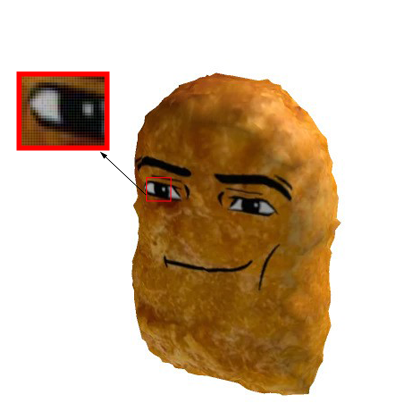

# Lesson 2: Data Preprocessing ⚡

## Objective 🧐🗿
Get ready to dive into the world of data prep! By the end of this lesson, you'll master the art of getting data set up just right for our model. We'll learn how to make images clearer, labels easier to understand, and set the stage for our AI adventure!

Let's get started!

## Pixels -> Images

Have you ever seen pixel art? Along with your coach, search for "pixelated images" on Google. In the search results, you'll notice that these images have so few pixels that you can see each individual block.

When images have lots of pixels, they don’t look pixelated anymore, but they still have pixels. Our eyes can't see the individual pixels because they blend together smoothly. Along with your coach, search for how many pixels the average picture has. You might be surprised by the number!

<div align="center">
    
</div>
<figure align="center">
  <figcaption>
Here's a picture of a pixel. Zoom in any picture close enough and you'll see it too!
 </figcaption>
</figure>

### How Computers Use Pixels to Form Images
Computers make images using a grid of tiny squares called pixels. Each pixel can show a different color. These colors are usually made using the RGB color model, which stands for Red, Green, and Blue.

**The RGB Color Model**

Red, Green, and Blue Colors: Each pixel is made up of three colors: red, green, and blue. By mixing these three colors in different amounts, you can make lots of other colors.

Color Values: Each color (red, green, and blue) can have a value between 0 and 255. 

- When all three colors are at their maximum value (255, 255, 255), the pixel looks white. 

- When all are at their minimum value (0, 0, 0), the pixel looks black. 

- Other combinations make different colors.

Let's head to this site: https://imagecolorpicker.com/

By using the dropper, you can see the individual RGB values of each pixel in the image. Try using your own image and test it out!

## Step 1: Normalizing the Images

So, we want computers to recognize things in images, right? Well, first, we need to make it easier for them to understand the images.

Think of it like this: imagine you're trying to understand a bunch of different numbers, but they're all really big and hard to work with. It's like trying to add up a bunch of huge numbers!

So, what we do is shrink those numbers down to a smaller range, like 0 to 1. That way, it's easier for the computer to understand and work with them.

This process is called **normalizing**!

In a new code cell, type the following code down along with your coach.
```python
x_train, x_test = x_train / 255.0, x_test / 255.0
```

This code takes the pixel values (which are big numbers) and shrinks them down to a smaller range (0 to 1) so the computer can understand them better.


## Step 2: One-Hot Encoding the Labels
We've normalized our images, and now it's time to make our labels more computer-friendly.

Labels are names for what's in the image. But computers don't understand words, they only understand numbers and codes!

So, we're going to give each label a special code, like a secret identity. This is called **one-hot encoding**.

Imagine you have a bunch of animals, like cats and dogs. We'll give each animal a special code, like:
- Cat: [1, 0, 0]
- Dog: [0, 1, 0]

These codes are like secret signals that the computer can understand. And we can use them to help our model learn and recognize different animals!
Follow the code below with your coach to check it out!

```python
y_train = tf.keras.utils.to_categorical(y_train, 10)
y_test = tf.keras.utils.to_categorical(y_test, 10)
```


## Step 3: Splitting the Data

Alright, it's time to sprinkle some magic on our data! 🎩✨ We're going to split our collection of pictures and labels into two groups using a special tool.

Imagine we have a huge gallery of pictures and their labels:

- We'll take 80% of these pictures to train our model. It's like teaching it new dance moves and helping it become a pro!
- The remaining 20% will be used to test how well our model learned. It's showtime! 🌟

This way, our model gets the perfect blend of practice and performance. Just like practicing a dance move and then dazzling everyone with a flawless performance!

By splitting our data this way, we ensure our model isn't just memorizing pictures but truly understanding them. How cool is that?

```python
from sklearn.model_selection import train_test_split

x_train, x_val, y_train, y_val = train_test_split(x_train, y_train, test_size=0.2, random_state=42)
```

## Step 4: Verifying the Shapes

Finally, let's check the shapes of our training, validation, and testing datasets to make sure everything is set up correctly.

This will show us how many images and labels are in each set.
It's like doing a quick headcount to make sure everyone is in the right group.

```python
print(f"Training data shape: {x_train.shape}")
print(f"Validation data shape: {x_val.shape}")
print(f"Testing data shape: {x_test.shape}")
```

<br />

- [x] **You've just prepped your data like a pro! By normalizing, encoding, and splitting, you've set the stage for your model to learn and perform its best. Awesome job!**