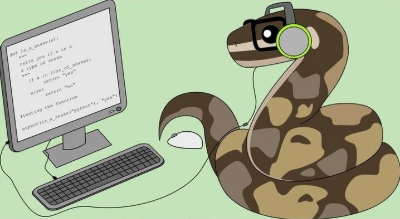

<!-- 

    

 -->

Welcome to Scratch: Coding 101! Ready to dive into creative game-building and machine-learning exploration? In this course, you’ll build two complete Scratch games—no text-based code required—and train your own models using Google’s Teachable Machine:

- **Space Shooter**: Pilot a rocket, blast asteroids, and race against the clock.  
- **Star Chase**: Guide a star-chaser, collect stars and crystals for points.  
- **Meteor Dodger & Solar System Tour**: Train and test models in Google’s Teachable Machine.

We’ll start by setting up your Scratch account once—no extra installs—then work through three parallel lesson tracks.

## What is Scratch?

Scratch is a block-based visual programming environment from MIT. You build games, animations, and interactive stories by snapping together colorful code blocks. It’s perfect for beginners and veteran coders alike—focus on game logic and creativity, not syntax.

## What is Google’s Teachable Machine?

Google’s Teachable Machine is a browser-based tool that lets anyone train simple machine-learning models without writing code. You can create image, audio, and pose classifiers by providing examples, then export your trained model to use in web pages, apps, or extensions.

## Lesson Flow

1. **Setup**  
   Create your free Scratch account (for the two games) and get familiar with the editor.

2. **Space Shooter Lessons**  
   - **Space Shooter 1 – Import Assets**  
     Upload the space backdrop plus the Rocketship, Laser, Rock, and Game Over sprites.  
   - **Space Shooter 2 – Rocketship**  
     Script the player’s ship: arrow-key movement, edge detection, and initializing variables.  
   - **Space Shooter 3 – Laser**  
     Program the Laser sprite: fire on key press, create clones, and add sound effects.  
   - **Space Shooter 4 – Rocks**  
     Spawn asteroid clones at random positions, set their speeds, recycle off-screen clones, and update score.  
   - **Space Shooter 5 – Game Over**  
     Detect collisions, display the Game Over screen, play sound, and stop all scripts.

3. **Star Chase Lessons**  
   - **Star Chase 1 – Import Assets**  
     Upload the chase-scene backdrop plus the Dot, Star, and Crystal sprites.  
   - **Star Chase 2 – Dot**  
     Script the Dot sprite: arrow-key movement, edge behavior, and starting variables.  
   - **Star Chase 3 – Star**  
     Spawn Star clones at random positions, award points when collected, then delete clones.  
   - **Star Chase 4 – Crystal**  
     Spawn Crystal clones as bonus items and award higher points when collected.

4. **Google’s Teachable Machine Lessons**  
   - **Teachable Machine 1 – Meteor Dodger**  
     Train a pose model to detect “Standing” vs. “Ducking” and dodge a meteor image.  
   - **Teachable Machine 2 – Solar System Tour**  
     Build an image model that recognizes planets and displays fun facts on detection.
     
Each section includes step-by-step instructions, block diagrams, and optional “challenge” extensions if you’d like to level up your project. Move at your own pace—review earlier lessons or jump into advanced challenges whenever you’re ready.

Next up: **Setup**—let’s create your Scratch account and prepare your first project!  

 