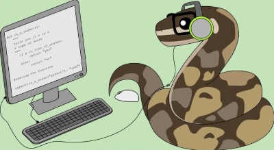

<!-- 

    

 -->

Welcome to Scratch: Game Design 101! Ready to blast off on a coding adventure? In this course, you’ll build a replica of the popular game, Geometry Dash!

We’ll begin by setting up your Scratch account, then tackle lessons centered on building a key piece of the game:

## What is Scratch?

Scratch is a block-based visual programming environment from MIT. You create games, animations, and interactive stories by snapping together colorful code blocks. It’s perfect for beginners and veteran coders alike, letting you focus on game logic and creativity instead of memorizing syntax.

## Lesson Flow

1. **Setup**  
   Create your free Scratch account and get familiar with the editor.

2. **Lesson 1 – Import Assets**  
   Upload the space backdrop plus the Rocketship, Laser, Rock, and Game Over sprites.

3. **Lesson 2 – Rocketship**  
   Script the player’s ship: arrow-key movement, edge detection, and initializing variables.

4. **Lesson 3 – Laser**  
   Program the Laser sprite: fire on key press, create laser clones, and add sound effects.

5. **Lesson 4 – Rocks**  
   Spawn asteroid clones at random positions, set their speeds, and recycle off-screen clones.

6. **Lesson 5 – Game Over**  
   Detect collisions, display the Game Over screen, stop all scripts, and reset the game.

Each section includes step-by-step instructions, example block diagrams, and optional “challenge” extensions if you want to level up your game. Feel free to move at your own pace—review earlier lessons or jump into the advanced challenges whenever you’re ready.

Next up: **Setup**—let’s create your Scratch account and prepare the playground!

 