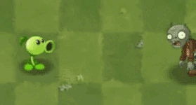

# Stage 3: Shooting Bullets

## Objective 🧐🗿

We are now going to make our peashooter shoot! Before we start here, make sure you are able to plant the peashooters on your grids from last session. 

## Step 1 - Creating the Bullet Object 👾🔫

### 1.1 Create the Bullet

We will need to create a new object that is going to represent our bullet.

It will have three components:
- Rigidbody2D
- Box collider2D
- Bullet Script (NOOOOO NOT SCRIPTING AGAIN)

Make sure to change some of the properties to your likings, remember to turn gravity scale to 0. 

### 1.2 Create the Bullet Origin 

Since our peashooter does not have the bullets with it, we need to:
- Add a new empty object in the peashooter as the bullet origin, or where the bullet will come out from. 

We can do this by:
- Going inside of the peashooter object,
- Move the empty object inside it so it becomes a child of the peashooter,
- Adjust the position of the bullet origin and put it near his mouth.

**Now we are ready to script.**

## Step 2 - Create the Bullet Script 🫛📜

### 2.1 Initializing Variables

```csharp
public class Bullet : MonoBehaviour

   Declare variables:
     - damage: an integer for the damage the bullet will cause
     - speed: a float for the bullet's movement speed
```
### 2.2 Start and Update Methhods 

```csharp
//...

Start method:
     - Destroy the bullet after 10 seconds

   Update method:
     - Every frame, move the bullet forward along the x-axis by "speed * Time.deltaTime"
```

### 2.3 Collision Method

```csharp
//...

   OnTriggerEnter2D method:
     - This method is triggered when the bullet collides with another object
     - Check if the object the bullet collided with is a Zombie (ZombieScript attached)

     If the collided object is a Zombie:
       - Call the 'hit' method on the ZombieScript, passing 'damage' and 'freeze' as arguments
       - Destroy the bullet to simulate it hitting the target
```

## Step 3 - Create the Shoot Script 🔫📜

Now we have a bullet script, we also need a shoot script that we put inside our peashooter so it can shoot out the bullets.

We will have to make a new script component inside the peashooter and we will begin scripting!
    
### 3.1 Initializing Variables

```csharp
public class Shoot : MonoBehaviour

   Declare variables:
     - bullet: a GameObject reference for the bullet to be shot
     - shootPosition: a Transform where bullets will be instantiated from
     - cooldown: a float representing the time between shots
     - canShoot: a boolean to control when the shooter can fire next
     - range: a float defining how far the shooter can detect targets
     - shootMask: a LayerMask determining which layers the raycast can hit
     - target: a GameObject that will store the currently detected target
```

### 3.2 Start and Update Methhods

```csharp
    Start method:
     - Invoke the ResetCooldown method after a delay equal to 'cooldown' to allow shooting

   Update method:
     - Perform a raycast starting from the current position going right, up to 'range', and only hitting objects on the 'shootMask' layer
     - If the raycast hits a collider:
         - Set 'target' to the GameObject hit by the raycast
         - Call the Fire method
```

### 3.3 ResetCooldown and Fire Methhods

```csharp
   ResetCooldown method:
     - Set 'canShoot' to true to enable shooting

   Fire method:
     - If 'canShoot' is false, exit the method to prevent firing
     - Set 'canShoot' to false to enforce cooldown
     - Invoke the ResetCooldown method after 'cooldown' seconds to reset the shooting ability
     - Instantiate a bullet at 'shootPosition' with default orientation (no rotation)
```

<details>
    <summary>**Medium: Add animations for bullets**</summary>

    <div className='image-wrapper'>
        
    </div>

    <br  />

    **3.4 Gather your assets**

    Search online for peashooter assets to animate!

    **3.5 Animate**

    Use the animation editor to create an animation!

    **3.6 Tie it together using the animator!**

    Use the animator to connect your animation transitions using parameters. You will want to make a trigger parameter.

    **3.7 Add it to the script!**

    In your script do the following:

    ```csharp
    public Animator anim;
    public GameObject Peashooter;

    void Start()
    {
        //...

        anim = Peashooter.GetComponent<Animator>();
    }

    //...

    void Fire()
    {
        if (!canShoot)
            return;

        anim.SetTrigger("Name of your animation");

        source.PlayOneShot(shootClips[Random.Range(0, shootClips.Length)]);
        canShoot = false;
        Invoke("ResetCooldown", cooldown);

        GameObject myBullet = Instantiate(bullet, shootPosition.position, Quaternion.identity);
    }
    ```
</details>

<details>
  <summary>**Hard: Create bullets for each of the new plants you made**</summary>

  <div className='image-wrapper'>
        
  </div>

  **4.1 Gather your assets**

  Search online or create your own assets for your enemy

  **4.2 Script your mechanics**

  Modify the shoot and bullet script to fit the needs of your newly designed plant.

  **4.3 Animate**

  Follow the same animation steps from medium

</details>

- [x] **If the peashooter is now shooting at the zombies, you are done! Next chapter we will be making the sun and sunflowers to get more peashooters!**